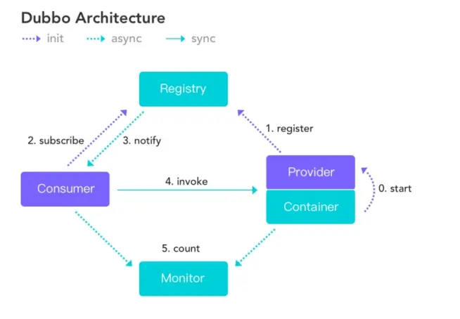
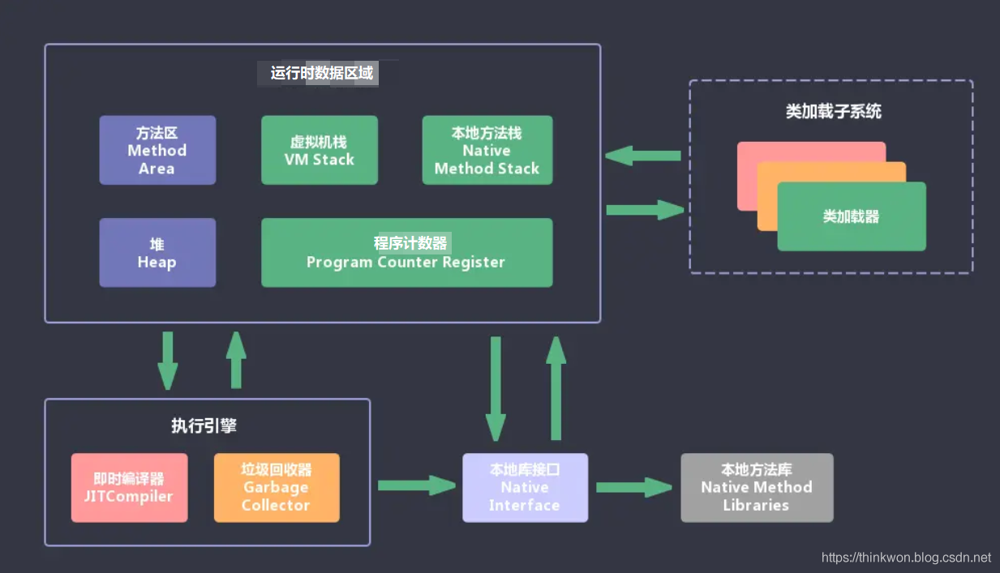

# java面试问题

线程假死的排查和处理

线程假死（Thread Deadlock）是指两个或多个线程在等待彼此持有的资源，从而陷入无法继续执行的状态。假死通常是由于线程间的循环依赖导致的。即使没有日志可供查看，依然可以通过以下方法排查和处理线程假死问题：

排查线程假死

线程转储（Thread Dump）：

使用工具如jstack生成JVM线程转储文件，分析所有线程的当前状态及其持有和等待的资源。

通过jvisualvm或JConsole等工具也可以查看线程转储。

分析线程转储：

查找BLOCKED状态的线程，这些线程通常等待其他线程释放资源。

找出资源的持有者及其当前状态。

如果多个线程相互等待对方持有的资源，则可能发生了死锁。

代码审查：

审查共享资源的获取顺序，确保一致性，避免循环依赖。

使用工具如FindBugs或SonarLint进行静态代码分析，查找潜在的死锁问题。

处理线程假死

重启应用程序：

如果线程假死无法通过其他方式解决，重启应用程序是恢复正常运行的最快方法。

修改代码逻辑：

尽量减少持有锁的时间，避免长时间持有锁。

使用tryLock方法来避免死锁，如果无法获取锁则及时放弃并采取其他措施。

实现超时机制，避免线程无限期等待。

使用并发工具库：

使用java.util.concurrent包中的并发工具类，如ReentrantLock、ReadWriteLock等，以替代传统的synchronized块。

使用条件变量（Condition）来控制线程等待和通知，避免不必要的等待。

避免微服务深度调用

深度调用链（Deep Call Chain）是指一个微服务调用链条中的层次过深，可能导致性能问题和复杂性增加。以下是一些避免微服务深度调用的方法：

服务合并：

合并职责相似或紧密相关的微服务，减少调用链的层次。

API网关模式：

使用API网关聚合多个微服务的调用，减少客户端直接调用多个微服务。

API网关可以提供聚合后的数据，简化客户端的调用逻辑。

异步通信：

使用消息队列（如RabbitMQ、Kafka）进行异步通信，解耦服务之间的调用。

异步通信可以减少同步调用带来的延迟和依赖。

缓存机制：

在可能的情况下，引入缓存机制，减少重复调用和深度调用。

可以使用分布式缓存（如Redis）来缓存常用数据。

服务网格（Service Mesh）：

引入服务网格，如Istio、Linkerd，提供微服务间的通信管理。

服务网格可以优化和管理服务调用路径，减少调用链的复杂性。

请求聚合：

在服务设计时，将多个小的、频繁调用的服务接口聚合成一个接口，减少调用次数和层次。

可以通过GraphQL实现客户端对多个数据源的统一查询。

观察和监控：

使用分布式追踪工具（如Zipkin、Jaeger）监控微服务调用链，识别并优化深度调用。

通过日志和监控系统（如ELK、Prometheus+Grafana）实时分析调用链的性能瓶颈。

通过以上方法，可以有效避免和处理线程假死问题，并优化微服务架构，减少深度调用带来的复杂性和性能问题。

## 为什么要用Dubbo？

随着服务化的进一步发展，服务越来越多，服务之间的调用和依赖关系也越来越复杂，诞生了面向服务的架构体系(SOA)，

也因此衍生出了一系列相应的技术，如对服务提供、服务调用、连接处理、通信协议、序列化方式、服务发现、服务路由、日志输出等行为进行封装的服务框架。

就这样为分布式系统的服务治理框架就出现了，Dubbo也就这样产生了。

## Dubbo 的整体架构设计有哪些分层?

接口服务层（Service）：该层与业务逻辑相关，根据 provider 和 consumer 的业务设计对应的接口和实现

配置层（Config）：对外配置接口，以 ServiceConfig 和 ReferenceConfig 为中心

服务代理层（Proxy）：服务接口透明代理，生成服务的客户端 Stub 和 服务端的 Skeleton，以 ServiceProxy 为中心，扩展接口为 ProxyFactory

服务注册层（Registry）：封装服务地址的注册和发现，以服务 URL 为中心，扩展接口为 RegistryFactory、Registry、RegistryService

路由层（Cluster）：封装多个提供者的路由和负载均衡，并桥接注册中心，以Invoker 为中心，扩展接口为 Cluster、Directory、Router和LoadBlancce

监控层（Monitor）：RPC调用次数和调用时间监控，以 Statistics 为中心，扩展接口为 MonitorFactory、Monitor和MonitorService

远程调用层（Protocal）：封装 RPC 调用，以 Invocation 和 Result 为中心，扩展接口为 Protocal、Invoker和Exporter

信息交换层（Exchange）：封装请求响应模式，同步转异步。以 Request 和 Response 为中心，扩展接口为 Exchanger、ExchangeChannel、ExchangeClient和ExchangeServer

网络传输层（Transport）：抽象 mina 和 netty 为统一接口，以 Message 为中心，扩展接口为Channel、Transporter、Client、Server和Codec

数据序列化层（Serialize）：可复用的一些工具，扩展接口为Serialization、 ObjectInput、ObjectOutput和ThreadPool

## 默认使用的是什么通信框架，还有别的选择吗?

默认也推荐使用netty框架，还有mina。

## 服务调用是阻塞的吗？

默认是阻塞的，可以异步调用，没有返回值的可以这么做。

Dubbo 是基于 NIO 的非阻塞实现并行调用，客户端不需要启动多线程即可完成并行调用多个远程服务，相对多线程开销较小，异步调用会返回一个 Future 对象。

## 一般使用什么注册中心？还有别的选择吗？

推荐使用 Zookeeper 作为注册中心，还有 Redis、Multicast、Simple 注册中心，但不推荐。

## 默认使用什么序列化框架，你知道的还有哪些？

推荐使用Hessian序列化，还有Duddo、FastJson、Java自带序列化。

## 服务提供者能实现失效踢出是什么原理？

服务失效踢出基于zookeeper的临时节点原理。

## 画一画服务注册与发现的流程图？

## MQ（消息队列）的使用场景以及常见的MQ

### 什么是消息中间件？

消息中间件通也被称为消息队列服务器，是当今分布式应用架构中经常采用的技术，程序员之间一般叫作消息队列或者 MQ。

消息队列属于面向消息的中间件，使用它可以使我们的系统之间进行解耦，尤其是现在微服务架构，分布式架构中，使用消息队列可以使我们的分布式应用之间通过发送和接收消息来进行数据交互。

消息中间件常见的角色就是 Producer（生产者）、Consumer（消费者） 、broker（消息中间件实例），消息队列通过消息的“发送-签收”机制来确保生产者和消费者之间数据传输的可靠性。

### JMS消息服务

讲消息队列就不得不提JMS 。JMS（JAVA Message Service，java消息服务）API是一个消息服务的标准/规范，JMS  只是定义了Java访问消息中间件的接口，其实就是在包javax.jms中，你会发现这个包下除了异常定义，其他都是interface。JMS只给出接口，然后由具体的中间件去实现，比如ActiveMQ就是实现了JMS的一种Provider，还有阿里巴巴的RocketMQ。这些消息中间件都符合JMS规范。允许应用程序组件基于JavaEE平台创建、发送、接收和读取消息。它使分布式通信耦合度更低，消息服务更加可靠以及异步性。

说起规范，自然要定义一些术语：

1. Provider/MessageProvider：生产者
2. Consumer/MessageConsumer：消费者
3. PTP：Point To Point，点对点通信消息模型
4. Pub/Sub：Publish/Subscribe，发布订阅消息模型
5. Queue：队列，目标类型之一，和PTP结合
6. Topic：主题，目标类型之一，和Pub/Sub结合
7. ConnectionFactory：连接工厂，JMS用它创建连接
8. Connnection：JMS Client到JMS Provider的连接
9. Destination：消息目的地，由Session创建
10. Session：会话，由Connection创建，实质上就是发送、接受消息的一个线程，因此生产者、消费者都是Session创建的

## 说一下 JVM 的主要组成部分及其作用？

## 深拷贝和浅拷贝

浅拷贝（shallowCopy）只是增加了一个指针指向已存在的内存地址，

深拷贝（deepCopy）是增加了一个指针并且申请了一个新的内存，使这个增加的指针指向这个新的内存，

使用深拷贝的情况下，释放内存的时候不会因为出现浅拷贝时释放同一个内存的错误。

浅复制：仅仅是指向被复制的内存地址，如果原地址发生改变，那么浅复制出来的对象也会相应的改变。

深复制：在计算机中开辟一块新的内存地址用于存放复制的对象。

## 说一下堆栈的区别？

物理地址

堆的物理地址分配对对象是不连续的。因此性能慢些。在GC的时候也要考虑到不连续的分配，所以有各种算法。比如，标记-消除，复制，标记-压缩，分代（即新生代使用复制算法，老年代使用标记——压缩）

栈使用的是数据结构中的栈，先进后出的原则，物理地址分配是连续的。所以性能快。

内存分别

堆因为是不连续的，所以分配的内存是在运行期确认的，因此大小不固定。一般堆大小远远大于栈。

栈是连续的，所以分配的内存大小要在编译期就确认，大小是固定的。

存放的内容

堆存放的是对象的实例和数组。因此该区更关注的是数据的存储

栈存放：局部变量，操作数栈，返回结果。该区更关注的是程序方法的执行。

PS：

1. 静态变量放在方法区
2. 静态的对象还是放在堆。

程序的可见度

堆对于整个应用程序都是共享、可见的。

栈只对于线程是可见的。所以也是线程私有。他的生命周期和线程相同。

# 队列和栈是什么？有什么区别？

队列和栈都是被用来预存储数据的。

操作的名称不同。队列的插入称为入队，队列的删除称为出队。栈的插入称为进栈，栈的删除称为出栈。

可操作的方式不同。队列是在队尾入队，队头出队，即两边都可操作。而栈的进栈和出栈都是在栈顶进行的，无法对栈底直接进行操作。

操作的方法不同。队列是先进先出（FIFO），即队列的修改是依先进先出的原则进行的。新来的成员总是加入队尾（不能从中间插入），每次离开的成员总是队列头上（不允许中途离队）。而栈为后进先出（LIFO）,即每次删除（出栈）的总是当前栈中最新的元素，即最后插入（进栈）的元素，而最先插入的被放在栈的底部，要到最后才能删除。

# 对象的访问定位

Java程序需要通过 JVM 栈上的引用访问堆中的具体对象。对象的访问方式取决于 JVM 虚拟机的实现。目前主流的访问方式有 句柄 和 直接指针 两种方式。

指针： 指向对象，代表一个对象在内存中的起始地址。

句柄： 可以理解为指向指针的指针，维护着对象的指针。句柄不直接指向对象，而是指向对象的指针（句柄不发生变化，指向固定内存地址），再由对象的指针指向对象的真实内存地址。

# Java会存在内存泄漏吗？请简单描述

内存泄漏是指不再被使用的对象或者变量一直被占据在内存中。理论上来说，Java是有GC垃圾回收机制的，也就是说，不再被使用的对象，会被GC自动回收掉，自动从内存中清除。

但是，即使这样，Java也还是存在着内存泄漏的情况，java导致内存泄露的原因很明确：长生命周期的对象持有短生命周期对象的引用就很可能发生内存泄露，尽管短生命周期对象已经不再需要，但是因为长生命周期对象持有它的引用而导致不能被回收，这就是java中内存泄露的发生场景。

# 简述Java垃圾回收机制

在java中，程序员是不需要显示的去释放一个对象的内存的，而是由虚拟机自行执行。在JVM中，有一个垃圾回收线程，它是低优先级的，在正常情况下是不会执行的，只有在虚拟机空闲或者当前堆内存不足时，才会触发执行，扫面那些没有被任何引用的对象，并将它们添加到要回收的集合中，进行回收。

## GC是什么？为什么要GC

GC 是垃圾收集的意思（Gabage Collection）,内存处理是编程人员容易出现问题的地方，忘记或者错误的内存

回收会导致程序或系统的不稳定甚至崩溃，Java 提供的 GC 功能可以自动监测对象是否超过作用域从而达到自动

回收内存的目的，Java 语言没有提供释放已分配内存的显示操作方法。

# 垃圾回收的优点和原理。并考虑2种回收机制

java语言最显著的特点就是引入了垃圾回收机制，它使java程序员在编写程序时不再考虑内存管理的问题。

由于有这个垃圾回收机制，java中的对象不再有“作用域”的概念，只有引用的对象才有“作用域”。

垃圾回收机制有效的防止了内存泄露，可以有效的使用可使用的内存。

垃圾回收器通常作为一个单独的低级别的线程运行，在不可预知的情况下对内存堆中已经死亡的或很长时间没有用过的对象进行清除和回收。

程序员不能实时的对某个对象或所有对象调用垃圾回收器进行垃圾回收。

垃圾回收有分代复制垃圾回收、标记垃圾回收、增量垃圾回收。

# 垃圾回收器的基本原理是什么？垃圾回收器可以马上回收内存吗？有什么办法主动通知虚拟机进行垃圾回收？

对于GC来说，当程序员创建对象时，GC就开始监控这个对象的地址、大小以及使用情况。

通常，GC采用有向图的方式记录和管理堆(heap)中的所有对象。通过这种方式确定哪些对象是"可达的"，哪些对象是"不可达的"。当GC确定一些对象为"不可达"时，GC就有责任回收这些内存空间。

可以。程序员可以手动执行System.gc()，通知GC运行，但是Java语言规范并不保证GC一定会执行。

# Java 中都有哪些引用类型？

1. 强引用：发生 gc 的时候不会被回收。
2. 软引用：有用但不是必须的对象，在发生内存溢出之前会被回收。
3. 弱引用：有用但不是必须的对象，在下一次GC时会被回收。
4. 虚引用（幽灵引用/幻影引用）：无法通过虚引用获得对象，用 PhantomReference 实现虚引用，虚引用的用途是在 gc 时返回一个通知。

# 怎么判断对象是否可以被回收？

垃圾收集器在做垃圾回收的时候，首先需要判定的就是哪些内存是需要被回收的，哪些对象是「存活」的，是不可以被回收的；哪些对象已经「死掉」了，需要被回收。

一般有两种方法来判断：

1. 引用计数器法：为每个对象创建一个引用计数，有对象引用时计数器 +1，引用被释放时计数 -1，当计数器为 0 时就可以被回收。它有一个缺点不能解决循环引用的问题；
2. 可达性分析算法：从 GC Roots 开始向下搜索，搜索所走过的路径称为引用链。当一个对象到 GC Roots 没有任何引用链相连时，则证明此对象是可以被回收的。

# 在Java中，对象什么时候可以被垃圾回收

当对象对当前使用这个对象的应用程序变得不可触及的时候，这个对象就可以被回收了。 垃圾回收不会发生在永久代，如果永久代满了或者是超过了临界值，会触发完全垃圾回收(Full GC)。如果你仔细查看垃圾收集器的输出信息，就会发现永久代也是被回收的。这就是为什么正确的永久代大小对避免Full GC是非常重要的原因。

# 流量削锋

流量削锋也是消息队列中的常用场景，一般在秒杀或团抢活动中使用广泛。

应用场景：秒杀活动，一般会因为流量过大，导致流量暴增，应用挂掉。为解决这个问题，一般需要在应用前端加入消息队列。

a、可以控制活动的人数

b、可以缓解短时间内高流量压垮应用

用户的请求，服务器接收后，首先写入消息队列。假如消息队列长度超过最大数量，则直接抛弃用户请求或跳转到错误页面。
秒杀业务根据消息队列中的请求信息，再做后续处理

# 日志处理

日志处理是指将消息队列用在日志处理中，比如Kafka的应用，解决大量日志传输的问题。架构简化如下

1. 日志采集客户端，负责日志数据采集，定时写受写入Kafka队列
2. Kafka消息队列，负责日志数据的接收，存储和转发
3. 日志处理应用：订阅并消费kafka队列中的日志数据 

消息通讯

消息通讯是指，消息队列一般都内置了高效的通信机制，因此也可以用在纯的消息通讯。比如实现点对点消息队列，或者聊天室等

点对点通讯：

客户端A和客户端B使用同一队列，进行消息通讯。

聊天室通讯：

客户端A，客户端B，客户端N订阅同一主题，进行消息发布和接收。实现类似聊天室效果。

## 消息队列采用高可用，可持久化的消息中间件。比如Active MQ，Rabbit MQ，Rocket Mq。

（1）应用将主干逻辑处理完成后，写入消息队列。消息发送是否成功可以开启消息的确认模式。（消息队列返回消息接收成功状态后，应用再返回，这样保障消息的完整性）

（2）扩展流程（发短信，配送处理）订阅队列消息。采用推或拉的方式获取消息并处理。

（3）消息将应用解耦的同时，带来了数据一致性问题，可以采用最终一致性方式解决。比如主数据写入数据库，扩展应用根据消息队列，并结合数据库方式实现基于消息队列的后续处理。

## mq如何避免消息堆积的问题

1、产生背景

生产者投递消息的速率与我们消费者消费的速率完全不匹配

2、生产者投递消息的速率 > 消费者消费的速率

导致我们消息会堆积在mq服务器中，没有及时的被消费者消费，所以就会产生消息堆积的问题

3、注意的是：rabbitmq消费者消费我们的消息，如果成功的话，消息会被立即删除

kafka或者rocketmq消息消费如果成功的话，消息是不会立即被删除

4、解决办法

A、提高消费者消费的速率（对我们的消费者实现集群）

10万条消息，消费者每次只取一条消息消费

B、消费者应该批量式获取消息，减少网络传输的次数

每次取10条或者100条消息

5、对kafka或rocketmq将消息理解为就是我们的日志，根据offset去获取消息
