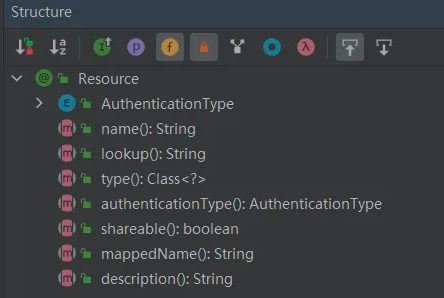

# AutoWired 与 Resource 区别

这两个我们在项目中经常能看到，只知道是进行自动注入的，本文就以最简单的方式给大家总结下两者有什么区别，主要是从以下四个维度：

1. 来源不同；
2. 依赖查找的顺序不同；
3. 支持的参数不同；
4. 依赖注入的用法支持不同；

## 来源不同

@Autowired 和 @Resource 来自不同的“父类”，其中 @Autowired 是 Spring2.5 定义的注解

同时宣布支持@Resource ，而 @Resource 是 Java 定义的注解，它来自于 JSR-250（Java 250 规范提案）

## 依赖查找的顺序不同

依赖注入的功能，是通过先在 Spring IoC 容器中查找对象，再将对象注入引入到当前类中。
而查找有分为两种实现：按名称（byName）查找或按类型（byType）查找，其中 @Autowired 和 @Resource 都是既使用了名称查找又使用了类型查找，
但二者进行查找的顺序却截然相反。

## @AutoWired注解

@Autowired 注解在查找要注入的 bean 时，首先会按照类型进行匹配。如果有多个匹配的 bean，就会根据名称进行匹配。
具体来说，如果被注入的属性或构造函数参数的类型在容器中有且只有一个对应的 bean，那么 @Autowired 注解就会直接将该 bean 注入到该属性或构造函数参数中。

例如：

```angular2html
@Autowired
private UserService userService;
```

在这个例子中，如果容器中只有一个类型为 UserService 的 bean ，那么它就会被自动注入到userService 属性中。

但是，如果容器中存在多个类型为 UserService 的 bean，就需要通过名称进行匹配。
此时，可以在 @Autowired 注解中使用 @Qualifier 注解来指定要注入的bean的名称，如果不使用 @Qualifier 注解就会使用属性名。

例如：

```angular2html
@Autowired
@Qualifier("userService2")
private UserService userService;
```

在这个例子中，如果容器中有多个类型为 UserService 的 bean，那么它会根据 @Qualifier 注解中指定的名称来匹配要注入的 bean。
如果找到了名为 "userService2" 的 bean，就会将它注入到 userService 属性中。

## @Resource注解

在Spring中，@Resource注解可以通过名称或者类型来注入bean，具体取决于@Resource注解的两个属性：name和type。
如果@Resource注解中指定了name属性，Spring将会根据该名称来查找对应的bean，并将其注入到被注解的属性或者方法参数中。例如：

```angular2html
@Resource(name = "myBean")
private MyBean myBean;
```

上述代码将会根据名称“myBean”来查找对应的bean，并将其注入到myBean属性中。

如果@Resource注解没有指定name属性，而是指定了type属性，Spring将会根据该类型来查找对应的bean，并将其注入到被注解的属性或者方法参数中。例如：

```
@Resource(type = MyBean.class)
private MyBean myBean;
```

上述代码将会根据类型MyBean来查找对应的bean，并将其注入到myBean属性中。

如果@Resource注解既没有指定name属性，也没有指定type属性，那么它会默认按照名称来查找对应的bean，并将其注入到被注解的属性或者方法参数中。例如：

```angular2html
@Resource
private MyBean myBean;
```

上述代码将会默认按照名称“myBean”来查找对应的bean，并将其注入到myBean属性中。

## 支持的参数不同

@Autowired 和 @Resource 在使用时都可以设置参数，但二者支持的参数以及参数的个数完全不同，
其中 @Autowired 只支持设置一个 required 的参数，而 @Resource 支持 7 个参数，支持的参数如下图所示：




## 依赖注入的用法支持不同

@Autowired 和 @Resource 支持依赖注入的用法不同，常见依赖注入有以下 3 种实现：

1. 属性注入
2. 构造方法注入
3. Setter 注入

@Autowired 支持属性注入、构造方法注入和 Setter 注入，而 @Resource 只支持属性注入和 Setter 注入

```angular2html
@RestController
public class UserController {
    // 属性注入
    @Autowired
    private UserService userService;

    @RequestMapping("/add")
    public UserInfo add(String username, String password) {
        return userService.add(username, password);
    }
}

@RestController
public class UserController {
    // 构造方法注入
    private UserService userService;

    @Autowired
    public UserController(UserService userService) {
        this.userService = userService;
    }

    @RequestMapping("/add")
    public UserInfo add(String username, String password) {
        return userService.add(username, password);
    }
}

@RestController
public class UserController {
    // Setter 注入
    private UserService userService;

    @Autowired
    public void setUserService(UserService userService) {
        this.userService = userService;
    }

    @RequestMapping("/add")
    public UserInfo add(String username, String password) {
        return userService.add(username, password);
    }
}
```


## 总结

@Autowired 和 @Resource 都是用来实现依赖注入的注解（在 Spring/Spring Boot 项目中），但二者却有着 4 点不同：

来源不同：@Autowired 来自 Spring 框架，而 @Resource 来自于（Java）JSR-250；

依赖查找的顺序不同：@Autowired 先根据类型再根据名称查询，而 @Resource 先根据名称再根据类型查询；

支持的参数不同：@Autowired 只支持设置 1 个参数，而 @Resource 支持设置 7 个参数；

依赖注入的用法支持不同：@Autowired 既支持构造方法注入，又支持属性注入和 Setter 注入，而 @Resource 只支持属性注入和 Setter 注入；


