# 五、Object 通用方法

> 概览

```angular2html
public native int hashCode()
public boolean equals(Object obj)
protected native Object clone() throws CloneNotSupportedException
public String toString()
public final native Class<?> getClass()
protected void finalize() throws Throwable {}
public final native void notify()
public final native void notifyAll()
public final native void wait(long timeout) throws
InterruptedException
public final void wait(long timeout, int nanos) throws
InterruptedException
public final void wait() throws InterruptedException
```

equals()

1. 等价关系

两个对象具有等价关系，需要满足以下五个条件：

Ⅰ 自反性

x.equals(x); // true

Ⅱ 对称性

x.equals(y) == y.equals(x); // true

Ⅲ 传递性

if (x.equals(y) && y.equals(z))
x.equals(z); // true;

Ⅳ 一致性

多次调用 equals() 方法结果不变

x.equals(y) == x.equals(y); // true

Ⅴ 与 null 的比较

对任何不是 null 的对象 x 调用 x.equals(null) 结果都为 false

x.equals(null); // false;

2. 等价与相等

* 对于基本类型，== 判断两个值是否相等，基本类型没有 equals() 方法。
* 对于引用类型，== 判断两个变量是否引用同一个对象，而 equals() 判断引用的对 象是否等价。

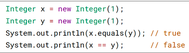

3. 实现

* 检查是否为同一个对象的引用，如果是直接返回 true；
* 检查是否是同一个类型，如果不是，直接返回 false；
* 将 Object 对象进行转型；
* 判断每个关键域是否相等。


```angular2html
public class EqualExample {
    private int x;
    private int y;
    private int z;
    public EqualExample(int x, int y, int z) {
        this.x = x;
        this.y = y;
        this.z = z;
    }
    @Override
    public boolean equals(Object o) {
        if (this == o) return true;
        if (o == null || getClass() != o.getClass()) return false;
        EqualExample that = (EqualExample) o;
        if (x != that.x) return false;
        if (y != that.y) return false;
        return z == that.z;
    }
}
```

> hashCode()

hashCode() 返回哈希值，而 equals() 是用来判断两个对象是否等价。等价的两个对象
散列值一定相同，但是散列值相同的两个对象不一定等价，这是因为计算哈希值具有
随机性，两个值不同的对象可能计算出相同的哈希值。

在覆盖 equals() 方法时应当总是覆盖 hashCode() 方法，保证等价的两个对象哈希值也
相等。

HashSet 和 HashMap 等集合类使用了 hashCode() 方法来计算对象应该存储的位置，
因此要将对象添加到这些集合类中，需要让对应的类实现 hashCode() 方法。

下面的代码中，新建了两个等价的对象，并将它们添加到 HashSet 中。我们希望将这
两个对象当成一样的，只在集合中添加一个对象。但是 EqualExample 没有实现
hashCode() 方法，因此这两个对象的哈希值是不同的，最终导致集合添加了两个等价
的对象。

```angular2html
EqualExample e1 = new EqualExample(1, 1, 1);
EqualExample e2 = new EqualExample(1, 1, 1);
System.out.println(e1.equals(e2)); // true
HashSet<EqualExample> set = new HashSet<>();
set.add(e1);
set.add(e2);
System.out.println(set.size()); // 2
```

理想的哈希函数应当具有均匀性，即不相等的对象应当均匀分布到所有可能的哈希值
上。这就要求了哈希函数要把所有域的值都考虑进来。可以将每个域都当成 R 进制
的某一位，然后组成一个 R 进制的整数。

R 一般取 31，因为它是一个奇素数，如果是偶数的话，当出现乘法溢出，信息就会
丢失，因为与 2 相乘相当于向左移一位，最左边的位丢失。并且一个数与 31 相乘可
以转换成移位和减法： 31*x == (x<<5)-x ，编译器会自动进行这个优化。

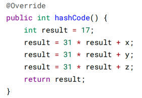

> toString()

默认返回 ToStringExample@4554617c 这种形式，其中 @ 后面的数值为散列码的无符
号十六进制表示。

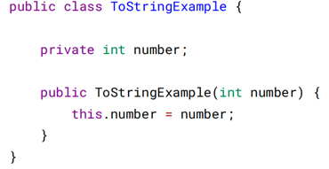

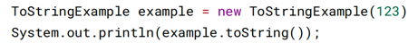


> clone()

1. cloneable

clone() 是 Object 的 protected 方法，它不是 public，一个类不显式去重写 clone()，
其它类就不能直接去调用该类实例的 clone() 方法。

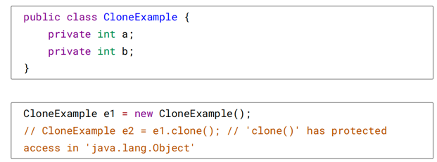

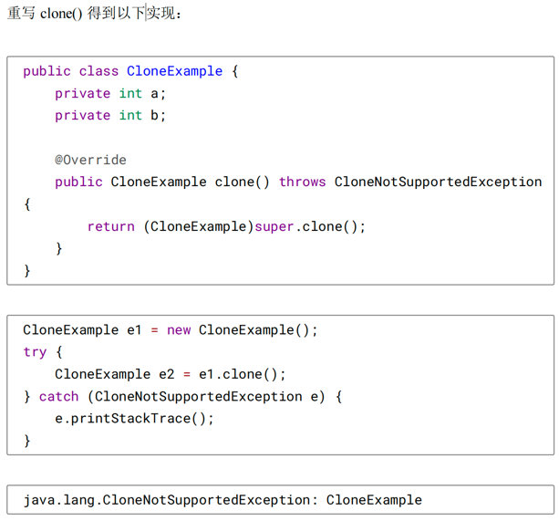

以上抛出了 CloneNotSupportedException，这是因为 CloneExample 没有实现
Cloneable 接口。

应该注意的是，clone() 方法并不是 Cloneable 接口的方法，而是 Object 的一个
protected 方法。Cloneable 接口只是规定，如果一个类没有实现 Cloneable 接口又调用
了 clone() 方法，就会抛出 CloneNotSupportedException。

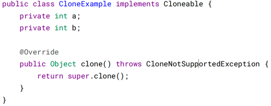

2. 浅拷贝

拷贝对象和原始对象的引用类型引用同一个对象。

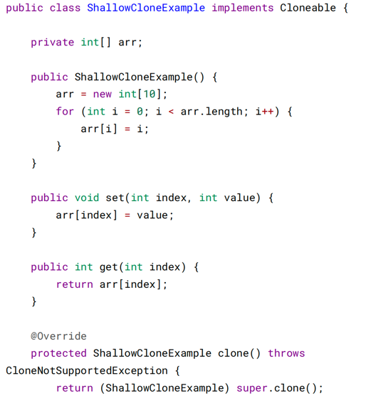

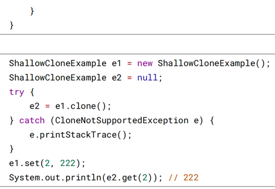

3. 深拷贝

拷贝对象和原始对象的引用类型引用不同对象。

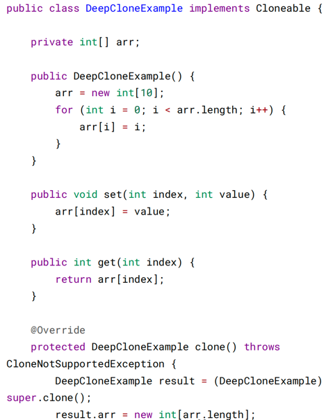

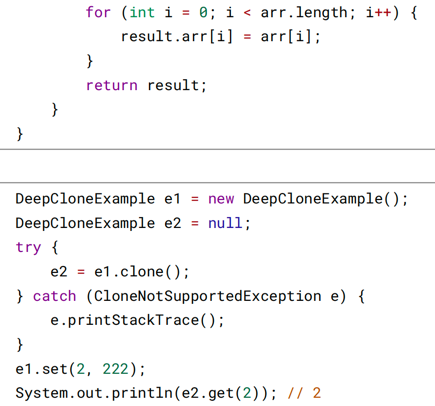

4. clone() 的替代方案

使用 clone() 方法来拷贝一个对象即复杂又有风险，它会抛出异常，并且还需要类型
转换。Effective Java 书上讲到，最好不要去使用 clone()，可以使用拷贝构造函数或
者拷贝工厂来拷贝一个对象。

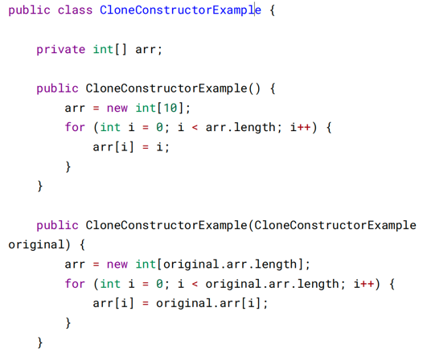

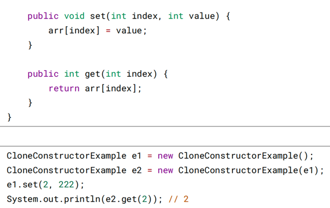
