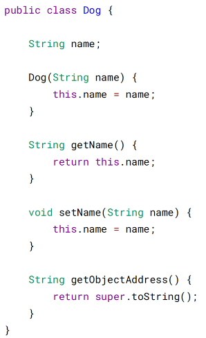
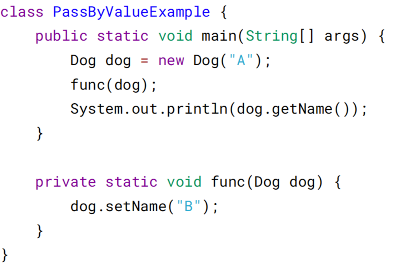
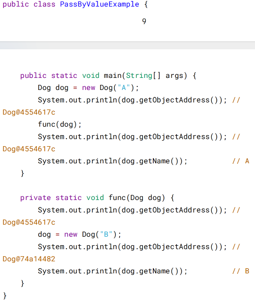
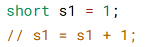
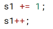
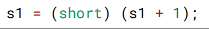
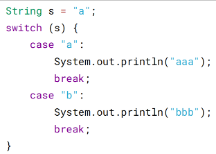
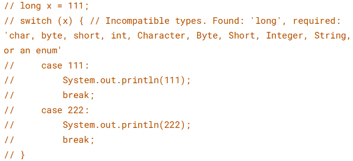

# 三、运算

参数传递

Java 的参数是以值传递的形式传入方法中，而不是引用传递。

以下代码中 Dog dog 的 dog 是一个指针，存储的是对象的地址。在将一个参数传入
一个方法时，本质上是将对象的地址以值的方式传递到形参中。

在方法中改变对象的字段值会改变原对象该字段值，因为引用的是同一个对象。

但是在方法中将指针引用了其它对象，那么此时方法里和方法外的两个指针指向了不
同的对象，在一个指针改变其所指向对象的内容对另一个指针所指向的对象没有影
响。

> float 与 double

Java 不能隐式执行向下转型，因为这会使得精度降低。

1.1 字面量属于 double 类型，不能直接将 1.1 直接赋值给 float 变量，因为这是向下
转型。

`// float f = 1.1;`

1.1f 字面量才是 float 类型。

> 隐式类型转换

因为字面量 1 是 int 类型，它比 short 类型精度要高，因此不能隐式地将 int 类型向下
转型为 short 类型。

但是使用 += 或者 ++ 运算符会执行隐式类型转换。

上面的语句相当于将 s1 + 1 的计算结果进行了向下转型：

> switch

从 Java 7 开始，可以在 switch 条件判断语句中使用 String 对象。

switch 不支持 long、float、double，是因为 switch 的设计初衷是对那些只有少数几个
值的类型进行等值判断，如果值过于复杂，那么还是用 if 比较合适。

