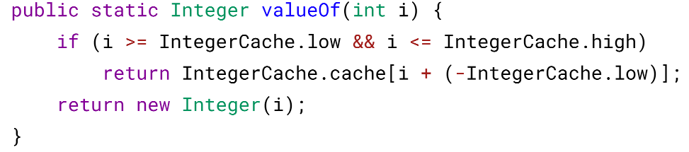

# 一、数据类型
## 基本类型
```angular2html
byte/8
char/16
short/16
int/32
float/32
long/64
double/64
boolean/ ~
```

boolean 只有两个值：true、false，可以使用 1 bit 来存储，但是具体大小没有明确规
定。JVM 会在编译时期将 boolean 类型的数据转换为 int，使用 1 来表示 true，0 表
示 false。JVM 支持 boolean 数组，但是是通过读写 byte 数组来实现的。

## 包装类型

基本类型都有对应的包装类型，基本类型与其对应的包装类型之间的赋值使用自动装
箱与拆箱完成。


## 缓存池

new Integer(123) 与 Integer.valueOf(123) 的区别在于：

1. new Integer(123) 每次都会新建一个对象；
2. Integer.valueOf(123) 会使用缓存池中的对象，多次调用会取得同一个对象的引用。


valueOf() 方法的实现比较简单，就是先判断值是否在缓存池中，如果在的话就直接
返回缓存池的内容。



在 Java 8 中，Integer 缓存池的大小默认为 -128~127。


编译器会在自动装箱过程调用 valueOf() 方法，因此多个值相同且值在缓存池范围内 的 Integer 实例使用自动装箱来创建，那么就会引用相同的对象。


基本类型对应的缓冲池如下：

### 缓冲池 


在使用这些基本类型对应的包装类型时，如果该数值范围在缓冲池范围内，就可以直
接使用缓冲池中的对象。

在 jdk 1.8 所有的数值类缓冲池中，Integer 的缓冲池 IntegerCache 很特殊，这个缓冲
池的下界是 - 128，上界默认是 127，但是这个上界是可调的，在启动 jvm 的时候，
通过 `-XX:AutoBoxCacheMax=<size>` 来指定这个缓冲池的大小，该选项在 JVM 初始
化的时候会设定一个名为 java.lang.IntegerCache.high 系统属性，然后 IntegerCache 初
始化的时候就会读取该系统属性来决定上界。

