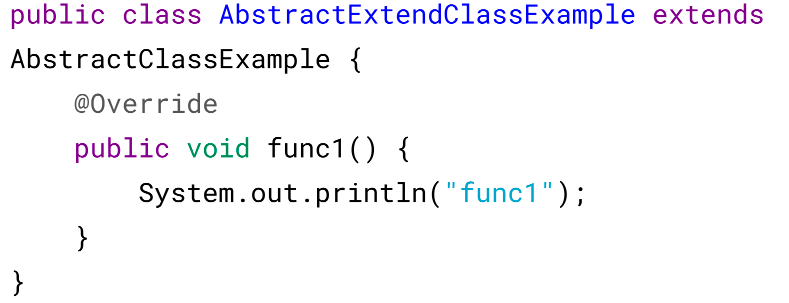

# 六、继承

> 访问权限

Java 中有三个访问权限修饰符：private、protected 以及 public，如果不加访问修饰
符，表示包级可见。

可以对类或类中的成员（字段和方法）加上访问修饰符。

* 类可见表示其它类可以用这个类创建实例对象。
* 成员可见表示其它类可以用这个类的实例对象访问到该成员；

protected 用于修饰成员，表示在继承体系中成员对于子类可见，但是这个访问修饰符
对于类没有意义。

设计良好的模块会隐藏所有的实现细节，把它的 API 与它的实现清晰地隔离开来。
模块之间只通过它们的 API 进行通信，一个模块不需要知道其他模块的内部工作情
况，这个概念被称为信息隐藏或封装。因此访问权限应当尽可能地使每个类或者成员
不被外界访问。

如果子类的方法重写了父类的方法，那么子类中该方法的访问级别不允许低于父类的
访问级别。这是为了确保可以使用父类实例的地方都可以使用子类实例去代替，也就
是确保满足里氏替换原则

字段决不能是公有的，因为这么做的话就失去了对这个字段修改行为的控制，客户端
可以对其随意修改。例如下面的例子中，AccessExample 拥有 id 公有字段，如果在某
个时刻，我们想要使用 int 存储 id 字段，那么就需要修改所有的客户端代码。

```
public class AccessExample {
    public String id;
}
```

可以使用公有的 getter 和 setter 方法来替换公有字段，这样的话就可以控制对字段的
修改行为。


但是也有例外，如果是包级私有的类或者私有的嵌套类，那么直接暴露成员不会有特
别大的影响


> 抽象类与接口

1. 抽象类

抽象类和抽象方法都使用 abstract 关键字进行声明。如果一个类中包含抽象方法，那
么这个类必须声明为抽象类。

抽象类和普通类最大的区别是，抽象类不能被实例化，只能被继承。





2. 接口

接口是抽象类的延伸，在 Java 8 之前，它可以看成是一个完全抽象的类，也就是说
它不能有任何的方法实现。

从 Java 8 开始，接口也可以拥有默认的方法实现，这是因为不支持默认方法的接口
的维护成本太高了。在 Java 8 之前，如果一个接口想要添加新的方法，那么要修改
所有实现了该接口的类，让它们都实现新增的方法。

接口的成员（字段 + 方法）默认都是 public 的，并且不允许定义为 private 或者
protected。从 Java 9 开始，允许将方法定义为 private，这样就能定义某些复用的代码
又不会把方法暴露出去。

接口的字段默认都是 static 和 final 的


3. 比较

从设计层面上看，抽象类提供了一种 IS-A 关系，需要满足里式替换原则，即子
类对象必须能够替换掉所有父类对象。而接口更像是一种 LIKE-A 关系，它只是
提供一种方法实现契约，并不要求接口和实现接口的类具有 IS-A 关系。

从使用上来看，一个类可以实现多个接口，但是不能继承多个抽象类。

接口的字段只能是 static 和 final 类型的，而抽象类的字段没有这种限制。

接口的成员只能是 public 的，而抽象类的成员可以有多种访问权限。

4. 使用选择

> 使用接口：

需要让不相关的类都实现一个方法，例如不相关的类都可以实现 Comparable 接
口中的 compareTo() 方法；

需要使用多重继承。

> 使用抽象类：

需要在几个相关的类中共享代码。

需要能控制继承来的成员的访问权限，而不是都为 public。

需要继承非静态和非常量字段。

在很多情况下，接口优先于抽象类。因为接口没有抽象类严格的类层次结构要求，可
以灵活地为一个类添加行为。并且从 Java 8 开始，接口也可以有默认的方法实现，
使得修改接口的成本也变的很低。

> super

访问父类的构造函数：可以使用 super() 函数访问父类的构造函数，从而委托父
类完成一些初始化的工作。应该注意到，子类一定会调用父类的构造函数来完成
初始化工作，一般是调用父类的默认构造函数，如果子类需要调用父类其它构造
函数，那么就可以使用 super() 函数。

访问父类的成员：如果子类重写了父类的某个方法，可以通过使用 super 关键字
来引用父类的方法实现。


```angular2html
SuperExample e = new SuperExtendExample(1, 2, 3);
e.func();

SuperExample.func()
SuperExtendExample.func()
```

## 重写与重载

1. 重写（Override）

存在于继承体系中，指子类实现了一个与父类在方法声明上完全相同的一个方法。

为了满足里式替换原则，重写有以下三个限制：

1. 子类方法的访问权限必须大于等于父类方法；
2. 子类方法的返回类型必须是父类方法返回类型或为其子类型。
3. 子类方法抛出的异常类型必须是父类抛出异常类型或为其子类型。

使用 @Override 注解，可以让编译器帮忙检查是否满足上面的三个限制条件。

下面的示例中，SubClass 为 SuperClass 的子类，SubClass 重写了 SuperClass 的 func()
方法。其中：

1. 子类方法访问权限为 public，大于父类的 protected。
2. 子类的返回类型为 ArrayList < Integer > ，是父类返回类型 List < Integer > 的子 类。
3. 子类抛出的异常类型为 Exception，是父类抛出异常 Throwable 的子类。
4. 子类重写方法使用 @Override 注解，从而让编译器自动检查是否满足限制条件。


在调用一个方法时，先从本类中查找看是否有对应的方法，如果没有再到父类中查
看，看是否从父类继承来。否则就要对参数进行转型，转成父类之后看是否有对应的
方法。总的来说，方法调用的优先级为：

```angular2html
1. this.func(this)
2. super.func(this)
3. this.func(super)
4. super.func(super)
```

2. 重载（Overload）

存在于同一个类中，指一个方法与已经存在的方法名称上相同，但是参数类型、个
数、顺序至少有一个不同。

应该注意的是，返回值不同，其它都相同不算是重载


