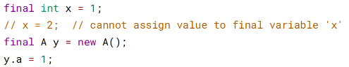
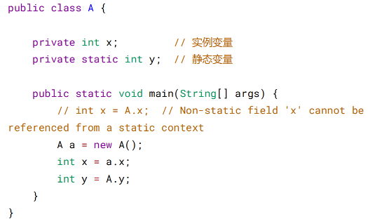
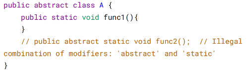
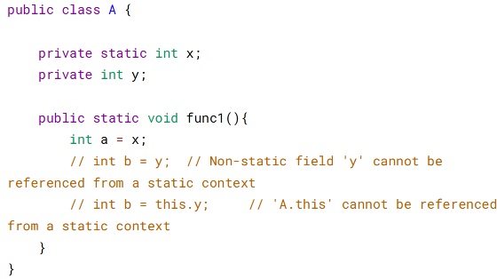
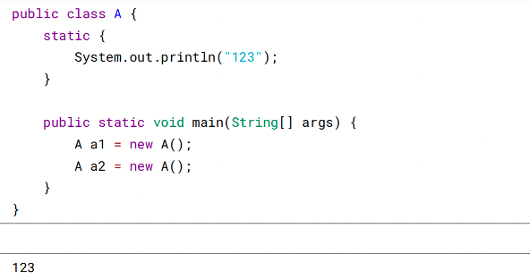
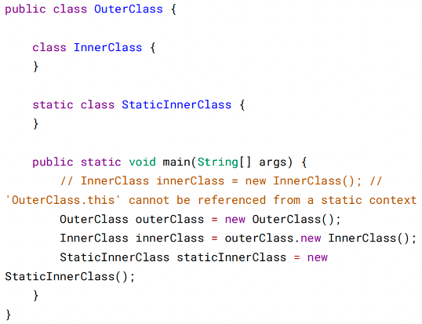

# 四、关键字

final

1. 数据

声明数据为常量，可以是编译时常量，也可以是在运行时被初始化后不能被改变的常
量。
* 对于基本类型，final 使数值不变；
* 对于引用类型，final 使引用不变，也就不能引用其它对象，但是被引用的对象本
* 身是可以修改的。



2. 方法

声明方法不能被子类重写。

private 方法隐式地被指定为 final，如果在子类中定义的方法和基类中的一个 private
方法签名相同，此时子类的方法不是重写基类方法，而是在子类中定义了一个新的方
法。

3. 类
   
声明类不允许被继承。

static

1. 静态变量
- 静态变量：又称为类变量，也就是说这个变量属于类的，类所有的实例都共享静 态变量，可以直接通过类名来访问它。静态变量在内存中只存在一份。
- 实例变量：每创建一个实例就会产生一个实例变量，它与该实例同生共死。



2. 静态方法

静态方法在类加载的时候就存在了，它不依赖于任何实例。所以静态方法必须有实
现，也就是说它不能是抽象方法。



只能访问所属类的静态字段和静态方法，方法中不能有 this 和 super 关键字，因为这
两个关键字与具体对象关联。



3. 静态语句块

静态语句块在类初始化时运行一次。



4. 静态内部类

非静态内部类依赖于外部类的实例，也就是说需要先创建外部类实例，才能用这个实
例去创建非静态内部类。而静态内部类不需要。



静态内部类不能访问外部类的非静态的变量和方法。

5. 静态导包

在使用静态变量和方法时不用再指明 ClassName，从而简化代码，但可读性大大降
低。

import static com.xxx.ClassName.*

6. 初始化顺序

静态变量和静态语句块优先于实例变量和普通语句块，静态变量和静态语句块的初始
化顺序取决于它们在代码中的顺序。

```angular2html
public static String staticField = "静态变量";
static {
System.out.println("静态语句块");
}
public String field = "实例变量";
{
System.out.println("普通语句块");
}
最后才是构造函数的初始化。
public InitialOrderTest() {
System.out.println("构造函数");
}
```

存在继承的情况下，初始化顺序为：
* 父类（静态变量、静态语句块）
* 子类（静态变量、静态语句块）
* 父类（实例变量、普通语句块）
* 父类（构造函数）
* 子类（实例变量、普通语句块）
* 子类（构造函数）


