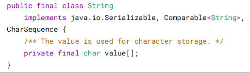
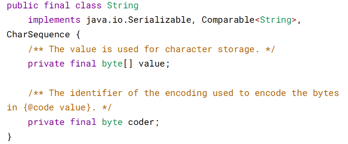
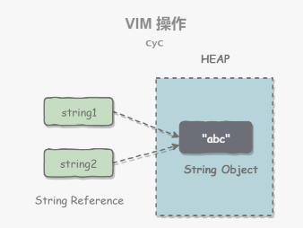
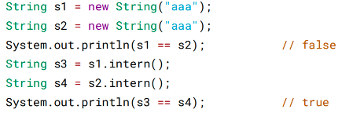
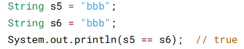
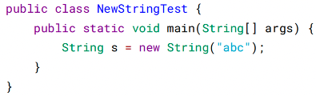
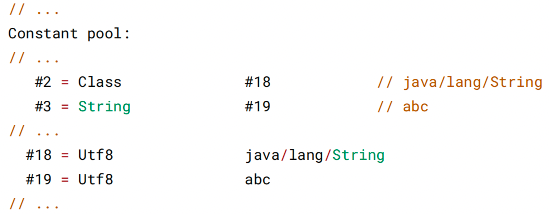
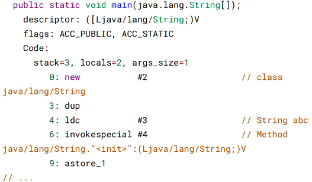
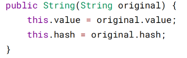

# 二、String

> 概览

String 被声明为 final，因此它不可被继承。(Integer 等包装类也不能被继承）
在 Java 8 中，String 内部使用 char 数组存储数据。

在 Java 9 之后，String 类的实现改用 byte 数组存储字符串，同时使用 coder 来标
识使用了哪种编码。

value 数组被声明为 final，这意味着 value 数组初始化之后就不能再引用其它数组。
并且 String 内部没有改变 value 数组的方法，因此可以保证 String 不可变。

> 不可变的好处

1. 可以缓存 hash 值
   因为 String 的 hash 值经常被使用，例如 String 用做 HashMap 的 key。不可变的特性
   可以使得 hash 值也不可变，因此只需要进行一次计算。
2. String Pool 的需要
   如果一个 String 对象已经被创建过了，那么就会从 String Pool 中取得引用。只有
   String 是不可变的，才可能使用 String Pool。

3. 安全性
   String 经常作为参数，String 不可变性可以保证参数不可变。例如在作为网络连接参
   数的情况下如果 String 是可变的，那么在网络连接过程中，String 被改变，改变
   String 的那一方以为现在连接的是其它主机，而实际情况却不一定是。
4. 线程安全
   String 不可变性天生具备线程安全，可以在多个线程中安全地使用。

> String, StringBuffer and StringBuilder

1. 可变性
   String 不可变
   StringBuffer 和 StringBuilder 可变
2. 线程安全
   String 不可变，因此是线程安全的
   StringBuilder 不是线程安全的
   StringBuffer 是线程安全的，内部使用 synchronized 进行同步

> String Pool

字符串常量池（String Pool）保存着所有字符串字面量（literal strings），这些字面量
在编译时期就确定。不仅如此，还可以使用 String 的 intern() 方法在运行过程将字符
串添加到 String Pool 中。

当一个字符串调用 intern() 方法时，如果 String Pool 中已经存在一个字符串和该字符
串值相等（使用 equals() 方法进行确定），那么就会返回 String Pool 中字符串的引
用；否则，就会在 String Pool 中添加一个新的字符串，并返回这个新字符串的引
用。

下面示例中，s1 和 s2 采用 new String() 的方式新建了两个不同字符串，而 s3 和 s4
是通过 s1.intern() 和 s2.intern() 方法取得同一个字符串引用。intern() 首先把 "aaa" 放
到 String Pool 中，然后返回这个字符串引用，因此 s3 和 s4 引用的是同一个字符
串。

如果是采用 "bbb" 这种字面量的形式创建字符串，会自动地将字符串放入 String Pool
中。

在 Java 7 之前，String Pool 被放在运行时常量池中，它属于永久代。而在 Java 7，
String Pool 被移到堆中。这是因为永久代的空间有限，在大量使用字符串的场景下会
导致 OutOfMemoryError 错误。

> new String("abc")

使用这种方式一共会创建两个字符串对象（前提是 String Pool 中还没有 "abc" 字符串
对象）。

1. "abc" 属于字符串字面量，因此编译时期会在 String Pool 中创建一个字符串对 象，指向这个 "abc" 字符串字面量；
2. 而使用 new 的方式会在堆中创建一个字符串对象。

创建一个测试类，其 main 方法中使用这种方式来创建字符串对象。

使用 javap -verbose 进行反编译，得到以下内容：

在 Constant Pool 中，#19 存储这字符串字面量 "abc"，#3 是 String Pool 的字符串对
象，它指向 #19 这个字符串字面量。在 main 方法中，0: 行使用 new #2 在堆中创建
一个字符串对象，并且使用 ldc #3 将 String Pool 中的字符串对象作为 String 构造函
数的参数。

以下是 String 构造函数的源码，可以看到，在将一个字符串对象作为另一个字符串对
象的构造函数参数时，并不会完全复制 value 数组内容，而是都会指向同一个 value
数组

