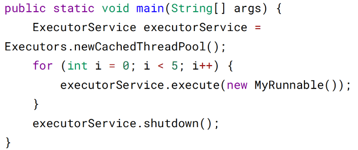
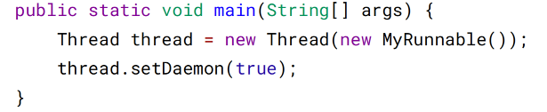
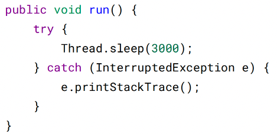
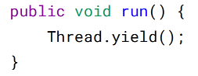

# 二、基础线程机制

## Executor

Executor 管理多个异步任务的执行，而无需程序员显式地管理线程的生命周期。这里
的异步是指多个任务的执行互不干扰，不需要进行同步操作。

主要有三种 Executor：

* CachedThreadPool：一个任务创建一个线程；
* FixedThreadPool：所有任务只能使用固定大小的线程；
* SingleThreadExecutor：相当于大小为 1 的 FixedThreadPool。

## Daemon

守护线程是程序运行时在后台提供服务的线程，不属于程序中不可或缺的部分。

当所有非守护线程结束时，程序也就终止，同时会杀死所有守护线程。

因此，守护线程通常用于执行支持性工作，比如垃圾回收。

### 设置守护线程

main() 属于非守护线程。

在线程启动之前使用 setDaemon() 方法可以将一个线程设置为守护线程。

## sleep()

Thread.sleep(millisec) 方法会休眠当前正在执行的线程，millisec 单位为毫秒。

sleep() 可能会抛出 InterruptedException，因为异常不能跨线程传播回 main() 中，因
此必须在本地进行处理。线程中抛出的其它异常也同样需要在本地进行处理。

## yield()

对静态方法 Thread.yield() 的调用声明了当前线程已经完成了生命周期中最重要的部
分，可以切换给其它线程来执行。该方法只是对线程调度器的一个建议，而且也只是
建议具有相同优先级的其它线程可以运行。

