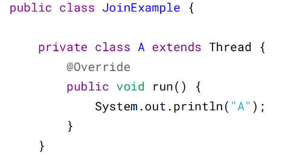
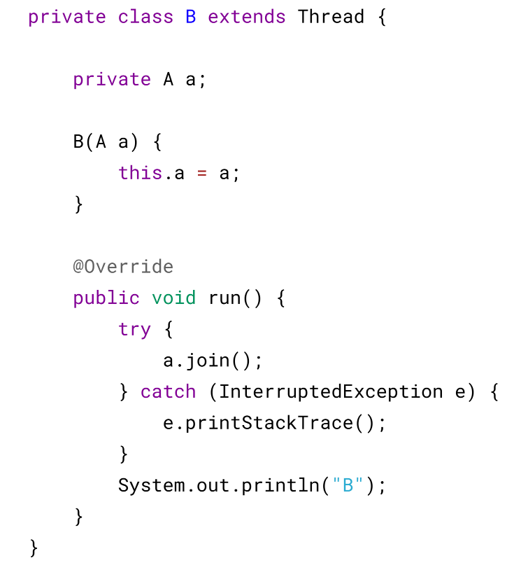
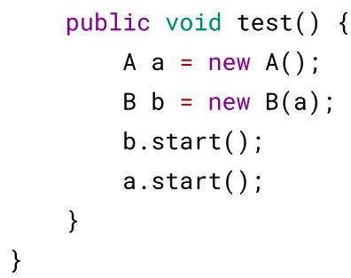
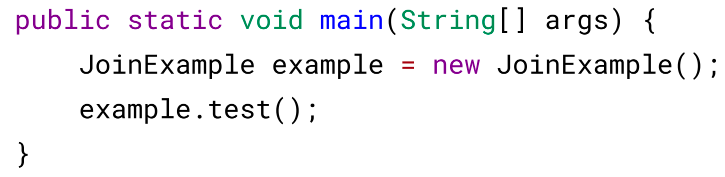
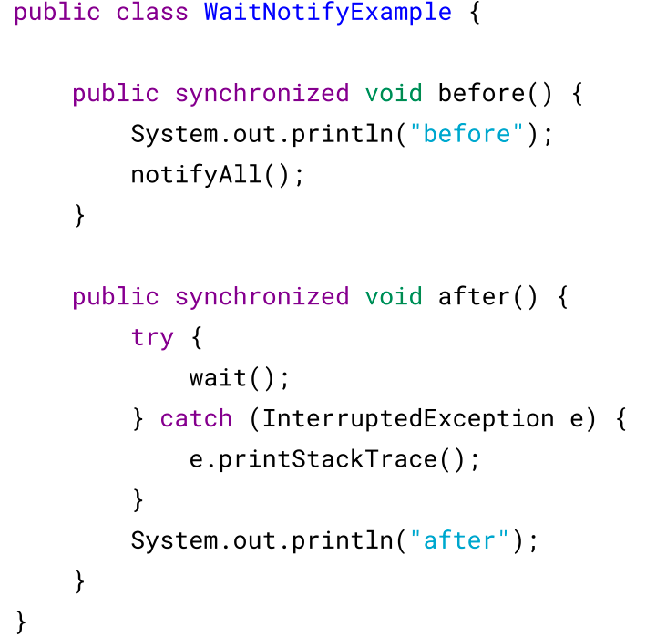
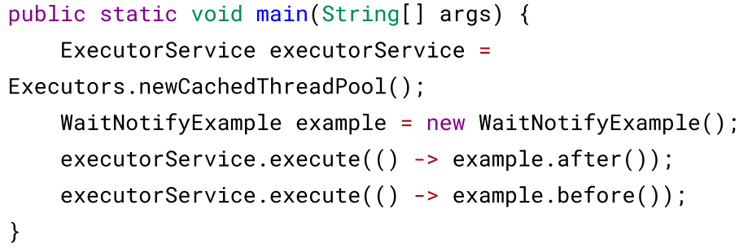
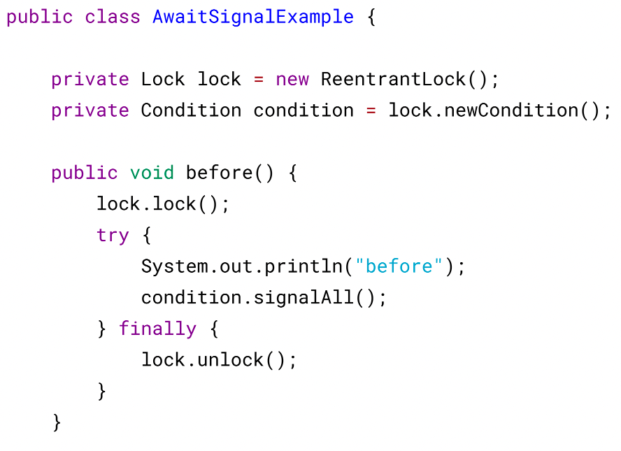
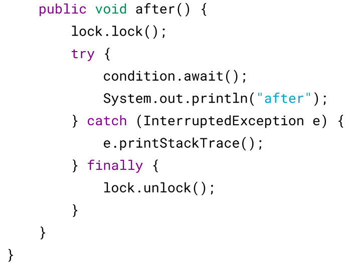
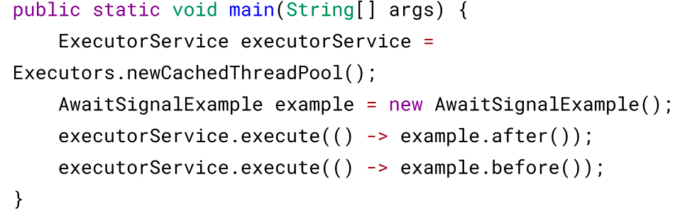

# 五、线程之间的协作

当多个线程可以一起工作去解决某个问题时，如果某些部分必须在其它部分之前完
成，那么就需要对线程进行协调。

## join()

在线程中调用另一个线程的 join() 方法，会将当前线程挂起，而不是忙等待，直到目
标线程结束。

对于以下代码，虽然 b 线程先启动，但是因为在 b 线程中调用了 a 线程的 join() 方
法，b 线程会等待 a 线程结束才继续执行，因此最后能够保证 a 线程的输出先于 b 线
程的输出。

## wait() notify() notifyAll()

调用 wait() 使得线程等待某个条件满足，线程在等待时会被挂起，当其他线程的运行
使得这个条件满足时，其它线程会调用 notify() 或者 notifyAll() 来唤醒挂起的线程。

它们都属于 Object 的一部分，而不属于 Thread。

只能用在同步方法或者同步控制块中使用，否则会在运行时抛出
IllegalMonitorStateException。

使用 wait() 挂起期间，线程会释放锁。这是因为，如果没有释放锁，那么其它线程就
无法进入对象的同步方法或者同步控制块中，那么就无法执行 notify() 或者
notifyAll() 来唤醒挂起的线程，造成死锁。

> wait() 和 sleep() 的区别

wait() 是 Object 的方法，而 sleep() 是 Thread 的静态方法

wait() 会释放锁，sleep() 不会。

## await() signal() signalAll()

java.util.concurrent 类库中提供了 Condition 类来实现线程之间的协调，可以在
Condition 上调用 await() 方法使线程等待，其它线程调用 signal() 或 signalAll() 方法
唤醒等待的线程

相比于 wait() 这种等待方式，await() 可以指定等待的条件，因此更加灵活。

使用 Lock 来获取一个 Condition 对象。

