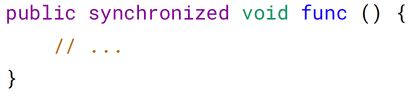

# 四、互斥同步

Java 提供了两种锁机制来控制多个线程对共享资源的互斥访问，第一个是 JVM 实现
的 synchronized，而另一个是 JDK 实现的 ReentrantLock。

## synchronized

1. 同步一个代码块


它只作用于同一个对象，如果调用两个对象上的同步代码块，就不会进行同步。

对于以下代码，使用 ExecutorService 执行了两个线程，由于调用的是同一个对象的
同步代码块，因此这两个线程会进行同步，当一个线程进入同步语句块时，另一个线
程就必须等待。


对于以下代码，两个线程调用了不同对象的同步代码块，因此这两个线程就不需要同
步。从输出结果可以看出，两个线程交叉执行。


2. 同步一个方法



它和同步代码块一样，作用于同一个对象。

3. 同步一个类


作用于整个类，也就是说两个线程调用同一个类的不同对象上的这种同步语句，也会
进行同步。


```angular2html
0 1 2 3 4 5 6 7 8 9 0 1 2 3 4 5 6 7 8 9
```

4. 同步一个静态方法

```angular2html
public synchronized static void fun() {
// ...
}
```

作用于整个类。

## ReentrantLock

ReentrantLock 是 java.util.concurrent（J.U.C）包中的锁。


```angular2html
0 1 2 3 4 5 6 7 8 9 0 1 2 3 4 5 6 7 8 9
```

## 比较

1. 锁的实现

synchronized 是 JVM 实现的，而 ReentrantLock 是 JDK 实现的。

2. 性能

新版本 Java 对 synchronized 进行了很多优化，例如自旋锁等，synchronized 与
ReentrantLock 大致相同。

3. 等待可中断

当持有锁的线程长期不释放锁的时候，正在等待的线程可以选择放弃等待，改为处理
其他事情。

ReentrantLock 可中断，而 synchronized 不行

4. 公平锁

公平锁是指多个线程在等待同一个锁时，必须按照申请锁的时间顺序来依次获得锁。

synchronized 中的锁是非公平的，ReentrantLock 默认情况下也是非公平的，但是也可
以是公平的。

5. 锁绑定多个条件

一个 ReentrantLock 可以同时绑定多个 Condition 对象。

## 使用选择

除非需要使用 ReentrantLock 的高级功能，否则优先使用 synchronized。这是因为
synchronized 是 JVM 实现的一种锁机制，JVM 原生地支持它，而 ReentrantLock 不
是所有的 JDK 版本都支持。并且使用 synchronized 不用担心没有释放锁而导致死锁
问题，因为 JVM 会确保锁的释放。

