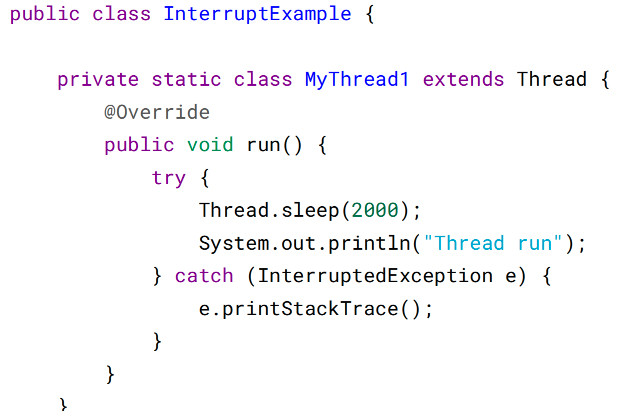
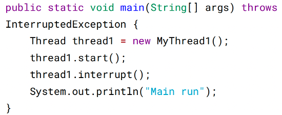
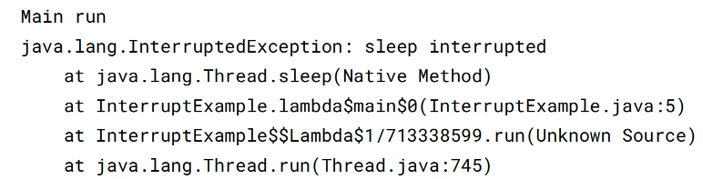
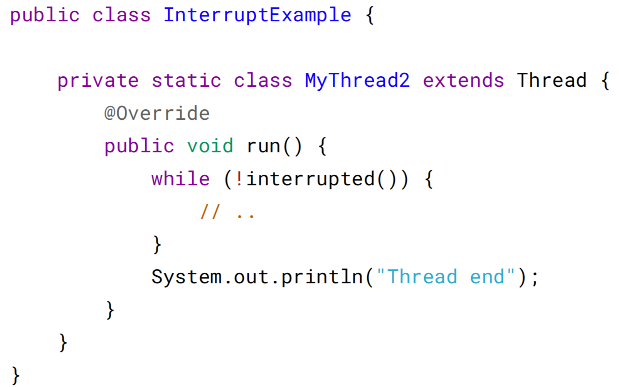
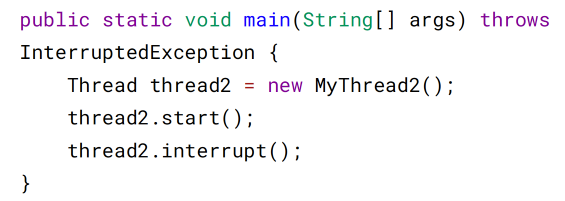
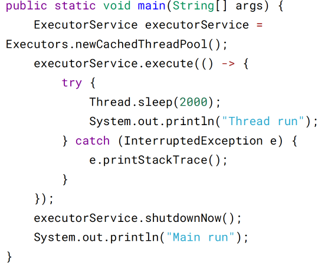
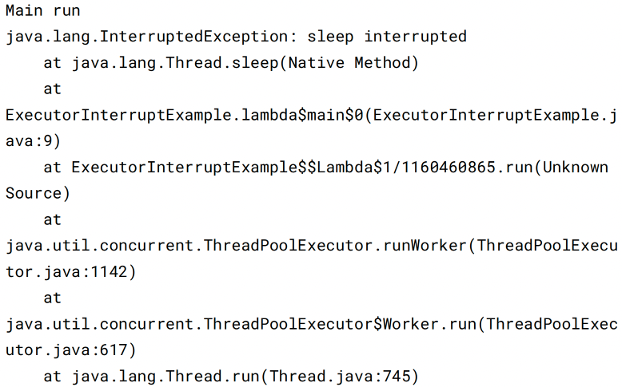
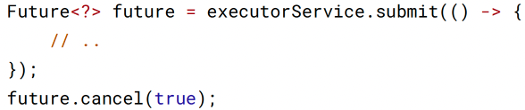

# 三、中断

一个线程执行完毕之后会自动结束，如果在运行过程中发生异常也会提前结束。

## InterruptedException

通过调用一个线程的 interrupt() 来中断该线程，如果该线程处于阻塞、限期等待或者
无限期等待状态，那么就会抛出 InterruptedException，从而提前结束该线程。但是不
能中断 I/O 阻塞和 synchronized 锁阻塞。

对于以下代码，在 main() 中启动一个线程之后再中断它，由于线程中调用了
Thread.sleep() 方法，因此会抛出一个 InterruptedException，从而提前结束线程，不执
行之后的语句。







## interrupted()

如果一个线程的 run() 方法执行一个无限循环，并且没有执行 sleep() 等会抛出
InterruptedException 的操作，那么调用线程的 interrupt() 方法就无法使线程提前结
束。

但是调用 interrupt() 方法会设置线程的中断标记，此时调用 interrupted() 方法会返回
true。因此可以在循环体中使用 interrupted() 方法来判断线程是否处于中断状态，从
而提前结束线程。





```angular2html
Thread end
```

## Executor 的中断操作

调用 Executor 的 shutdown() 方法会等待线程都执行完毕之后再关闭，但是如果调用
的是 shutdownNow() 方法，则相当于调用每个线程的 interrupt() 方法。

以下使用 Lambda 创建线程，相当于创建了一个匿名内部线程。





```angular2html
如果只想中断 Executor 中的一个线程，可以通过使用 submit() 方法来提交一个线
程，它会返回一个 Future<?> 对象，通过调用该对象的 cancel(true) 方法就可以中断
线程。
```




