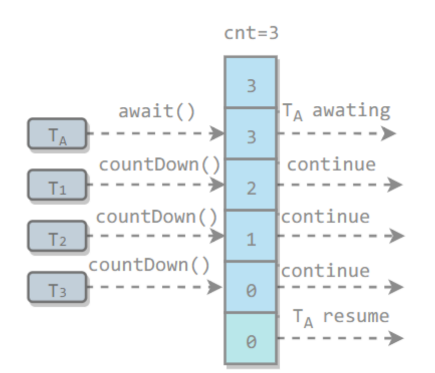
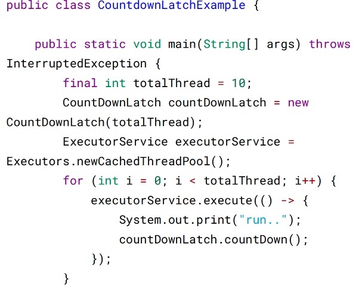
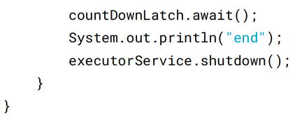
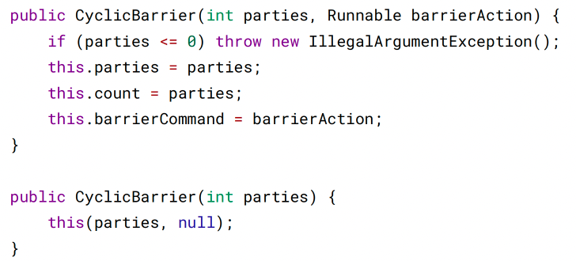
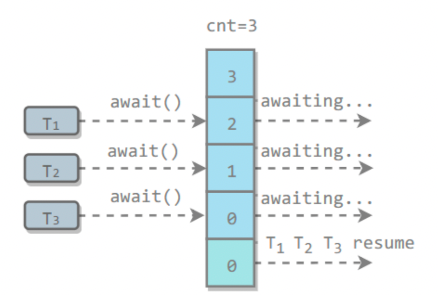
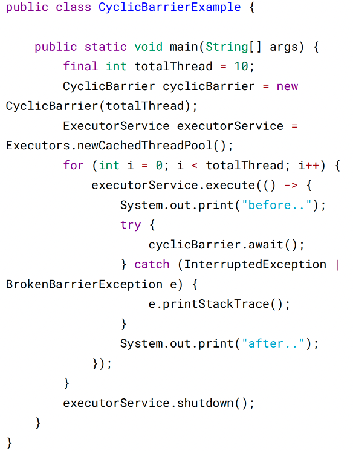
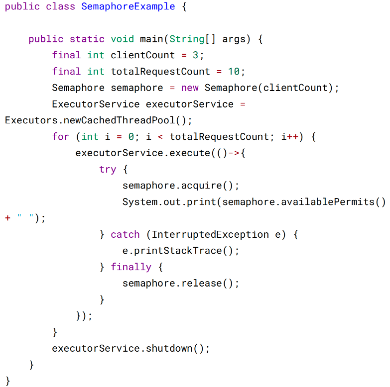

# 七、J.U.C - AQS

java.util.concurrent（J.U.C）大大提高了并发性能，AQS 被认为是 J.U.C 的核心。

## CountDownLatch

用来控制一个或者多个线程等待多个线程。

维护了一个计数器 cnt，每次调用 countDown() 方法会让计数器的值减 1，减到 0 的
时候，那些因为调用 await() 方法而在等待的线程就会被唤醒。







```angular2html
run..run..run..run..run..run..run..run..run..run..end
```

## CyclicBarrier

用来控制多个线程互相等待，只有当多个线程都到达时，这些线程才会继续执行。

和 CountdownLatch 相似，都是通过维护计数器来实现的。线程执行 await() 方法之后
计数器会减 1，并进行等待，直到计数器为 0，所有调用 await() 方法而在等待的线程
才能继续执行。

CyclicBarrier 和 CountdownLatch 的一个区别是，CyclicBarrier 的计数器通过调用
reset() 方法可以循环使用，所以它才叫做循环屏障。

CyclicBarrier 有两个构造函数，其中 parties 指示计数器的初始值，barrierAction 在所
有线程都到达屏障的时候会执行一次。







```angular2html
before..before..before..before..before..before..before..before..b
efore..before..after..after..after..after..after..after..after..a
fter..after..after..
```

## Semaphore

Semaphore 类似于操作系统中的信号量，可以控制对互斥资源的访问线程数。

以下代码模拟了对某个服务的并发请求，每次只能有 3 个客户端同时访问，请求总
数为 10。



```angular2html
2 1 2 2 2 2 2 1 2 2
```

