# J.U.C - 其它组件

## FutureTask


在介绍 `Callable` 时我们知道它可以有返回值，返回值通过 `Future<V>` 进行封装。
`FutureTask` 实现了 `RunnableFuture` 接口，该接口继承自 Runnable 和 `Future<V>` 接
口，这使得 `FutureTask` 既可以当做一个任务执行，也可以有返回值。

```angular2html
public class FutureTask<V> implements RunnableFuture<V>
```

```angular2html
public interface RunnableFuture<V> extends Runnable, Future<V>
```

`FutureTask` 可用于异步获取执行结果或取消执行任务的场景。当一个计算任务需要执行很长时间，那么就可以用一个 `FutureTask` 来包装该任务
，用另一个线程来执行这个 `FutureTask`。这样就能充分利用多核 CPU 的优势，让每个 CPU 核都执行一个线程，从而提升程序的执行效率。

FutureTask 可用于异步获取执行结果或取消执行任务的场景。当一个计算任务需要执
行很长时间，那么就可以用 FutureTask 来封装这个任务，主线程在完成自己的任务
之后再去获取结果。

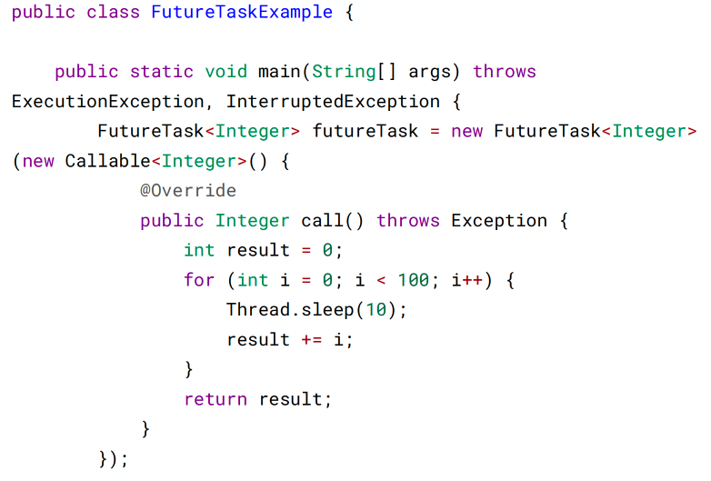

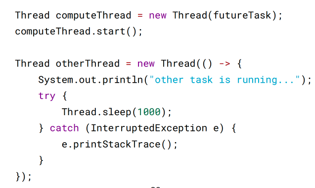

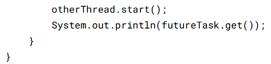

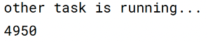

## BlockingQueue

java.util.concurrent.BlockingQueue 接口有以下阻塞队列的实现：

FIFO 队列 ：LinkedBlockingQueue、ArrayBlockingQueue（固定长度）

优先级队列 ：PriorityBlockingQueue

提供了阻塞的 take() 和 put() 方法：如果队列为空 take() 将阻塞，直到队列中有内
容；如果队列为满 put() 将阻塞，直到队列有空闲位置

> 使用 BlockingQueue 实现生产者消费者问题

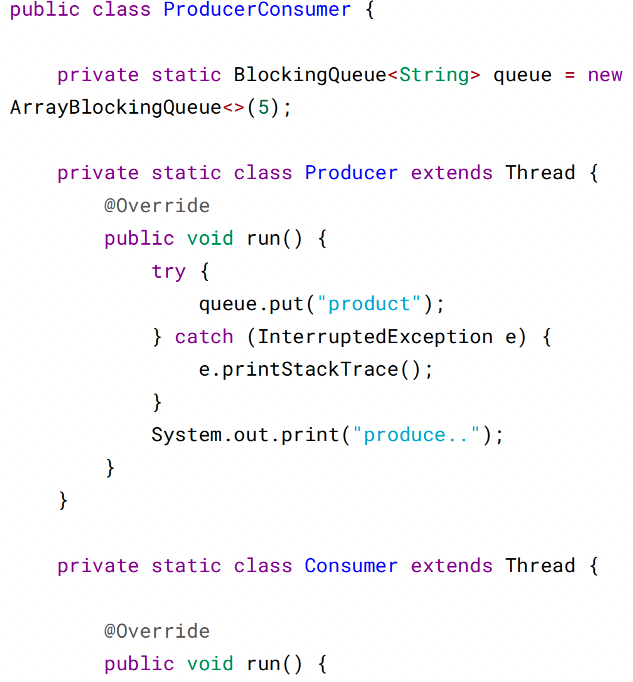

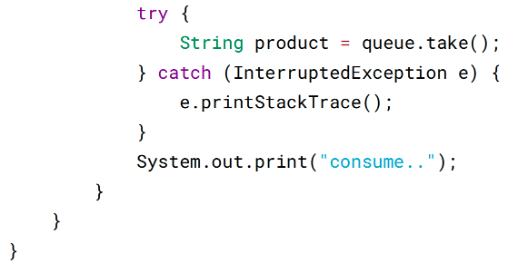

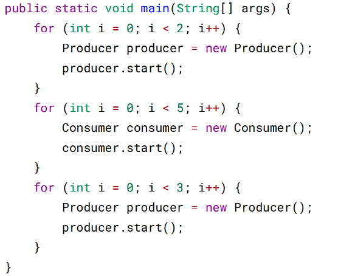

```angular2html
produce..produce..consume..consume..produce..consume..produce..co
nsume..produce..consume..
```

## ForkJoin

主要用于并行计算中，和 MapReduce 原理类似，都是把大的计算任务拆分成多个小
任务并行计算。

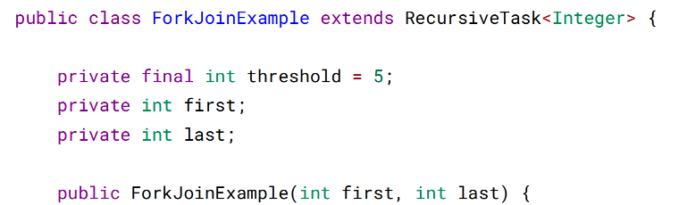

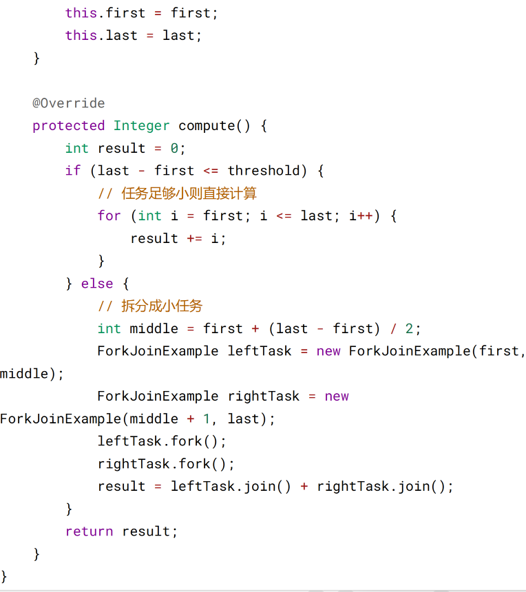

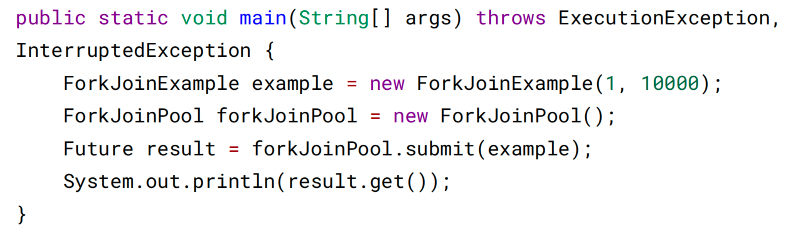

ForkJoin 使用 ForkJoinPool 来启动，它是一个特殊的线程池，线程数量取决于 CPU
核数。

```angular2html
public class ForkJoinPool extends AbstractExecutorService
```

ForkJoinPool 实现了工作窃取算法来提高 CPU 的利用率。每个线程都维护了一个双
端队列，用来存储需要执行的任务。工作窃取算法允许空闲的线程从其它线程的双端
队列中窃取一个任务来执行。窃取的任务必须是最晚的任务，避免和队列所属线程发
生竞争。例如下图中，Thread2 从 Thread1 的队列中拿出最晚的 Task1 任务，Thread1
会拿出 Task2 来执行，这样就避免发生竞争。但是如果队列中只有一个任务时还是会
发生竞争。

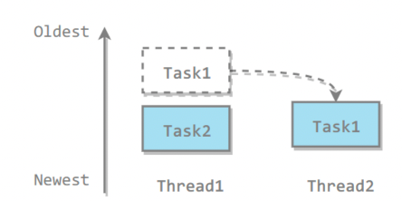

