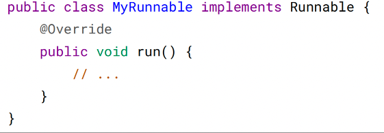
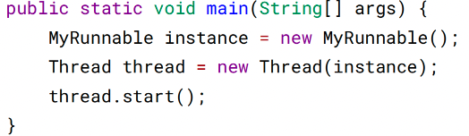
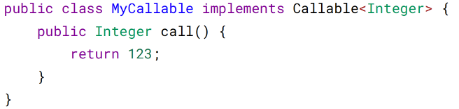
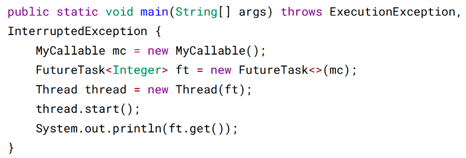
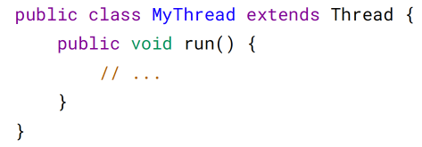
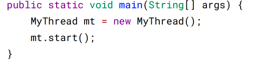

# 一、使用线程

有三种使用线程的方法：
* 实现 Runnable 接口；
* 实现 Callable 接口；
* 继承 Thread 类。

实现 Runnable 和 Callable 接口的类只能当做一个可以在线程中运行的任务，不是真
正意义上的线程，因此最后还需要通过 Thread 来调用。可以理解为任务是通过线程
驱动从而执行的

## 实现 Runnable 接口

需要实现接口中的 run() 方法。

使用 Runnable 实例再创建一个 Thread 实例，然后调用 Thread 实例的 start() 方法来
启动线程。

## 实现 Callable 接口

与 Runnable 相比，Callable 可以有返回值，返回值通过 FutureTask 进行封装

## 继承 Thread 类

同样也是需要实现 run() 方法，因为 Thread 类也实现了 Runable 接口

当调用 start() 方法启动一个线程时，虚拟机会将该线程放入就绪队列中等待被调度，
当一个线程被调度时会执行该线程的 run() 方法

## 实现接口 VS 继承 Thread

实现接口会更好一些，因为：

Java 不支持多重继承，因此继承了 Thread 类就无法继承其它类，但是可以实现
多个接口；

类可能只要求可执行就行，继承整个 Thread 类开销过大。

