# 三、源码分析

基于 JDK 1.8。

在 IDEA 中 double shift 调出 Search EveryWhere，查找源码文件，找到之后就可以阅
读源码。

## ArrayList

1. 概览

因为 ArrayList 是基于数组实现的，所以支持快速随机访问。RandomAccess 接口标识
着该类支持快速随机访问。

```angular2html
public class ArrayList<E> extends AbstractList<E>
implements List<E>, RandomAccess, Cloneable,
java.io.Serializable
```

数组的默认大小为 10。

```
private static final int DEFAULT_CAPACITY = 10;
```

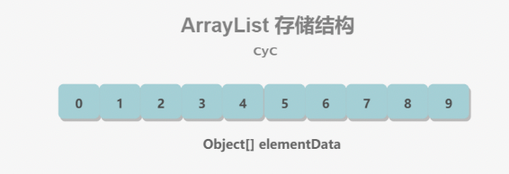

2. 扩容

添加元素时使用 ensureCapacityInternal() 方法来保证容量足够，如果不够时，需要使
用 grow() 方法进行扩容，新容量的大小为 `oldCapacity + (oldCapacity >>
1)` ，即 `oldCapacity+oldCapacity/2`。其中 `oldCapacity >> 1` 需要取整，所以新容量大
约是旧容量的 1.5 倍左右。（oldCapacity 为偶数就是 1.5 倍，为奇数就是 1.5 倍-0.5）

扩容操作需要调用 Arrays.copyOf() 把原数组整个复制到新数组中，这个操作代
价很高，因此最好在创建 ArrayList 对象时就指定大概的容量大小，减少扩容操作的
次数。

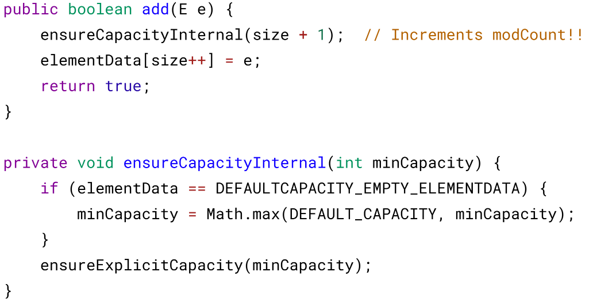

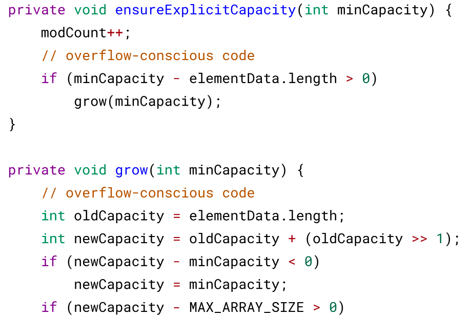

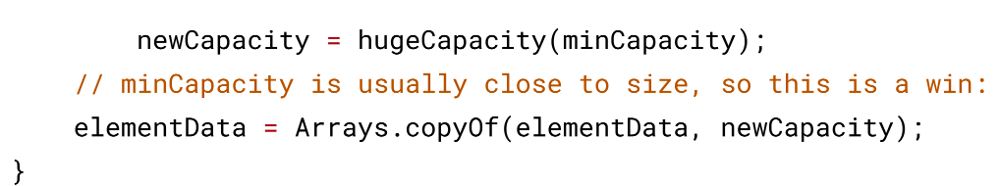

3. 删除元素

需要调用 System.arraycopy() 将 index+1 后面的元素都复制到 index 位置上，该操作
的时间复杂度为 O(N)，可以看到 ArrayList 删除元素的代价是非常高的。

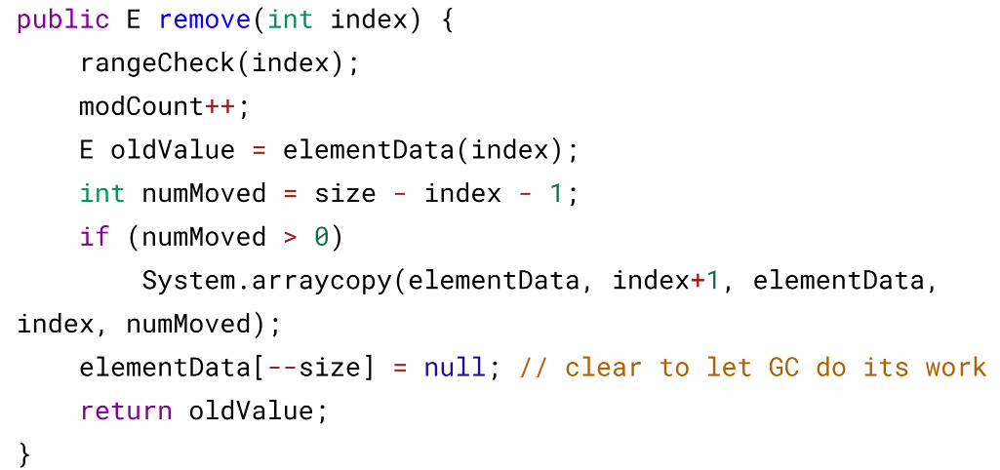

4. 序列化

ArrayList 基于数组实现，并且具有动态扩容特性，因此保存元素的数组不一定都会
被使用，那么就没必要全部进行序列化。

保存元素的数组 elementData 使用 transient 修饰，该关键字声明数组默认不会被序列
化。

```angular2html
transient Object[] elementData; // non-private to simplify nested
class access
```

ArrayList 实现了 writeObject() 和 readObject() 来控制只序列化数组中有元素填充那部
分内容。

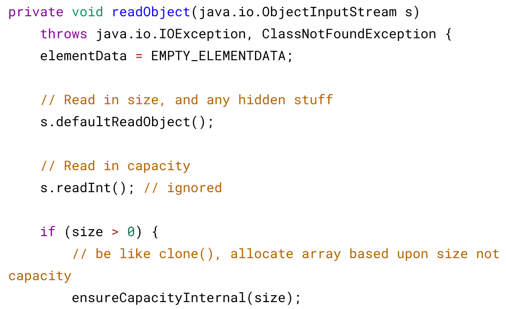

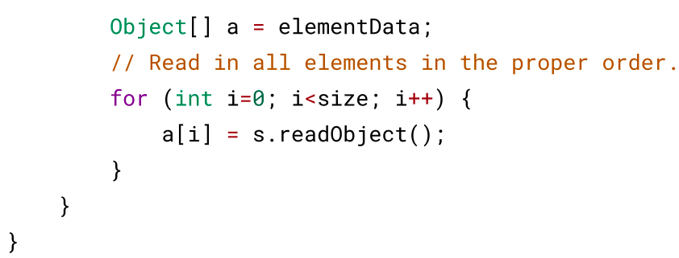

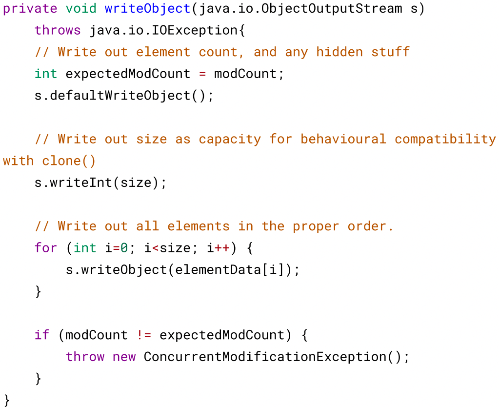

序列化时需要使用 ObjectOutputStream 的 writeObject() 将对象转换为字节流并输出。
而 writeObject() 方法在传入的对象存在 writeObject() 的时候会去反射调用该对象的
writeObject() 来实现序列化。反序列化使用的是 ObjectInputStream 的 readObject() 方
法，原理类似。

```angular2html
ArrayList list = new ArrayList();
ObjectOutputStream oos = new ObjectOutputStream(new
FileOutputStream(file));
oos.writeObject(list);
```

5. Fail-Fast

modCount 用来记录 ArrayList 结构发生变化的次数。结构发生变化是指添加或者删除
至少一个元素的所有操作，或者是调整内部数组的大小，仅仅只是设置元素的值不算
结构发生变化。

在进行序列化或者迭代等操作时，需要比较操作前后 modCount 是否改变，如果改变
了需要抛出 ConcurrentModificationException。代码参考上节序列化中的 writeObject()
方法。

## Vector

1. 同步

它的实现与 ArrayList 类似，但是使用了 synchronized 进行同步。

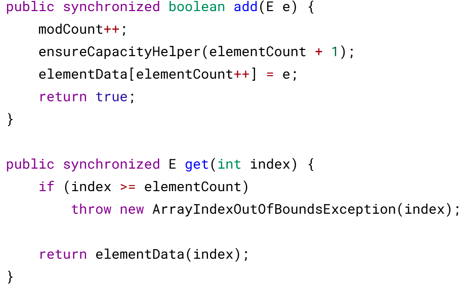

2. 扩容

Vector 的构造函数可以传入 capacityIncrement 参数，它的作用是在扩容时使容量
capacity 增长 capacityIncrement。如果这个参数的值小于等于 0，扩容时每次都令
capacity 为原来的两倍。

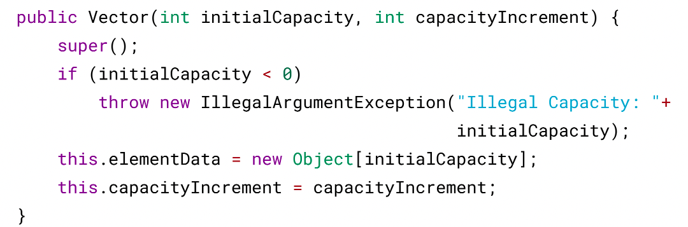

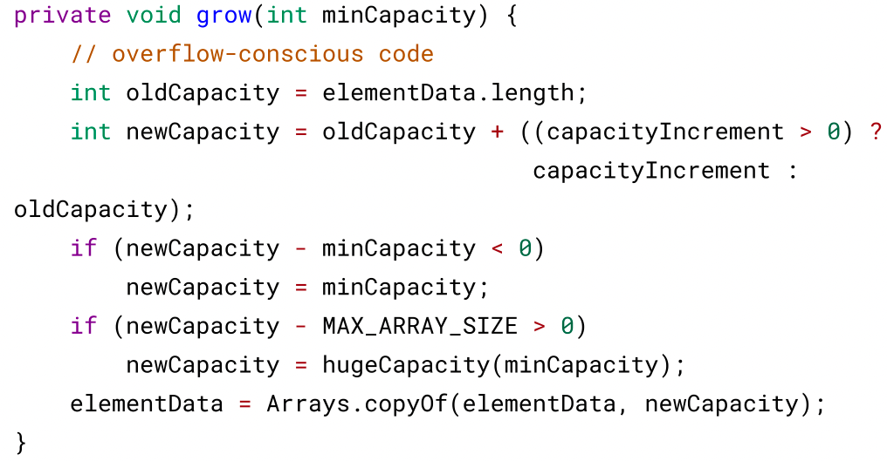

调用没有 capacityIncrement 的构造函数时，capacityIncrement 值被设置为 0，也就是
说默认情况下 Vector 每次扩容时容量都会翻倍。

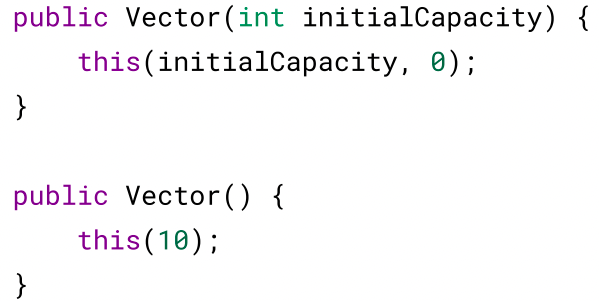

3. 与 ArrayList 的比较

Vector 是同步的，因此开销就比 ArrayList 要大，访问速度更慢。最好使用
ArrayList 而不是 Vector，因为同步操作完全可以由程序员自己来控制；

Vector 每次扩容请求其大小的 2 倍（也可以通过构造函数设置增长的容量），而
ArrayList 是 1.5 倍。

4. 替代方案

可以使用 Collections.synchronizedList(); 得到一个线程安全的 ArrayList。

```angular2html
List<String> list = new ArrayList<>();
List<String> synList = Collections.synchronizedList(list);
```

也可以使用 concurrent 并发包下的 CopyOnWriteArrayList 类。

```angular2html
List<String> list = new CopyOnWriteArrayList<>();
```

## CopyOnWriteArrayList

1. 读写分离

写操作在一个复制的数组上进行，读操作还是在原始数组中进行，读写分离，互不影
响

写操作需要加锁，防止并发写入时导致写入数据丢失。

写操作结束之后需要把原始数组指向新的复制数组。

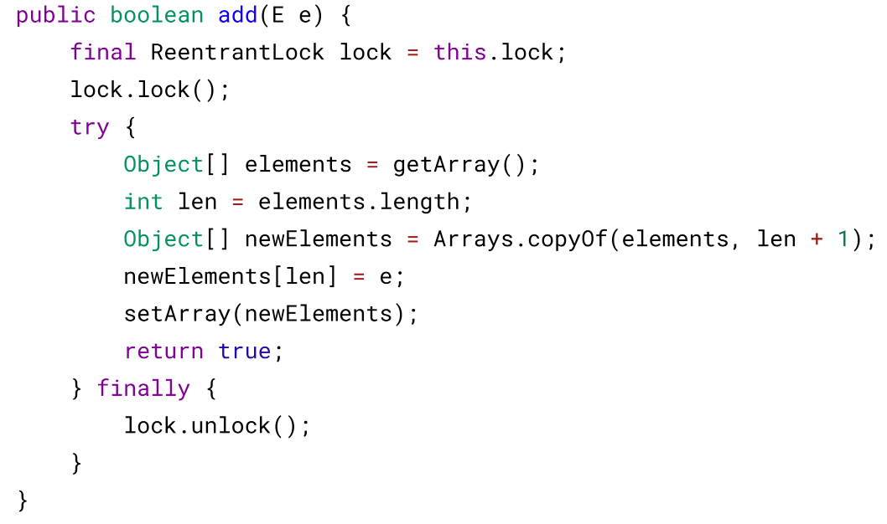

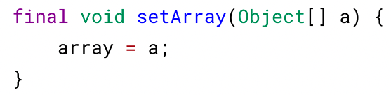

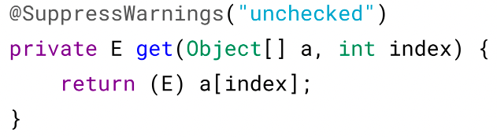

2. 适用场景

CopyOnWriteArrayList 在写操作的同时允许读操作，大大提高了读操作的性能，因此
很适合读多写少的应用场景。

但是 CopyOnWriteArrayList 有其缺陷：

内存占用：在写操作时需要复制一个新的数组，使得内存占用为原来的两倍左
右；

数据不一致：读操作不能读取实时性的数据，因为部分写操作的数据还未同步到
读数组中。

所以 CopyOnWriteArrayList 不适合内存敏感以及对实时性要求很高的场景.

## LinkedList

1. 概览

基于双向链表实现，使用 Node 存储链表节点信息。

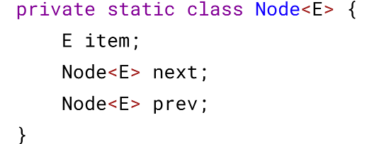

每个链表存储了 first 和 last 指针：

```angular2html
transient Node<E> first;
transient Node<E> last;// 尾指针
```

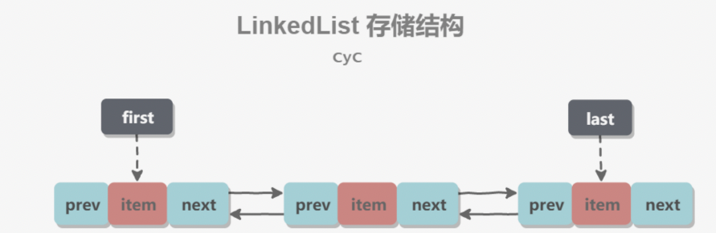

2. 与 ArrayList 的比较

ArrayList 基于动态数组实现，LinkedList 基于双向链表实现。ArrayList 和 LinkedList
的区别可以归结为数组和链表的区别：

- 数组支持随机访问，但插入删除的代价很高，需要移动大量元素；
- 链表不支持随机访问，但插入删除只需要改变指针。

## HashMap

为了便于理解，以下源码分析以 JDK 1.7 为主。

1. 存储结构

内部包含了一个 Entry 类型的数组 table。Entry 存储着键值对。它包含了四个字段，
从 next 字段我们可以看出 Entry 是一个链表。即数组中的每个位置被当成一个桶，
一个桶存放一个链表。HashMap 使用拉链法来解决冲突，同一个链表中存放哈希值
和散列桶取模运算结果相同的 Entry。

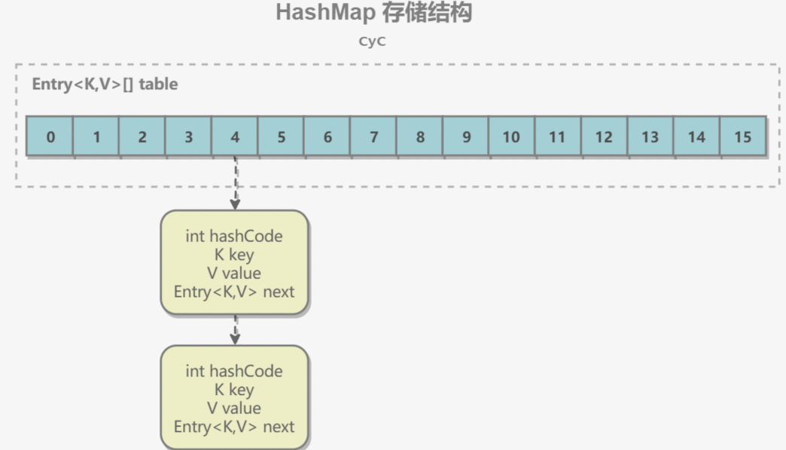

```angular2html
transient Entry[] table;
```

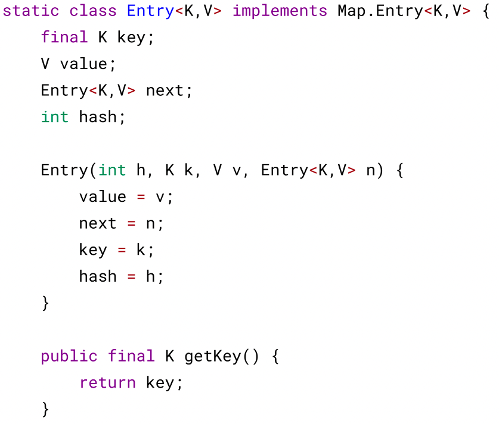

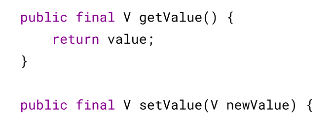

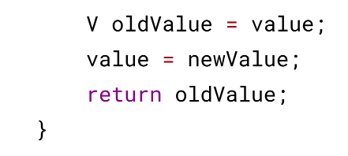

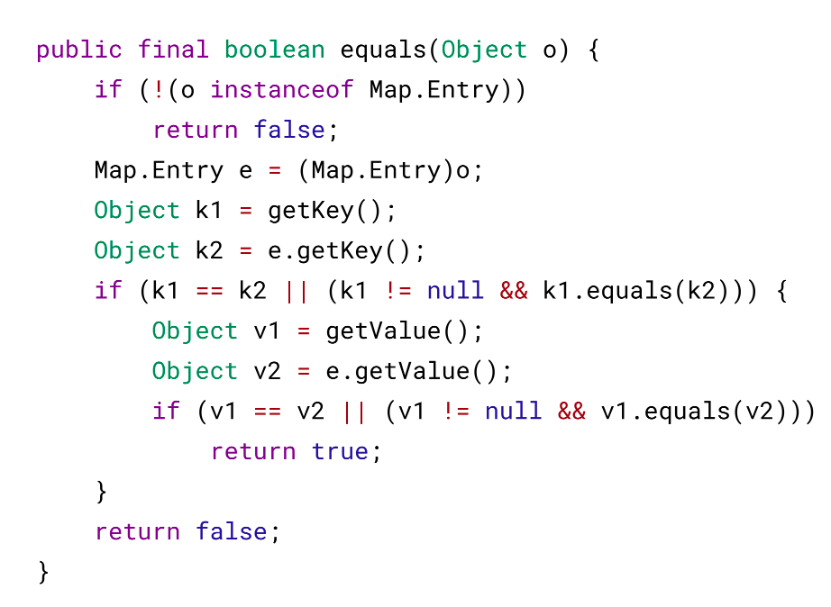

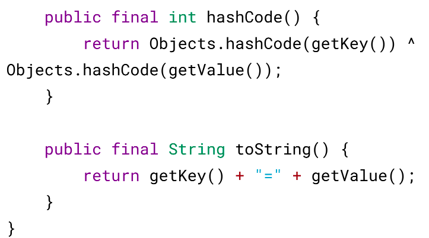

2. 拉链法的工作原理

```angular2html
HashMap<String, String> map = new HashMap<>();
map.put("K1", "V1");
map.put("K2", "V2");
map.put("K3", "V3");
```

新建一个 HashMap，默认大小为 16；

```angular2html
插入 < K1,V1 > 键值对，先计算 K1 的 hashCode 为 115，使用除留余数法得到所
在的桶下标 115%16=3。
插入 < K2,V2 > 键值对，先计算 K2 的 hashCode 为 118，使用除留余数法得到所
在的桶下标 118%16=6。
插入 < K3,V3 > 键值对，先计算 K3 的 hashCode 为 118，使用除留余数法得到所
在的桶下标 118%16=6，插在 < K2,V2 > 前面。
```

应该注意到链表的插入是以头插法方式进行的，例如上面的 `<K3,V3>` 不是插在
`<K2,V2>` 后面，而是插入在链表头部。

查找需要分成两步进行：

- 计算键值对所在的桶；
- 在链表上顺序查找，时间复杂度显然和链表的长度成正比。

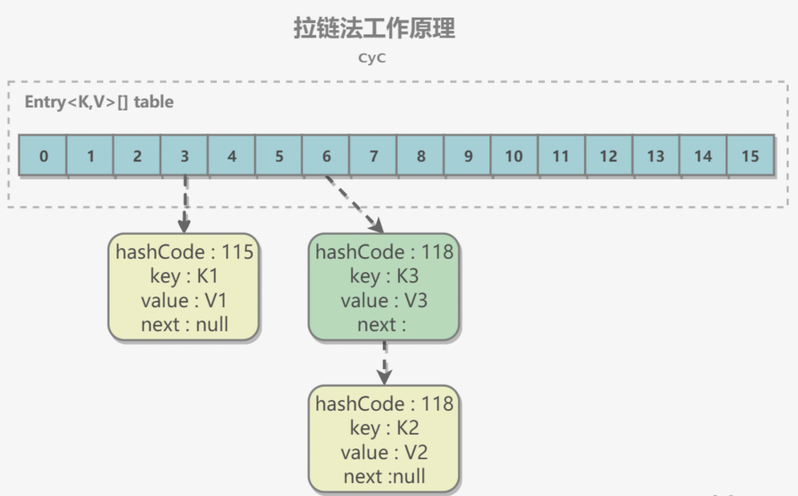

3. put 操作

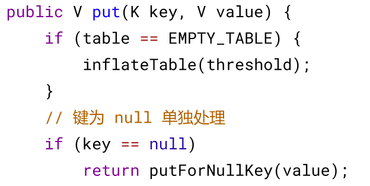

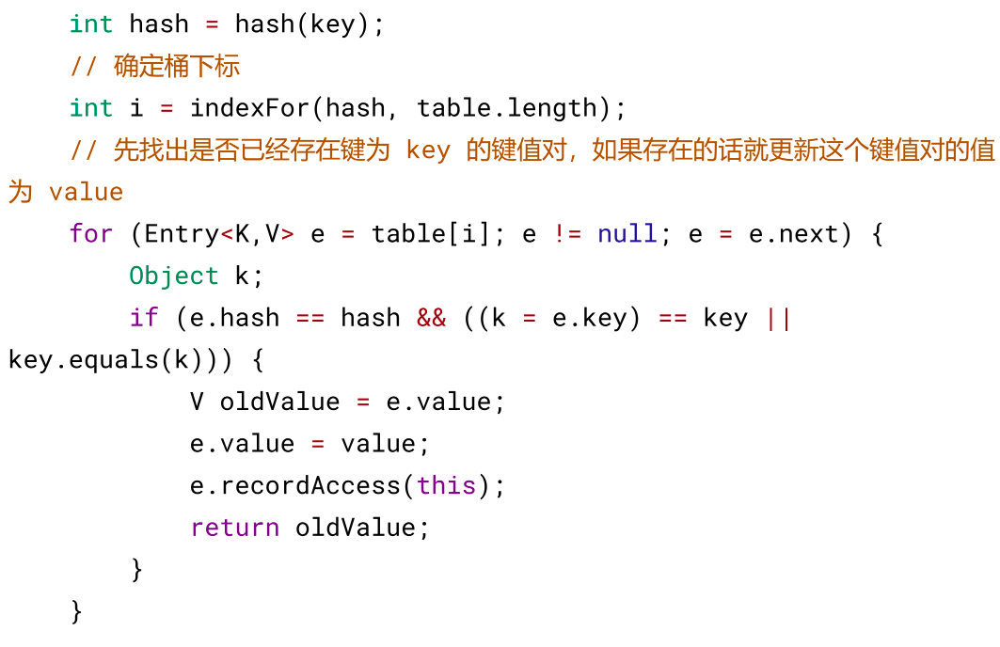

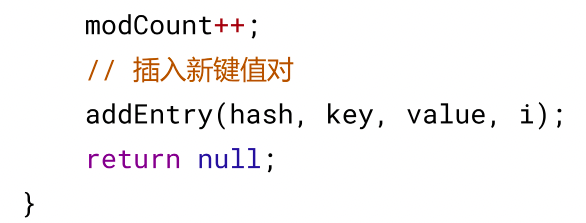

HashMap 允许插入键为 null 的键值对。但是因为无法调用 null 的 hashCode() 方法，
也就无法确定该键值对的桶下标，只能通过强制指定一个桶下标来存放。HashMap
使用第 0 个桶存放键为 null 的键值对。

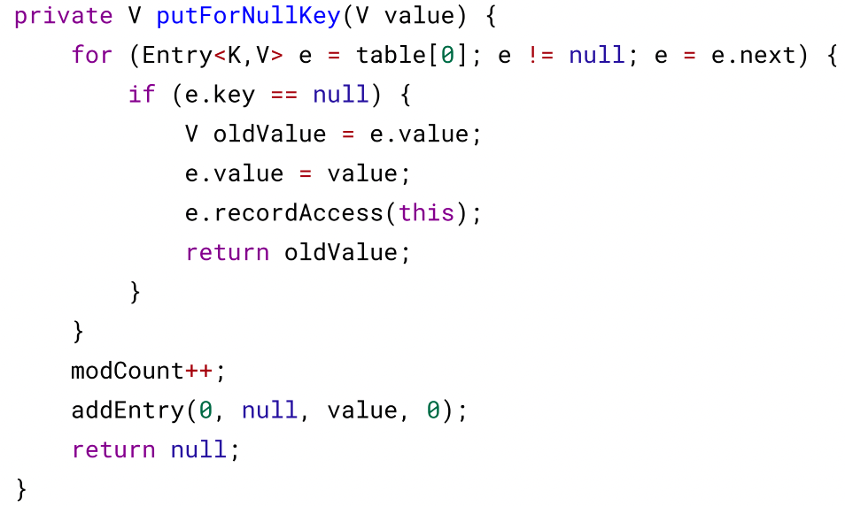

使用链表的头插法，也就是新的键值对插在链表的头部，而不是链表的尾部

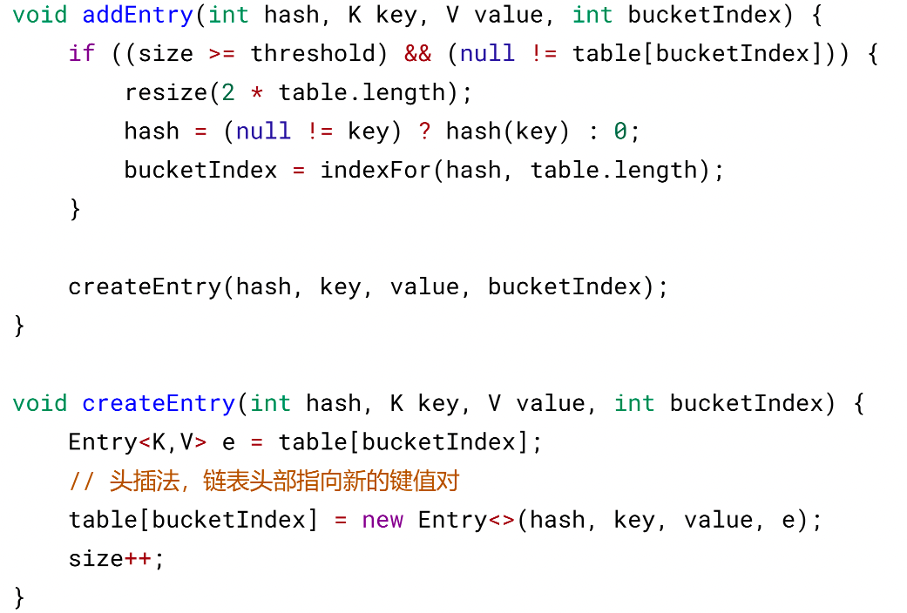

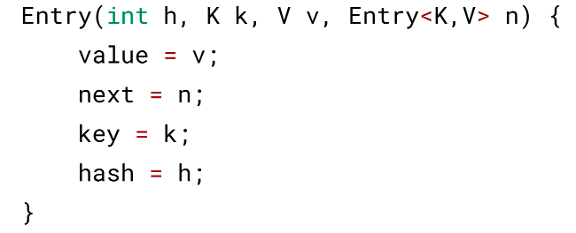

4. 确定桶下标

很多操作都需要先确定一个键值对所在的桶下标。

```angular2html
int hash = hash(key);
int i = indexFor(hash, table.length);
```

4.1 计算 hash 值

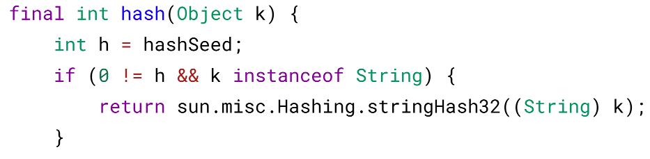

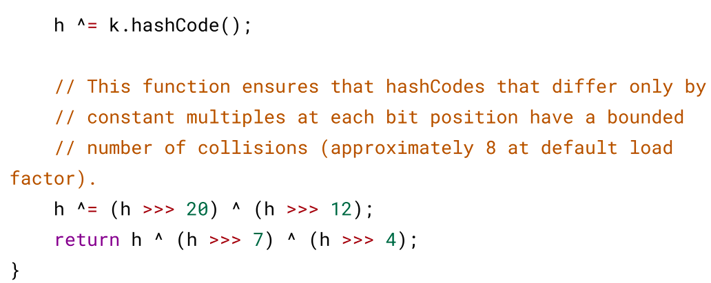

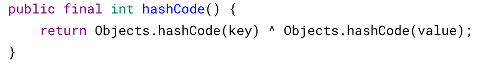

4.2 取模

```angular2html
令 x = 1<<4，即 x 为 2 的 4 次方，它具有以下性质：

x : 00010000
x-1 : 00001111

令一个数 y 与 x-1 做与运算，可以去除 y 位级表示的第 4 位以上数：

y : 10110010
x-1 : 00001111
y&(x-1) : 00000010

这个性质和 y 对 x 取模效果是一样的：

y : 10110010
x : 00010000
y%x : 00000010


```

我们知道，位运算的代价比求模运算小的多，因此在进行这种计算时用位运算的话能
带来更高的性能。

确定桶下标的最后一步是将 key 的 hash 值对桶个数取模：hash%capacity，如果能保
证 capacity 为 2 的 n 次方，那么就可以将这个操作转换为位运算。

```angular2html

static int indexFor(int h, int length) {
return h & (length-1);
}
```

5. 扩容-基本原理

设 HashMap 的 table 长度为 M，需要存储的键值对数量为 N，如果哈希函数满足均
匀性的要求，那么每条链表的长度大约为 N/M，因此查找的复杂度为 O(N/M)。

为了让查找的成本降低，应该使 N/M 尽可能小，因此需要保证 M 尽可能大，也就是
说 table 要尽可能大。HashMap 采用动态扩容来根据当前的 N 值来调整 M 值，使得
空间效率和时间效率都能得到保证。

和扩容相关的参数主要有：capacity、size、threshold 和 load_factor。

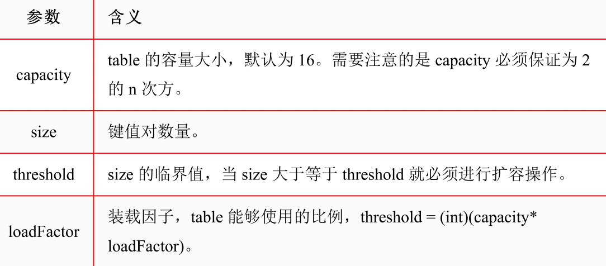

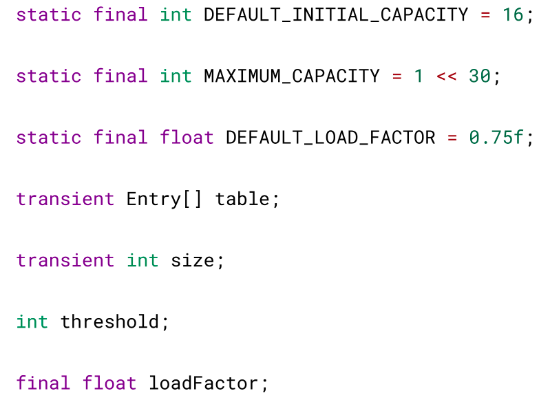

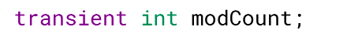

从下面的添加元素代码中可以看出，当需要扩容时，令 capacity 为原来的两倍。

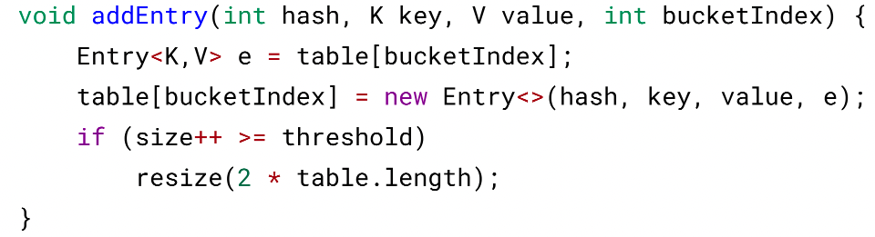

扩容使用 resize() 实现，需要注意的是，扩容操作同样需要把 oldTable 的所有键值对
重新插入 newTable 中，因此这一步是很费时的。

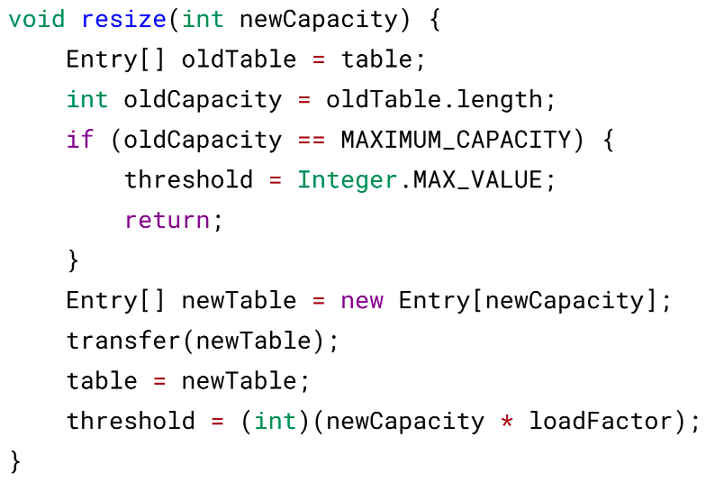

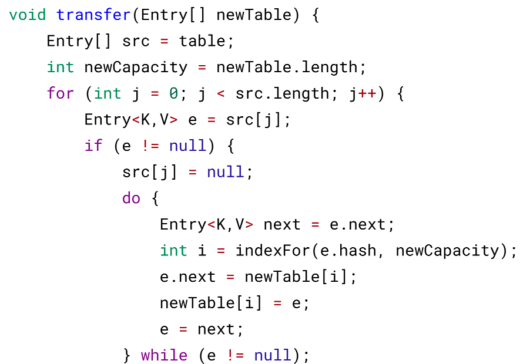

6. 扩容-重新计算桶下标

在进行扩容时，需要把键值对重新计算桶下标，从而放到对应的桶上。在前面提到，
HashMap 使用 hash%capacity 来确定桶下标。HashMap capacity 为 2 的 n 次方这一特
点能够极大降低重新计算桶下标操作的复杂度。

假设原数组长度 capacity 为 16，扩容之后 new capacity 为 32：

```angular2html
capacity : 00010000
new capacity : 00100000
```

对于一个 Key，它的哈希值 hash 在第 5 位：

```angular2html
为 0，那么 hash%00010000 = hash%00100000，桶位置和原来一致；
为 1，hash%00010000 = hash%00100000 + 16，桶位置是原位置 + 16。

```

7. 计算数组容量

HashMap 构造函数允许用户传入的容量不是 2 的 n 次方，因为它可以自动地将传入
的容量转换为 2 的 n 次方。

先考虑如何求一个数的掩码，对于 10010000，它的掩码为 11111111，可以使用以下
方法得到：

```angular2html
mask |= mask >> 1 11011000
mask |= mask >> 2 11111110
mask |= mask >> 4 11111111
```

mask+1 是大于原始数字的最小的 2 的 n 次方。

```angular2html
num 10010000
mask+1 100000000
```

以下是 HashMap 中计算数组容量的代码：

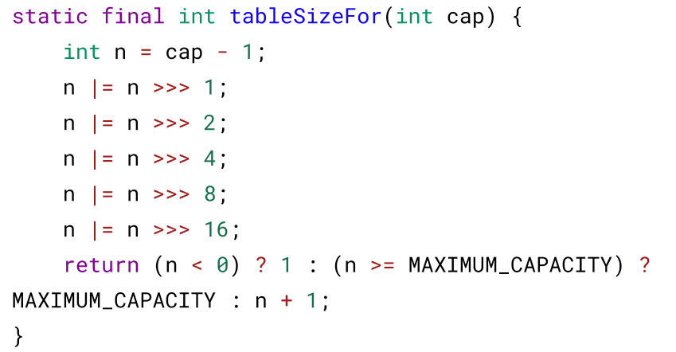

8. 链表转红黑树

从 JDK 1.8 开始，一个桶存储的链表长度大于等于 8 时会将链表转换为红黑树。

9. 与 Hashtable 的比较

1. Hashtable 使用 synchronized 来进行同步。
2. HashMap 可以插入键为 null 的 Entry。
3. HashMap 的迭代器是 fail-fast 迭代器。
4. HashMap 不能保证随着时间的推移 Map 中的元素次序是不变的。

## ConcurrentHashMap

1. 存储结构

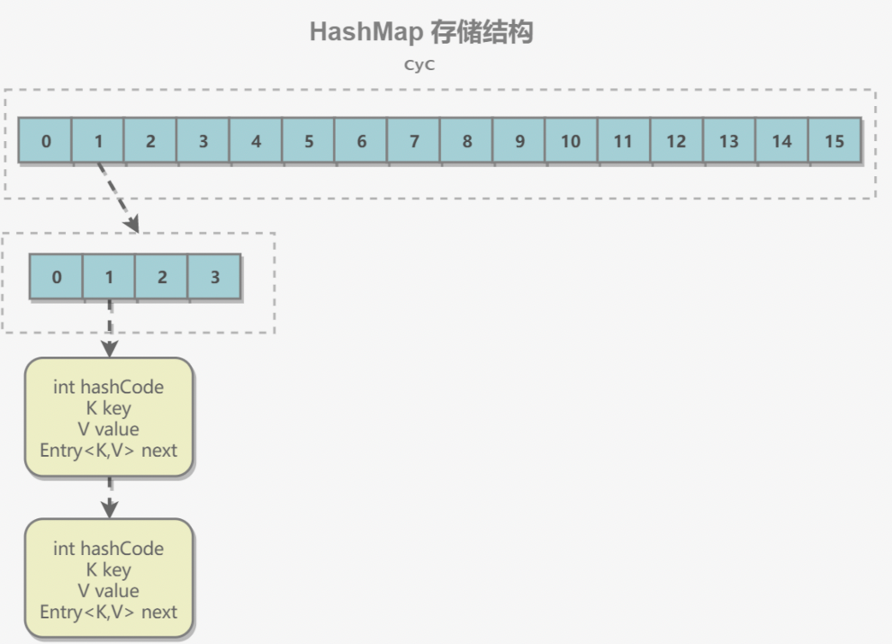

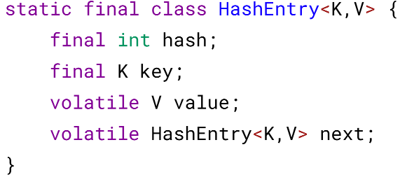

ConcurrentHashMap 和 HashMap 实现上类似，最主要的差别是 ConcurrentHashMap
采用了分段锁（Segment），每个分段锁维护着几个桶（HashEntry），多个线程可以
同时访问不同分段锁上的桶，从而使其并发度更高（并发度就是 Segment 的个
数）。

Segment 继承自 ReentrantLock。

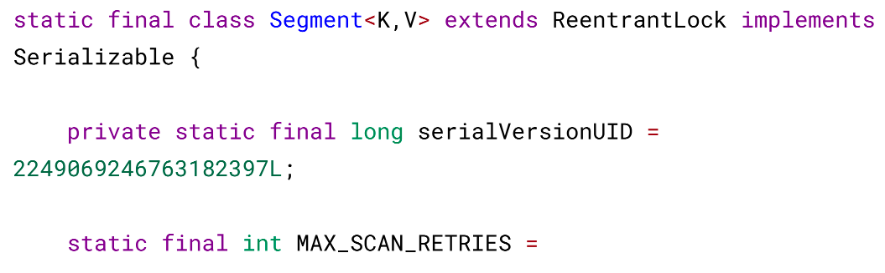

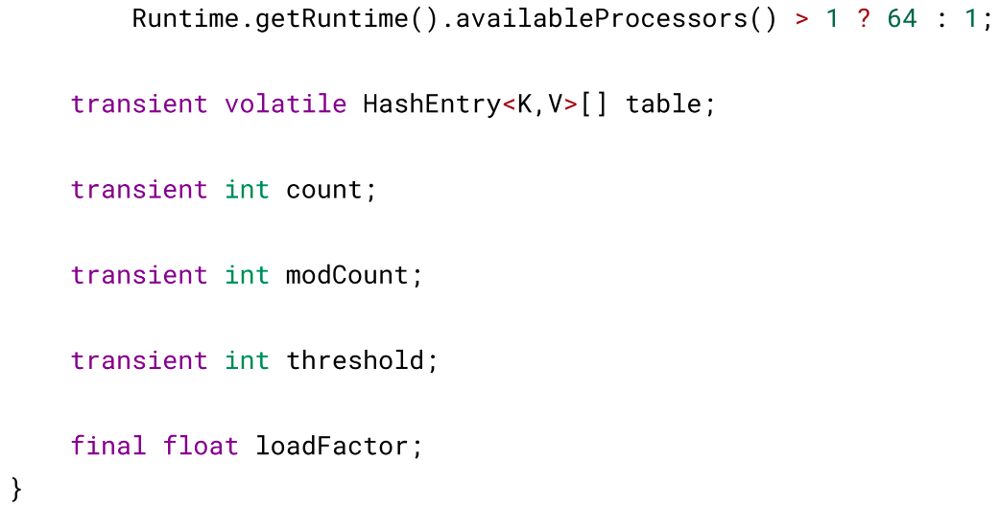

```angular2html
final Segment<K,V>[] segments;
```

默认的并发级别为 16，也就是说默认创建 16 个 Segment。

```angular2html
static final int DEFAULT_CONCURRENCY_LEVEL = 16;
```

2. size 操作

每个 Segment 维护了一个 count 变量来统计该 Segment 中的键值对个数。

```angular2html
/**
* The number of elements. Accessed only either within locks
* or among other volatile reads that maintain visibility.
*/
transient int count;
```

在执行 size 操作时，需要遍历所有 Segment 然后把 count 累计起来。

ConcurrentHashMap 在执行 size 操作时先尝试不加锁，如果连续两次不加锁操作得到
的结果一致，那么可以认为这个结果是正确的。

尝试次数使用 RETRIES_BEFORE_LOCK 定义，该值为 2，retries 初始值为 -1，因此
尝试次数为 3。

如果尝试的次数超过 3 次，就需要对每个 Segment 加锁。

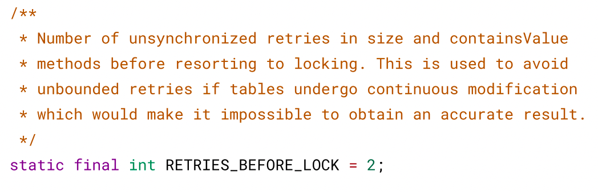

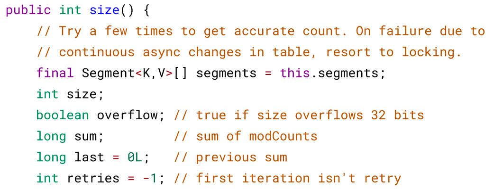

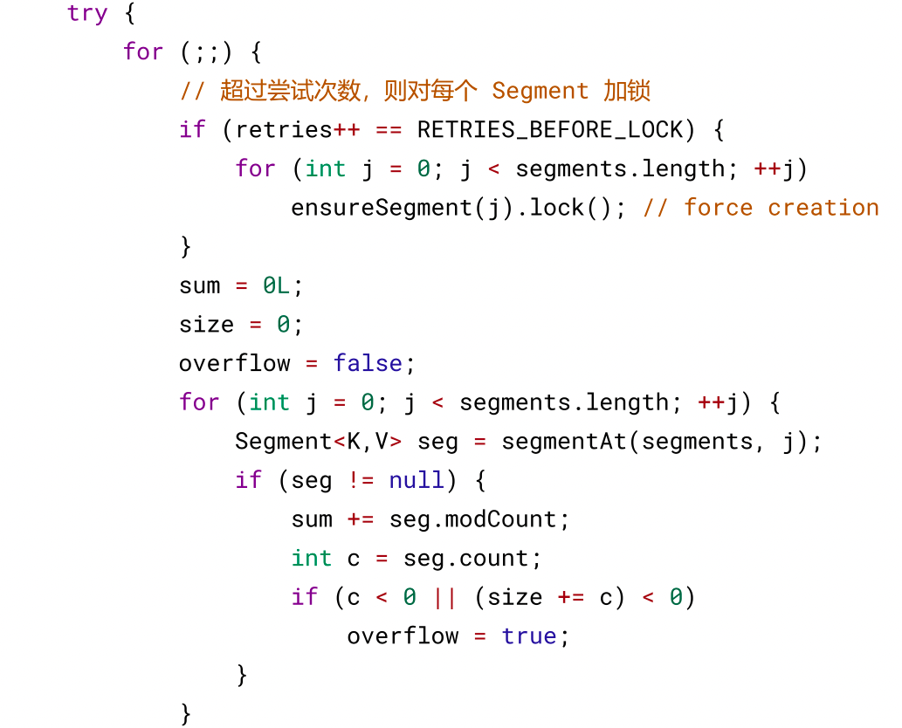

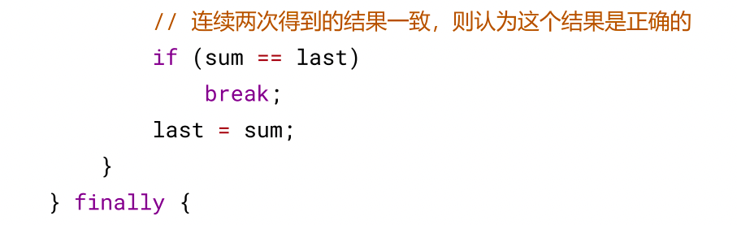

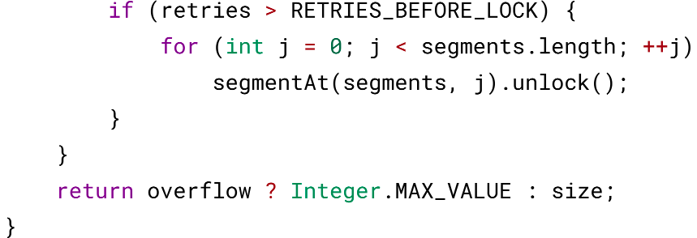

3. JDK 1.8 的改动

JDK 1.7 使用分段锁机制来实现并发更新操作，核心类为 Segment，它继承自重入锁
ReentrantLock，并发度与 Segment 数量相等。

JDK 1.8 使用了 CAS 操作来支持更高的并发度，在 CAS 操作失败时使用内置锁
synchronized。

并且 JDK 1.8 的实现也在链表过长时会转换为红黑树。

## LinkedHashMap

存储结构

继承自 HashMap，因此具有和 HashMap 一样的快速查找特性。

```angular2html
public class LinkedHashMap<K,V> extends HashMap<K,V> implements
Map<K,V>
```

内部维护了一个双向链表，用来维护插入顺序或者 LRU 顺序。

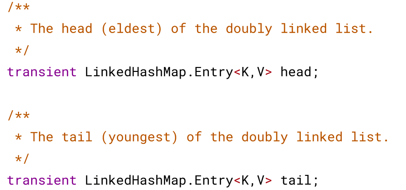

accessOrder 决定了顺序，默认为 false，此时维护的是插入顺序。

```angular2html
final boolean accessOrder;
```

LinkedHashMap 最重要的是以下用于维护顺序的函数，它们会在 put、get 等方法中
调用。

```angular2html
void afterNodeAccess(Node<K,V> p) { }
void afterNodeInsertion(boolean evict) { }
```

> afterNodeAccess()

当一个节点被访问时，如果 accessOrder 为 true，则会将该节点移到链表尾部。也就
是说指定为 LRU 顺序之后，在每次访问一个节点时，会将这个节点移到链表尾部，
保证链表尾部是最近访问的节点，那么链表首部就是最近最久未使用的节点。

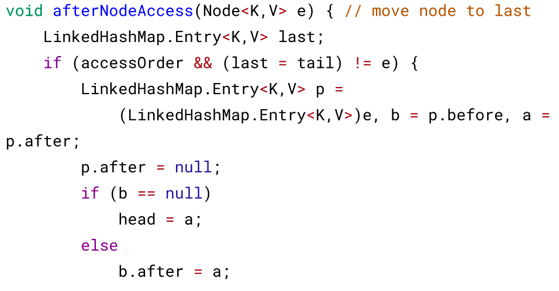

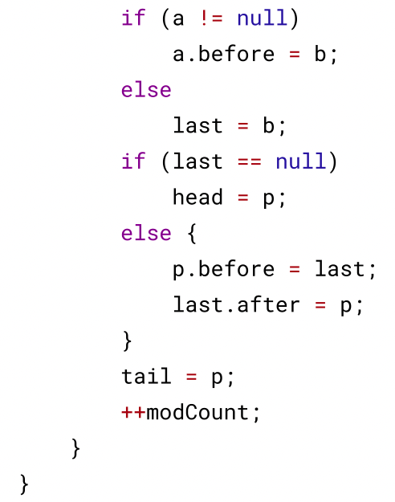

> afterNodeInsertion()

在 put 等操作之后执行，当 removeEldestEntry() 方法返回 true 时会移除最晚的节点，
也就是链表首部节点 first。

evict 只有在构建 Map 的时候才为 false，在这里为 true。

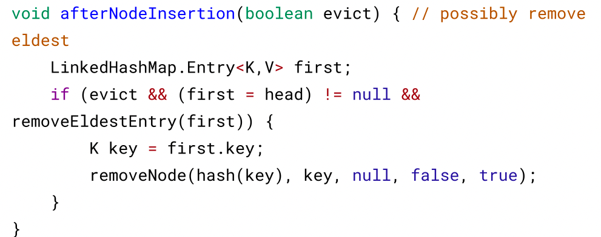

removeEldestEntry() 默认为 false，如果需要让它为 true，需要继承 LinkedHashMap 并
且覆盖这个方法的实现，这在实现 LRU 的缓存中特别有用，通过移除最近最久未使
用的节点，从而保证缓存空间足够，并且缓存的数据都是热点数据。

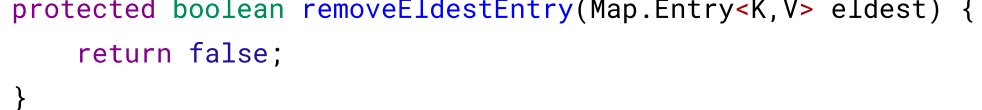

> LRU 缓存

以下是使用 LinkedHashMap 实现的一个 LRU 缓存：

1. 设定最大缓存空间 MAX_ENTRIES 为 3；
2. 使用 LinkedHashMap 的构造函数将 accessOrder 设置为 true，开启 LRU 顺序；
3. 覆盖 removeEldestEntry() 方法实现，在节点多于 MAX_ENTRIES 就会将最近最 久未使用的数据移除。

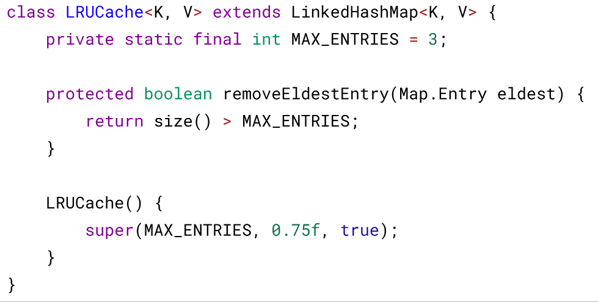

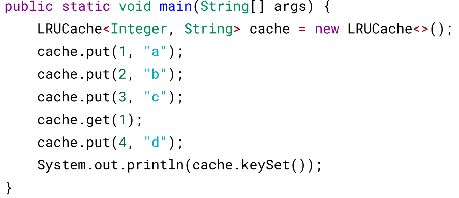

```angular2html
[3, 1, 4]
```

## WeakHashMap

> 存储结构

WeakHashMap 的 Entry 继承自 WeakReference，被 WeakReference 关联的对象在下一
次垃圾回收时会被回收。

WeakHashMap 主要用来实现缓存，通过使用 WeakHashMap 来引用缓存对象，由
JVM 对这部分缓存进行回收。

```angular2html
private static class Entry<K,V> extends WeakReference<Object>
implements Map.Entry<K,V>
```

### ConcurrentCache

Tomcat 中的 ConcurrentCache 使用了 WeakHashMap 来实现缓存功能。

ConcurrentCache 采取的是分代缓存：

经常使用的对象放入 eden 中，eden 使用 ConcurrentHashMap 实现，不用担心会
被回收（伊甸园）；

不常用的对象放入 longterm，longterm 使用 WeakHashMap 实现，这些老对象会
被垃圾收集器回收。

当调用 get() 方法时，会先从 eden 区获取，如果没有找到的话再到 longterm 获
取，当从 longterm 获取到就把对象放入 eden 中，从而保证经常被访问的节点不容
易被回收。

当调用 put() 方法时，如果 eden 的大小超过了 size，那么就将 eden 中的所有对象
都放入 longterm 中，利用虚拟机回收掉一部分不经常使用的对象。


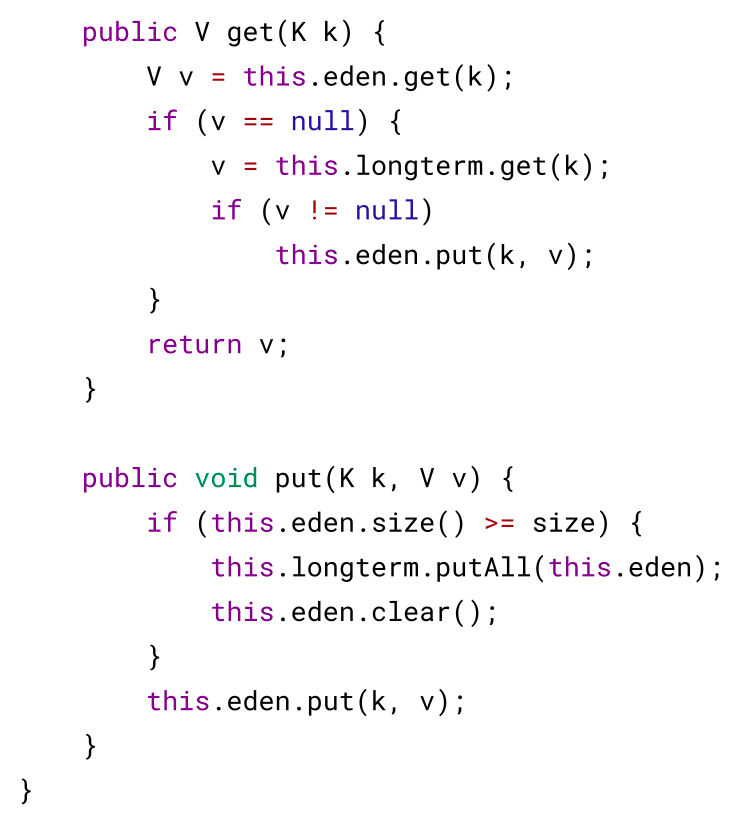
