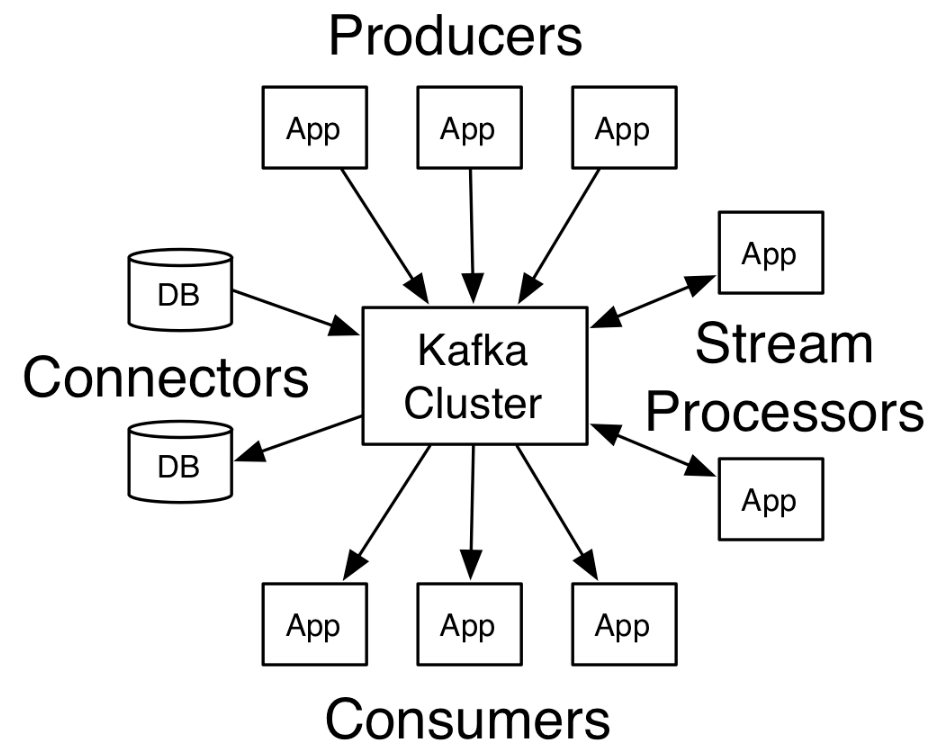
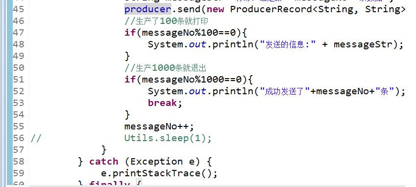
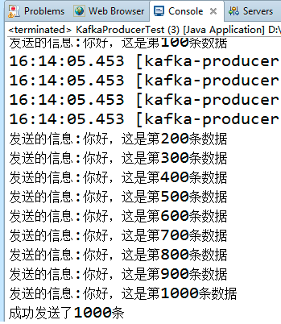
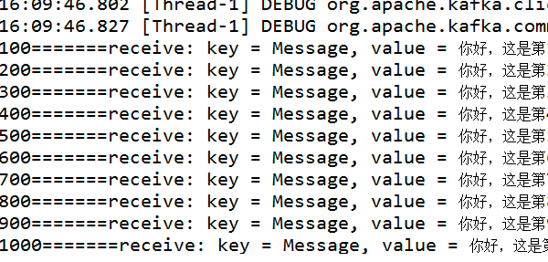

# Kafka 使用Java实现数据的生产和消费demo

## Kafka的介绍

Kafka是一种高吞吐量的分布式发布订阅消息系统，它可以处理消费者规模的网站中的所有动作流数据。

Kafka 有如下特性：

- 以时间复杂度为O(1)的方式提供消息持久化能力，即使对TB级以上数据也能保证常数时间复杂度的访问性能。
- 高吞吐率。即使在非常廉价的商用机器上也能做到单机支持每秒100K条以上消息的传输。
- 支持Kafka Server间的消息分区，及分布式消费，同时保证每个Partition内的消息顺序传输。
- 同时支持离线数据处理和实时数据处理。
- Scale out：支持在线水平扩展。

## kafka的术语

1. Broker：Kafka集群包含一个或多个服务器，这种服务器被称为broker。
2. Topic：每条发布到Kafka集群的消息都有一个类别，这个类别被称为Topic。（物理上不同Topic的消息分开存储，逻辑上一个Topic的消息虽然保存于一个或多个broker上但用户只需指定消息的Topic即可生产或消费数据而不必关心数据存于何处）
3. Partition：Partition是物理上的概念，每个Topic包含一个或多个Partition。
4. Producer：负责发布消息到Kafka broker。
5. Consumer：消息消费者，向Kafka broker读取消息的客户端。
6. Consumer Group:每个Consumer属于一个特定的Consumer Group（可为每个Consumer指定group name，若不指定group name则属于默认的group）。

## kafka核心Api

kafka有四个核心API

- 应用程序使用producer API发布消息到1个或多个topic中。
- 应用程序使用consumer API来订阅一个或多个topic,并处理产生的消息。
- 应用程序使用streams API充当一个流处理器,从1个或多个topic消费输入流,并产生一个输出流到1个或多个topic,有效地将输入流转换到输出流。
- connector API允许构建或运行可重复使用的生产者或消费者,将topic链接到现有的应用程序或数据系统。



## kafka 应用场景

1. 构建可在系统或应用程序之间可靠获取数据的实时流数据管道。
2. 构建实时流应用程序，可以转换或响应数据流。

## 开发准备

如果我们要开发一个kafka的程序，应该做些什么呢？

首先，在搭建好kafka环境之后，我们要考虑的是我们是生产者还是消费者，也就是消息的发送者还是接受者。

用的开发语言是Java，构建工具Maven。

```angular2html
<dependency>
    <groupId>org.apache.kafka</groupId>
     <artifactId>kafka_2.12</artifactId>
     <version>1.0.0</version>
        <scope>provided</scope> 
    </dependency>

    <dependency>
         <groupId>org.apache.kafka</groupId>
         <artifactId>kafka-clients</artifactId>
          <version>1.0.0</version>
    </dependency>

    <dependency>
        <groupId>org.apache.kafka</groupId>
        <artifactId>kafka-streams</artifactId>
        <version>1.0.0</version>
    </dependency>
</dependency>
```

## Kafka Producer

在开发生产的时候，先简单的介绍下kafka各种配置说明：

1. bootstrap.servers： kafka的地址。
2. acks:消息的确认机制，默认值是0。
3. acks=0：如果设置为0，生产者不会等待kafka的响应。
4. acks=1：这个配置意味着kafka会把这条消息写到本地日志文件中，但是不会等待集群中其他机器的成功响应。
5. acks=all：这个配置意味着leader会等待所有的follower同步完成。这个确保消息不会丢失，除非kafka集群中所有机器挂掉。这是最强的可用性保证。
6. retries：配置为大于0的值的话，客户端会在消息发送失败时重新发送。
7. batch.size:当多条消息需要发送到同一个分区时，生产者会尝试合并网络请求。这会提高client和生产者的效率。
8. key.serializer: 键序列化，默认org.apache.kafka.common.serialization.StringDeserializer。
9. value.deserializer:值序列化，默认org.apache.kafka.common.serialization.StringDeserializer。

那么我们kafka 的producer配置如下:

```angular2html
        Properties props = new Properties();
        props.put("bootstrap.servers", "master:9092,slave1:9092,slave2:9092");
        props.put("acks", "all");
        props.put("retries", 0);
        props.put("batch.size", 16384);
        props.put("key.serializer", StringSerializer.class.getName());
        props.put("value.serializer", StringSerializer.class.getName());
        KafkaProducer<String, String> producer = new KafkaProducer<String, String>(props);
```

kafka的配置添加之后，我们便开始生产数据，生产数据代码只需如下就行:

```angular2html
 producer.send(new ProducerRecord<String, String>(topic,key,value));
```

1. topic: 消息队列的名称，可以先行在kafka服务中进行创建。如果kafka中并未创建该topic，那么便会自动创建！
2. key:键值，也就是value对应的值，和Map类似。
3. value:要发送的数据，数据格式为String类型的。

在写好生产者程序之后，那我们先来生产吧！

我这里发送的消息为:

```
 String messageStr="你好，这是第"+messageNo+"条数据";
```

并且只发送1000条就退出，结果如下:





可以看到信息成功的打印了。

如果不想用程序进行验证程序是否发送成功，以及消息发送的准确性，可以在kafka服务器上使用命令查看。

## Kafka Consumer

kafka消费这块应该来说是重点，毕竟大部分的时候，我们主要使用的是将数据进行消费。

kafka消费的配置如下:

1. bootstrap.servers： kafka的地址。
2. group.id：组名 不同组名可以重复消费。例如你先使用了组名A消费了kafka的1000条数据，但是你还想再次进行消费这1000条数据，并且不想重新去产生，那么这里你只需要更改组名就可以重复消费了。
3. enable.auto.commit：是否自动提交，默认为true。
4. auto.commit.interval.ms: 从poll(拉)的回话处理时长。
5. session.timeout.ms:超时时间。
6. max.poll.records:一次最大拉取的条数。
7. auto.offset.reset：消费规则，默认earliest 。
8. earliest: 当各分区下有已提交的offset时，从提交的offset开始消费；无提交的offset时，从头开始消费 。
9. latest: 当各分区下有已提交的offset时，从提交的offset开始消费；无提交的offset时，消费新产生的该分区下的数据 。
10. none: topic各分区都存在已提交的offset时，从offset后开始消费；只要有一个分区不存在已提交的offset，则抛出异常。
11. key.serializer: 键序列化，默认org.apache.kafka.common.serialization.StringDeserializer。
12. value.deserializer:值序列化，默认org.apache.kafka.common.serialization.StringDeserializer。

那么我们kafka 的consumer配置如下:

```angular2html
    Properties props = new Properties();
        props.put("bootstrap.servers", "master:9092,slave1:9092,slave2:9092");
        props.put("group.id", GROUPID);
        props.put("enable.auto.commit", "true");
        props.put("auto.commit.interval.ms", "1000");
        props.put("session.timeout.ms", "30000");
        props.put("max.poll.records", 1000);
        props.put("auto.offset.reset", "earliest");
        props.put("key.deserializer", StringDeserializer.class.getName());
        props.put("value.deserializer", StringDeserializer.class.getName());
        KafkaConsumer<String, String> consumer = new KafkaConsumer<String, String>(props);
```

由于我这是设置的自动提交，所以消费代码如下:

我们需要先订阅一个topic，也就是指定消费哪一个topic。

```angular2html
consumer.subscribe(Arrays.asList(topic));
```

订阅之后，我们再从kafka中拉取数据:

```angular2html
ConsumerRecords<String, String> msgList=consumer.poll(1000);
```

一般来说进行消费会使用监听，这里我们就用for(;;)来进行监听， 并且设置消费1000条就退出！




可以看到我们这里已经成功消费了生产的数据了。

## 代码

那么生产者和消费者的代码如下:

生产者:

```angular2html
import java.util.Properties;
import org.apache.kafka.clients.producer.KafkaProducer;
import org.apache.kafka.clients.producer.ProducerRecord;
import org.apache.kafka.common.serialization.StringSerializer;

public class KafkaProducerTest implements Runnable {

    private final KafkaProducer<String, String> producer;
    private final String topic;
    public KafkaProducerTest(String topicName) {
        Properties props = new Properties();
        props.put("bootstrap.servers", "master:9092,slave1:9092,slave2:9092");
        props.put("acks", "all");
        props.put("retries", 0);
        props.put("batch.size", 16384);
        props.put("key.serializer", StringSerializer.class.getName());
        props.put("value.serializer", StringSerializer.class.getName());
        this.producer = new KafkaProducer<String, String>(props);
        this.topic = topicName;
    }

    @Override
    public void run() {
        int messageNo = 1;
        try {
            for(;;) {
                String messageStr="你好，这是第"+messageNo+"条数据";
                producer.send(new ProducerRecord<String, String>(topic, "Message", messageStr));
                //生产了100条就打印
                if(messageNo%100==0){
                    System.out.println("发送的信息:" + messageStr);
                }
                //生产1000条就退出
                if(messageNo%1000==0){
                    System.out.println("成功发送了"+messageNo+"条");
                    break;
                }
                messageNo++;
            }
        } catch (Exception e) {
            e.printStackTrace();
        } finally {
            producer.close();
        }
    }

    public static void main(String args[]) {
        KafkaProducerTest test = new KafkaProducerTest("KAFKA_TEST");
        Thread thread = new Thread(test);
        thread.start();
    }
}
```

消费者:

```angular2html
import java.util.Arrays;
import java.util.Properties;
import org.apache.kafka.clients.consumer.ConsumerRecord;
import org.apache.kafka.clients.consumer.ConsumerRecords;
import org.apache.kafka.clients.consumer.KafkaConsumer;
import org.apache.kafka.common.serialization.StringDeserializer;

public class KafkaConsumerTest implements Runnable {

    private final KafkaConsumer<String, String> consumer;
    private ConsumerRecords<String, String> msgList;
    private final String topic;
    private static final String GROUPID = "groupA";

    public KafkaConsumerTest(String topicName) {
        Properties props = new Properties();
        props.put("bootstrap.servers", "master:9092,slave1:9092,slave2:9092");
        props.put("group.id", GROUPID);
        props.put("enable.auto.commit", "true");
        props.put("auto.commit.interval.ms", "1000");
        props.put("session.timeout.ms", "30000");
        props.put("auto.offset.reset", "earliest");
        props.put("key.deserializer", StringDeserializer.class.getName());
        props.put("value.deserializer", StringDeserializer.class.getName());
        this.consumer = new KafkaConsumer<String, String>(props);
        this.topic = topicName;
        this.consumer.subscribe(Arrays.asList(topic));
    }

    @Override
    public void run() {
        int messageNo = 1;
        System.out.println("---------开始消费---------");
        try {
            for (;;) {
                    msgList = consumer.poll(1000);
                    if(null!=msgList&&msgList.count()>0){
                    for (ConsumerRecord<String, String> record : msgList) {
                        //消费100条就打印 ,但打印的数据不一定是这个规律的
                        if(messageNo%100==0){
                            System.out.println(messageNo+"=======receive: key = " + record.key() + ", value = " + record.value()+" offset==="+record.offset());
                        }
                        //当消费了1000条就退出
                        if(messageNo%1000==0){
                            break;
                        }
                        messageNo++;
                    }
                }else{  
                    Thread.sleep(1000);
                }
            }       
        } catch (InterruptedException e) {
            e.printStackTrace();
        } finally {
            consumer.close();
        }
    }  
    public static void main(String args[]) {
        KafkaConsumerTest test1 = new KafkaConsumerTest("KAFKA_TEST");
        Thread thread1 = new Thread(test1);
        thread1.start();
    }
}
```

注: master、slave1、slave2 是因为我在自己的环境做了关系映射，这个可以换成服务器的IP。

## 总结

简单的开发一个kafka的程序需要以下步骤:

1. 成功搭建kafka服务器，并成功启动！
2. 得到kafka服务信息，然后在代码中进行相应的配置。
3. 配置完成之后，监听kafka中的消息队列是否有消息产生。
4. 将产生的数据进行业务逻辑处理！
