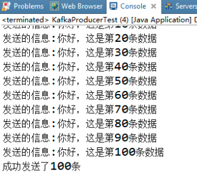
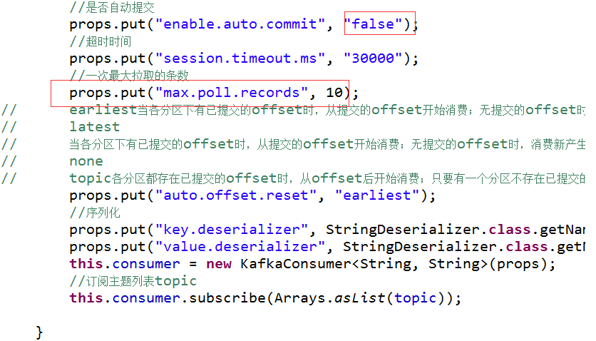

# 关于Kafka 的 consumer 消费者手动提交详解

但是offset下标自动提交其实在很多场景都不适用，因为自动提交是在kafka拉取到数据之后就直接提交，这样很容易丢失数据，尤其是在需要事物控制的时候。

很多情况下我们需要从kafka成功拉取数据之后，对数据进行相应的处理之后再进行提交。
如拉取数据之后进行写入mysql这种 ， 所以这时我们就需要进行手动提交kafka的offset下标。

> 这里顺便说下offset具体是什么。

offset：指的是kafka的topic中的每个消费组消费的下标。

简单的来说就是一条消息对应一个offset下标，每次消费数据的时候如果提交offset，那么下次消费就会从提交的offset加一那里开始消费。

比如一个topic中有100条数据，我消费了50条并且提交了，那么此时的kafka服务端记录提交的offset就是49(offset从0开始)，那么下次消费的时候offset就从50开始消费。

## 测试

说了这么，那么我们开始进行手动提交测试。

首先，使用kafka 的producer 程序往kafka集群发送了100条测试数据。




程序打印中已经成功发送了，这里我们在kafka服务器使用命令中来查看是否成功发送.

命令如下:

```angular2html
 kafka-console-consumer.sh  --zookeeper master:2181  --topic KAFKA_TEST2 --from-beginning
```

> 注:

1.master 是我在linux中做了IP映射的关系，实际可以换成IP。

2.因为kafka是集群，所以也可以在集群的其他机器进行消费。

可以看到已经成功发送了100条。

成功发送消息之后，我们再使用kafka的consumer 进行数据消费。

因为是用来测试手动提交

所以 将 enable.auto.commit 改成 false 进行手动提交

并且设置每次拉取最大10条

```
props.put("enable.auto.commit", "false");
props.put("max.poll.records", 10);
```

将提交方式改成false之后

需要手动提交只需加上这段代码

```angular2html
consumer.commitSync();
```

那么首先尝试消费不提交，测试能不能重复消费。

右键运行main方法进行消费，不提交offset下标。




成功消费之后，结束程序，再次运行main方法进行消费，也不提交offset下标。


并未手动进行提交，而且并未更改消费组名，但是可以看到已经重复消费了！

接下来，开始测试手动提交。

测试目的:

1.测试手动提交之后的offset，能不能再次消费。

2.测试未提交的offset，能不能再次进行消费。

测试方法: 当消费到50条的时候，进行手动提交，然后剩下的50条不进行提交。

希望达成的目的: 手动提交的offset不能再次消费，未提交的可以再次进行消费。

为了达到上述目的，我们测试只需添加如下代码即可:

```
if(list.size()==50){
    consumer.commitSync();
}
```

更改代码之后，开始运行程序

测试示例图如下:


简单的一看，和之前未提交的一样，貌似没有什么问题。

> 但是正常来说，未提交的下标不应该重复进行消费，直到它提交为止吗？

因为要进行重复消费，但是messageNo 会一直累加，只会手动的提交前50条offset，

后面的50条offset会一直无法消费，所以打印的条数不应该是100，而是应该一直打印。

> 那么测试的结果和预想的为什么不一致呢？

之前不是已经测试过可以重复消费未提交的offset吗？

其实这点可以根据两次启动方式的不同而得出结论。

开始测试未提交重复消费的时候，实际我是启动-暂停-启动，那么本地的consumer实际是被初始化过两次。

而刚刚测试的实际consumer只有初始化一次。

> 至于为什么初始化一次就不行呢？

因为kafka的offset下标的记录实际会有两份，服务端会自己记录一份，本地的消费者客户端也会记录一份，
提交的offset会告诉服务端已经消费到这了，但是本地的并不会因此而改变offset进行再次消费。

简单的来说假如有10条数据，在第5条的时候进行提交了offset下标，那么服务端就知道该组消费的下标到第5条了，
如果同组其他的consumer进行消费的时候就会从第6条开始进行消费。但是本地的消费者客户端并不会因此而改变，
它还是会继续消费下去，并不会再次从第6条开始消费，所以会出现上图情况。

但是项目中运行之后，是不会因此而重启的，所以这时我们可以换一种思路。

就是如果触发某个条件，所以导致offset未提交，我们就可以关闭之前的consumer，然后新new一个consumer，这样就可以再次进行消费了！ 当然配置要和之前的一样。

那么将之前的提交代码更改如下:

```angular2html
if(list.size()==50){
    consumer.commitSync();
}else if(list.size()>50){
    consumer.close();
    init();
    list.clear();
    list2.clear();
}
```

注:这里因为是测试，为了简单明了，所以条件我写的很简单。实际情况请根据个人的为准。


> 说明:

1.因为每次是拉取10条，所以在60条的时候kafka的配置初始化了，然后又从新拉取了50-60条的数据，但是没有提交，所以并不会影响实际结果。

2.这里为了方便截图展示，所以打印条件改了，但是不影响程序！

* 从测试结果中，我们达到了之前想要测试的目的，未提交的offset可以重复进行消费。
* 这种做法一般也可以满足大部分需求。
* 例如从kafka获取数据入库，如果一批数据入库成功，就提交offset，否则不提交，然后再次拉取。
* 但是这种做法并不能最大的保证数据的完整性。比如在运行的时候，程序挂了之类的。

所以还有一种方法是手动的指定offset下标进行获取数据，直到kafka的数据处理成功之后，将offset记录下来，比如写在数据库中。


