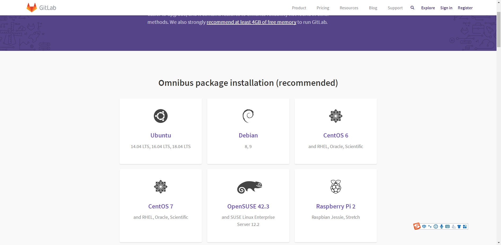
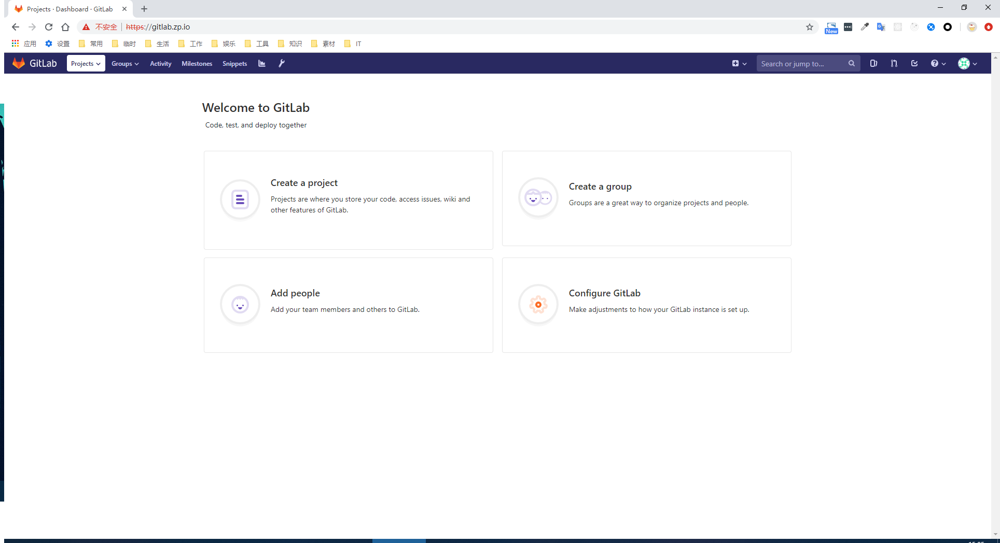
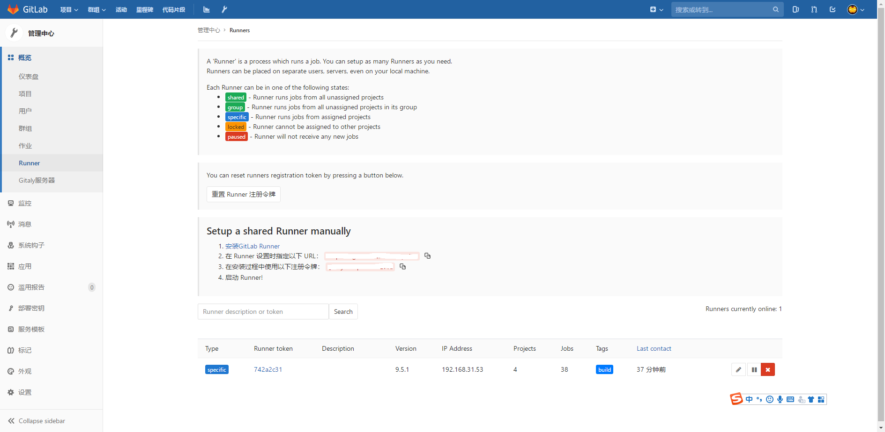

# Gitlab 运维

## 一、gitlab 安装

## Gitlab 的普通安装

## 下载

进入官方下载地址：https://about.gitlab.com/install/ ，如下图，选择合适的版本。



以 CentOS7 为例：

## 安装和配置必要依赖

在系统防火墙中启用 HTTP 和 SSH

```angular2html
sudo yum install -y curl policycoreutils-python openssh-server
sudo systemctl enable sshd
sudo systemctl start sshd
sudo firewall-cmd --permanent --add-service=http
sudo systemctl reload firewalld

```

安装 Postfix ，使得 Gitlab 可以发送通知邮件

```angular2html
sudo yum install postfix
sudo systemctl enable postfix
sudo systemctl start postfix

```

添加 Gitlab yum 仓库并安装包

添加 Gitlab yum 仓库

```
curl https://packages.gitlab.com/install/repositories/gitlab/gitlab-ce/script.rpm.sh | sudo bash

```

通过 yum 安装 gitlab-ce

```
sudo EXTERNAL_URL="http://gitlab.example.com" yum install -y gitlab-ce

```

安装完成后，即可通过默认的 root 账户进行登录。


# Gitlab 的 Docker 安装

拉取镜像

```angular2html
docker pull docker.io/gitlab/gitlab-ce
```

启动

```angular2html
docker run -d \
--hostname gitlab.zp.io \
--publish 8443:443 --publish 80:80 --publish 2222:22 \
--name gitlab \
--restart always \
--volume $GITLAB_HOME/config:/etc/gitlab \
--volume $GITLAB_HOME/logs:/var/log/gitlab \
--volume $GITLAB_HOME/data:/var/opt/gitlab \
gitlab/gitlab-ce
```



# 自签名证书

首先，创建认证目录

```angular2html
sudo mkdir -p /etc/gitlab/ssl
sudo chmod 700 /etc/gitlab/ssl

```

（1）创建 Private Key

```angular2html
sudo openssl genrsa -des3 -out /etc/gitlab/ssl/gitlab.domain.com.key 2048
```

会提示输入密码，请记住

（2）生成 Certificate Request

```angular2html
sudo openssl req -new -key /etc/gitlab/ssl/gitlab.domain.com.key -out /etc/gitlab/ssl/gitlab.domain.com.csr
```

根据提示，输入信息

```angular2html
Country Name (2 letter code) [XX]:CN
State or Province Name (full name) []:JS
Locality Name (eg, city) [Default City]:NJ
Organization Name (eg, company) [Default Company Ltd]:xxxxx
Organizational Unit Name (eg, section) []:
Common Name (eg, your name or your server's hostname) []:gitlab.xxxx.io
Email Address []:

Please enter the following 'extra' attributes
to be sent with your certificate request
A challenge password []:
An optional company name []:
```

（3）移除 Private Key 中的密码短语

```angular2html
sudo cp -v /etc/gitlab/ssl/gitlab.domain.com.{key,original}
sudo openssl rsa -in /etc/gitlab/ssl/gitlab.domain.com.original -out /etc/gitlab/ssl/gitlab.domain.com.key
sudo rm -v /etc/gitlab/ssl/gitlab.domain.com.original
```

（4）设置文件权限

```angular2html
sudo chmod 600 /etc/gitlab/ssl/gitlab.domain.com.*
```

# 二、gitlab-ci-multi-runner 安装

参考：https://docs.gitlab.com/runner/install/

## 常规安装 gitlab-ci-multi-runner

## 下载

```angular2html
sudo wget -O /usr/local/bin/gitlab-runner https://gitlab-runner-downloads.s3.amazonaws.com/latest/binaries/gitlab-runner-linux-amd64

```

## 配置执行权限

```angular2html
sudo chmod +x /usr/local/bin/gitlab-runner
```

## 如果想使用 Docker，安装 Docker（可选的）

```angular2html
curl -sSL https://get.docker.com/ | sh
```

## 创建 CI 用户

```
sudo useradd --comment 'GitLab Runner' --create-home gitlab-runner --shell /bin/bash
```

## 安装并启动服务

```angular2html
sudo gitlab-runner install --user=gitlab-runner --working-directory=/home/gitlab-runner
sudo gitlab-runner start
```

## 注册 Runner

（1）执行命令：

```angular2html
sudo gitlab-runner register
```

（2）输入 Gitlab URL 和 令牌

URL 和令牌信息在 Gitlab 的 Runner 管理页面获取：



```angular2html
Please enter the gitlab-ci coordinator URL (e.g. https://gitlab.com )
https://gitlab.com

Please enter the gitlab-ci token for this runner
xxx
```

（3）输入 Runner 的描述

```angular2html
Please enter the gitlab-ci description for this runner
[hostame] my-runner
```

（4）输入 Runner 相关的标签

```angular2html
Please enter the gitlab-ci tags for this runner (comma separated):
my-tag,another-tag
```

（5）输入 Runner 执行器

```angular2html
Please enter the executor: ssh, docker+machine, docker-ssh+machine, kubernetes, docker, parallels, virtualbox, docker-ssh, shell:
docker
```

如果想选择 Docker 作为执行器，你需要指定默认镜像（ .gitlab-ci.yml 中没有此配置）

```angular2html
Please enter the Docker image (eg. ruby:2.1):
alpine:latest
```

## Docker 安装 gitlab-ci-multi-runner

拉取镜像

```angular2html
docker pull docker.io/gitlab/gitlab-runner
```

启动

```angular2html
docker run -d --name gitlab-runner --restart always \
-v /srv/gitlab-runner/config:/etc/gitlab-runner \
-v /var/run/docker.sock:/var/run/docker.sock \
gitlab/gitlab-runner:latest
```

## 升级

升级前，一定要做好备份，记录当前 gitlab 的版本号。

第一步还是使用官方命令进行升级。

```angular2html
sudo yum install -y gitlab-ce
```

如果下载速度理想，就无需手动升级安装。不理想就需要停止自动更新，并手动下载安装包

访问官方地址，下载对应版本，对应系统的安装包。

注：可以根据自动升级时下载的版本，选择对应文件。

https://packages.gitlab.com/gitlab/gitlab-ce

安装包手动上传至服务器，并替换下载未完成的安装包。下面是升级缓存地址：

```angular2html
/var/cache/yum/x86_64/7/gitlab_gitlab-ce/packages/
```

再次执行官方升级命令即可完成自动安装。


