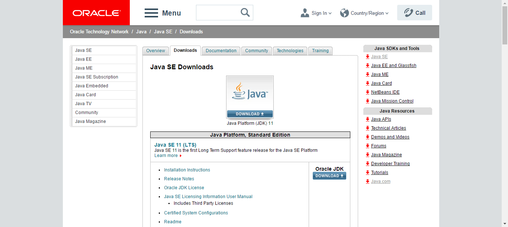
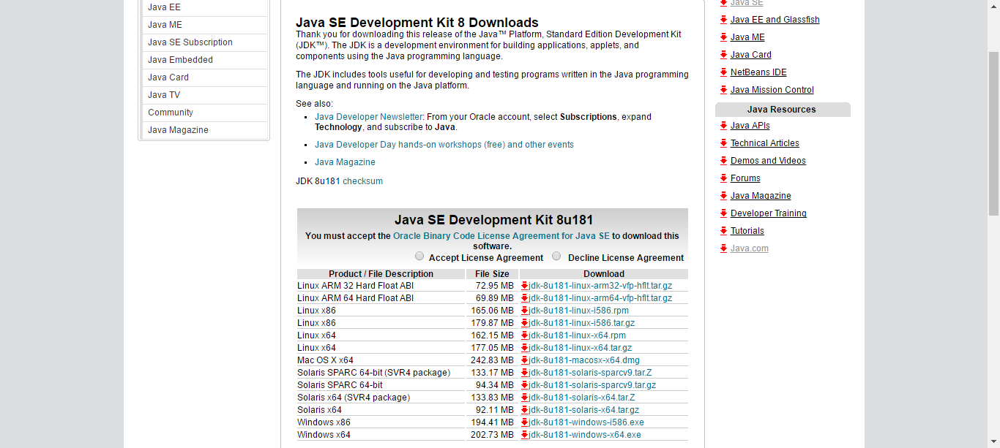
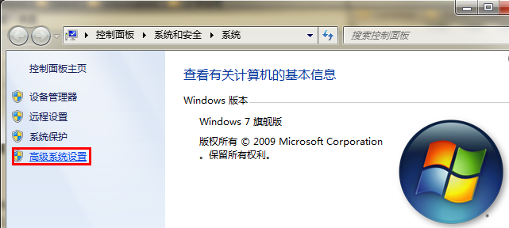
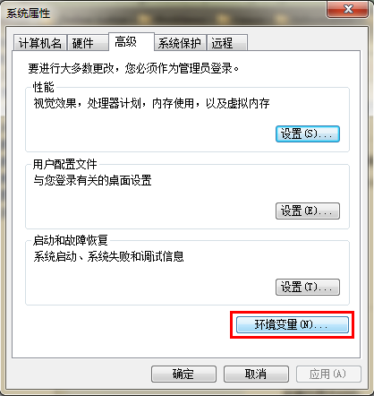

# JDK 安装步骤
JDK 安装步骤：

（1）下载 JDK https://www.oracle.com/java/technologies/downloads/?er=221886

a. 进入 Java 官网下载页面 (opens new window)；

b. 选择需要的版本：



c. 选择对应操作系统的安装包：

Windows 系统选择 exe 安装包；Mac 系统选择 dmp 安装包；Linux 系统选择 tar.gz 压缩包（RedHat 发行版可以安装 rpm 包）。



（2）运行安装包，按提示逐步安装

（3）配置系统环境变量：JAVA_HOME, CLASSPATH, PATH

（4）验证 Java 是否安装成功

## Windows 系统安装方法
（1）下载 JDK

需要根据 Windows 系统实际情况，选择 exe 安装文件：

32 位计算机选择 Windows x86

64 位计算机选择 Windows x64

（2）运行安装包，按提示逐步安装

（3）配置系统环境变量

a. 安装完成后，右击"我的电脑"，点击"属性"，选择"高级系统设置"；



b. 选择"高级"选项卡，点击"环境变量"；




然后就会出现如下图所示的画面：

在"系统变量"中设置 3 项属性，JAVA_HOME,PATH,CLASSPATH(大小写无所谓),若已存在则点击"编辑"，不存在则点击"新建"。

> 变量设置参数如下：

变量名：JAVA_HOME

变量值：C:\Program Files (x86)\Java\jdk1.8.0_91 // 要根据自己的实际路径配置

变量名：CLASSPATH

变量值：.;%JAVA_HOME%\lib\dt.jar;%JAVA_HOME%\lib\tools.jar; //记得前面有个"."

变量名：Path

变量值：%JAVA_HOME%\bin;%JAVA_HOME%\jre\bin;

（4）验证 Java 是否安装成功

a. "开始"->"运行"，键入"cmd"；

b. 键入命令: java -version、java、javac 几个命令，出现以下信息，说明环境变量配置成功；


## Linux 系统安装方法
（1）下载 JDK

需要根据 Linux 系统实际情况，选择 tar.gz 压缩包：

32 位计算机选择 Linux x86

64 位计算机选择 Linux x64

（2）解压压缩包到本地

```angular2html
$ tar -zxf jdk-8u162-linux-x64.tar.gz
```

（3）配置系统环境变量

执行 /etc/profile 命令，添加以下内容：

```angular2html
# JDK 的根路径
export JAVA_HOME=/opt/java/jdk1.8.0_162
export CLASSPATH=$CLASSPATH:$JAVA_HOME/lib:$JAVA_HOME/jre/lib
export PATH=$JAVA_HOME/bin:$JAVA_HOME/jre/bin:$PATH
```

执行 source /etc/profile ，立即生效

（4）验证 Java 是否安装成功

执行 java -version 命令，验证安装是否成功。

## RedHat 发行版本使用 rpm 安装方法
（1）下载 JDK

下载 rpm 安装包

（2）选择一个合适的版本安装

```angular2html
$ rpm -ivh jdk-8u181-linux-x64.rpm
```

安装成功后，默认安装路径在 /usr/local 下：

（3）设置环境变量，同压缩包安装。

（4）检验是否安装成功，执行 java -version 命令

## JDK配置

```angular2html
#JDK配置
export JAVA_HOME=/home/jdk1.8.0_341
export JRE_HOME=${JAVA_HOME}/jre
export CLASSPATH=.:${JAVA_HOME}/lib:${JRE_HOME}/lib:$CLASSPATH
export JAVA_PATH=${JAVA_HOME}/bin:${JRE_HOME}/bin
export PATH=$PATH:${JAVA_PATH}
#Esc --> :wq保存并退出
#通过命令让profile文件立即生效
source /etc/profile
```

```angular2html
上传文件 jdk-8u341-linux-x64.tar.gz
解压文件 tar -zxvf jdk-8u341-linux-x64.tar.gz
文件授权 chmod 777 jdk-8u341/bin/j*
vi /etc/profile
#按i进入编辑，在profile文件尾部添加如下内容
#JDK配置
```

## jar启动

```angular2html
nohup java -jar xxx-1.0.jar >/dev/null 2>&1 &
nohup java  -jar xxx-9.1.1.jar  2>&1 &

#!/bin/bash

# 定义要关闭的应用程序的名称
APP_NAME="user-1.0.jar"

# 查找应用程序的进程ID（PID）
PID=$(ps -ef | grep "$APP_NAME" | grep -v grep | awk '{ print $2 }')

if [ -z "$PID" ]; then
echo "应用程序已经停止"
else
echo "正在关闭应用程序 $APP_NAME (PID: $PID) ..."
kill -9 "$PID"
echo "应用程序已成功关闭"
fi
```

## Mysql 安裝步骤

```angular2html
1.Mysql 安裝步骤
上传mysql-8.0.23-1.el7.x86_64.rpm-bundle.tar 文件
解压tar -xf mysql-8.0.23-1.el7.x86_64.rpm-bundle.tar
移动文件 mv mysql-* mysql/
切换目录 cd mysql/
# 2.选择性安装（可以不安装embedded、devel和test）本次安装 rpm -ivh mysql-community-{client,common,libs,server}-*.rpm检查cnf文件 vim /etc/my.cnf
Mysql 文件授权chown -R mysql:mysql /var/lib/mysql
启动服务 systemctl start mysql
检查服务 systemctl status mysql
查询初始化密码 grep "A temporary password is generated for root@localhost" /var/log/mysqld.log
后续修改账户密码不体现命令,自行按需求修改。
```

# jdk8-install.sh

```angular2html

#!/usr/bin/env bash

###################################################################################
# 控制台颜色
BLACK="\033[1;30m"
RED="\033[1;31m"
GREEN="\033[1;32m"
YELLOW="\033[1;33m"
BLUE="\033[1;34m"
PURPLE="\033[1;35m"
CYAN="\033[1;36m"
RESET="$(tput sgr0)"
###################################################################################

printf "${BLUE}"
cat << EOF

###################################################################################
# 安装 JDK8 脚本
# JDK 会被安装到 /usr/lib/jvm/java 路径。
# @system: 适用于 CentOS
###################################################################################

EOF
printf "${RESET}"

printf "${GREEN}>>>>>>>> install jdk8 begin.${RESET}\n"

command -v yum > /dev/null 2>&1 || {
	printf "${RED}Require yum but it's not installed.${RESET}\n";
	exit 1;
}

yum -y install java-1.8.0-openjdk-devel.x86_64
java -version

printf "${GREEN}<<<<<<<< install jdk8 end.${RESET}\n"

```