# Jenkins 运维

## 一、jenkins是什么？

Jenkins是一个开源的、提供友好操作界面的持续集成(CI)工具，
起源于Hudson（Hudson是商用的），主要用于持续、自动的构建/测试软件项目、监控外部任务的运行（这个比较抽象，暂且写上，不做解释）。

Jenkins用Java语言编写，可在Tomcat等流行的servlet容器中运行，也可独立运行。通常与版本管理工具(SCM)、构建工具结合使用。
常用的版本控制工具有SVN、GIT，构建工具有Maven、Ant、Gradle。

## 二、CI/CD是什么？

CI(Continuous integration，中文意思是持续集成)是一种软件开发时间。

持续集成强调开发人员提交了新代码之后，立刻进行构建、（单元）测试。根据测试结果，我们可以确定新代码和原有代码能否正确地集成在一起。
借用网络图片对CI加以理解。

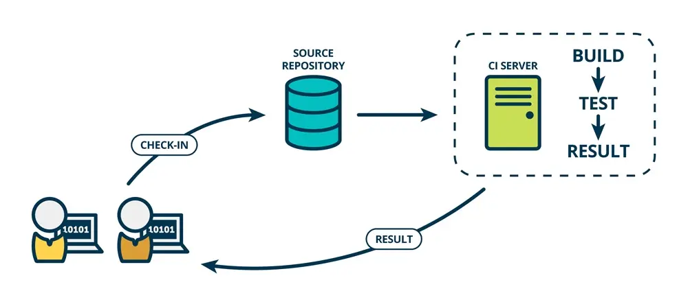

CD(Continuous Delivery， 中文意思持续交付)是在持续集成的基础上，将集成后的代码部署到更贴近真实运行环境(类生产环境)中。

比如，我们完成单元测试后，可以把代码部署到连接数据库的Staging环境中更多的测试。
如果代码没有问题，可以继续手动部署到生产环境。下图反应的是CI/CD 的大概工作模式。

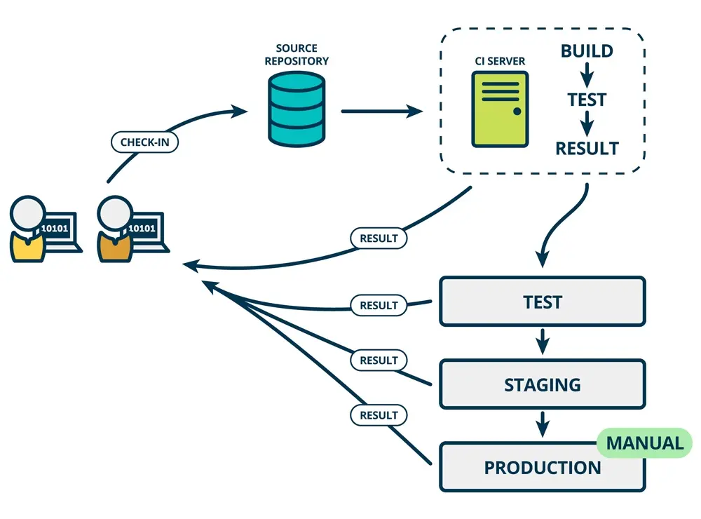

登录Jenkins， 点击左侧的新建，创建新的构建任务。

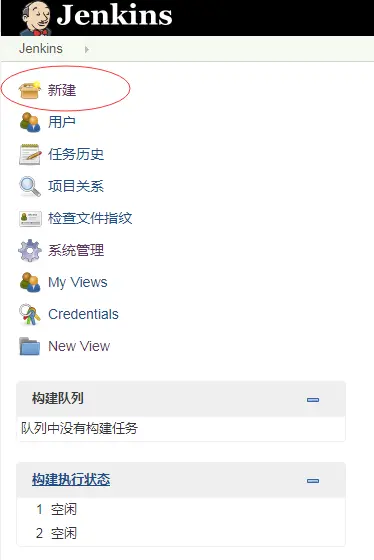

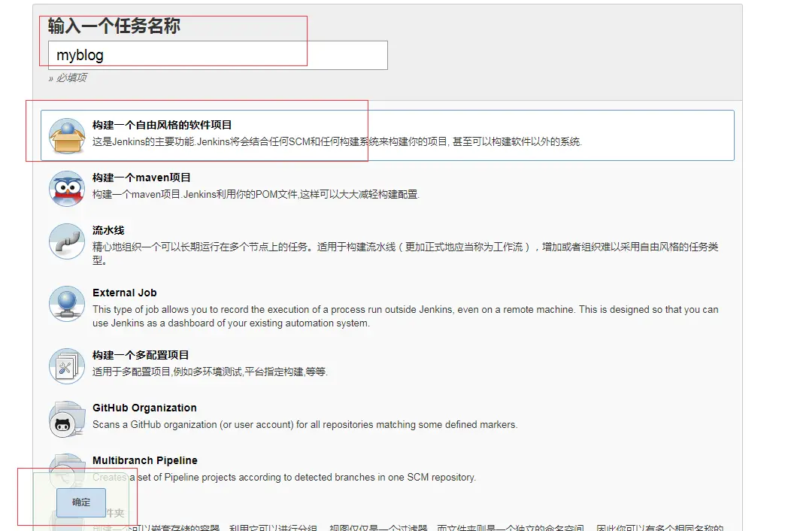

下图是构建任务设置界面，可以看到上方的几个选项"General", "源码管理"， "构建触发器"，"构建环境"， "构建"， "构建后操作"。

下面逐一介绍。

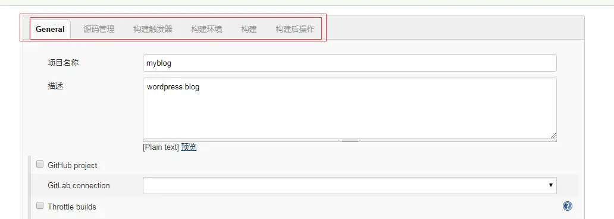

## 1.General

General是构建任务的一些基本配置。名称，描述之类的。

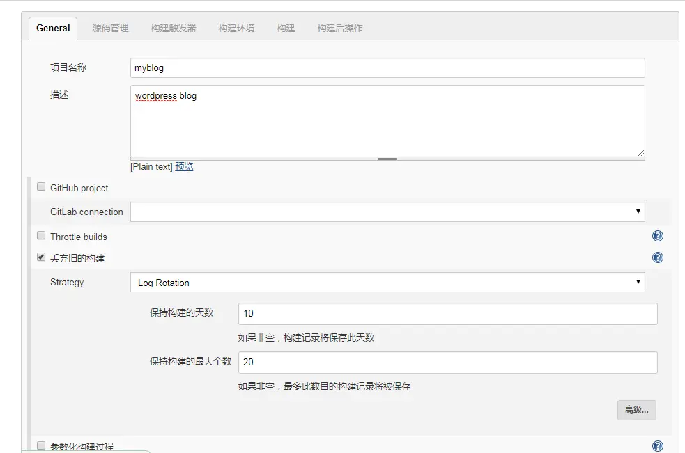

项目名称: 是刚才创建构建任务步骤设置的，当然在这里也可以更改。

描述: 对构建任务的描述。  

丢弃旧的构建： 服务器资源是有限的，有时候保存了太多的历史构建，会导致Jenkins速度变慢，并且服务器硬盘资源也会被占满。
当然下方的"保持构建天数" 和 保持构建的最大个数是可以自定义的，需要根据实际情况确定一个合理的值。

其他几个选项在这里不做介绍，有兴趣的可以查看Jenkins"帮助信息"， 会有一个大概的介绍。不过这些"帮助信息"都是英文的。

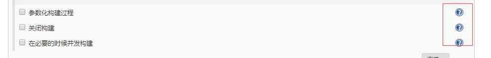

## 2.源码管理

源码管理就是配置你代码的存放位置。

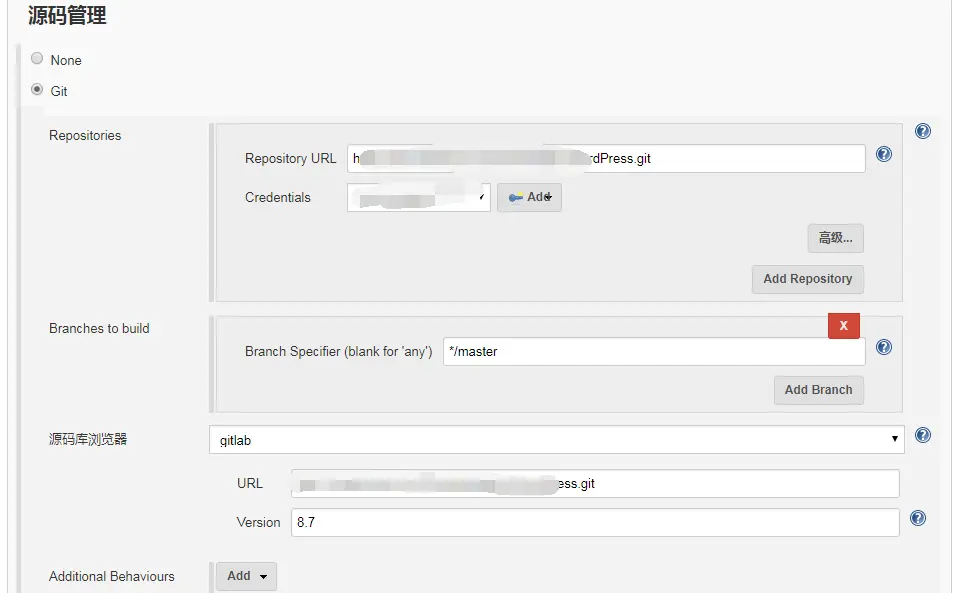

Git: 支持主流的github 和gitlab代码仓库。因我们的研发团队使用的是gitlab，所以下面我只会对该项进行介绍。

Repository URL：仓库地址

Credentials：凭证。可以使用HTTP方式的用户名密码，也可以是RSA文件。 但要通过后面的"ADD"按钮添加凭证。

Branches to build：构建的分支。*/master表示master分支，也可以设置为其他分支。

源码浏览器：你所使用的代码仓库管理工具，如github, gitlab.  

URL：填入上方的仓库地址即可。

Version: 8.7   这个是我们gitlab服务器的版本。

Subversion：就是SVN，这里不作介绍。

## 3.构建触发器

构建触发器，顾名思义，就是构建任务的触发器。

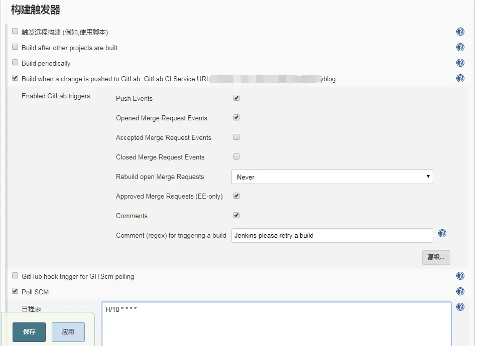

触发远程构建(例如，使用脚本): 该选项会提供一个接口，可以用来在代码层面触发构建。这里不做介绍，后期可能会用到。

Build after other projects are built： 该选项意思是"在其他projects构建后构建"。这里不作介绍，后期可能会用到该选项。

Build periodically： 周期性的构建。很好理解，就是每隔一段时间进行构建。日程表类似        linux crontab书写格式。如下图的设置，表示每隔30分钟进行一次构建。

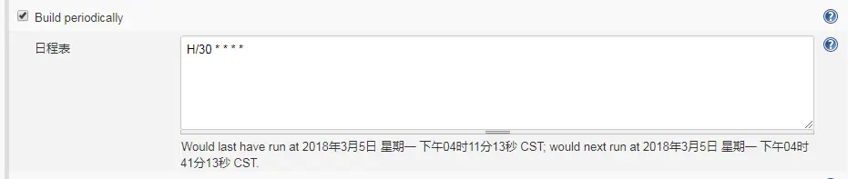

Build when a change is pushed to GitLab：当有更改push到gitlab代码仓库，即触发构建。后面会有一个触发构建的地址，一般被称为webhooks。需要将这个地址配置到gitlab中，webhooks如何配置后面介绍。这个是常用的构建触发器。

Poll SCM：该选项是配合上面这个选项使用的。当代码仓库发生改动，jenkins并不知道。需要配置这个选项，周期性的去检查代码仓库是否发生改动。

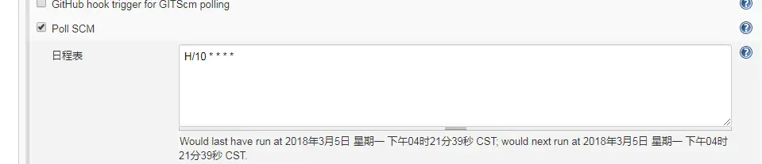

## 4.构建环境

构建环境就是构建之前的一些准备工作，如指定构建工具(在这里我使用ant)。

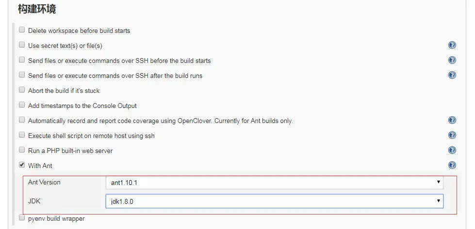

With Ant：选择这个工具，并指定ant版本和jdk版本。这两个工具的版本我都事先在服务器上安装，并且在jenkins全局工具中配置好了。

其他选项不作介绍，同样可以查看"帮助信息" 获得使用帮助。

## 5.构建

       选择下方的增加构建步骤。

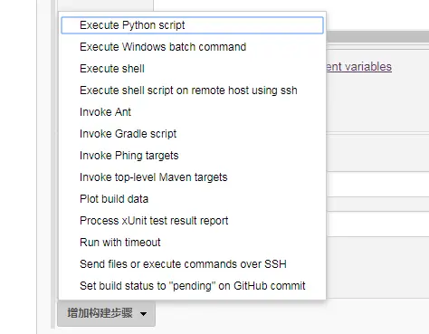

可以选择的项很多。这里就介绍"Invoke Ant" 和"Execute shell".

Eexcute shell： 执行shell命令，该工具是针对linux环境的，windows环境也有对应的工            具"Execute Windows batch command"。 在构建之前，可能我们需要执行一些命令，比如压缩包的解压之类的。为了演示，我就简单的执行  "echo $RANDOM" 这样的linux shell下生产随机数命令。

Invoke Ant：Ant是一款java项目构建工具

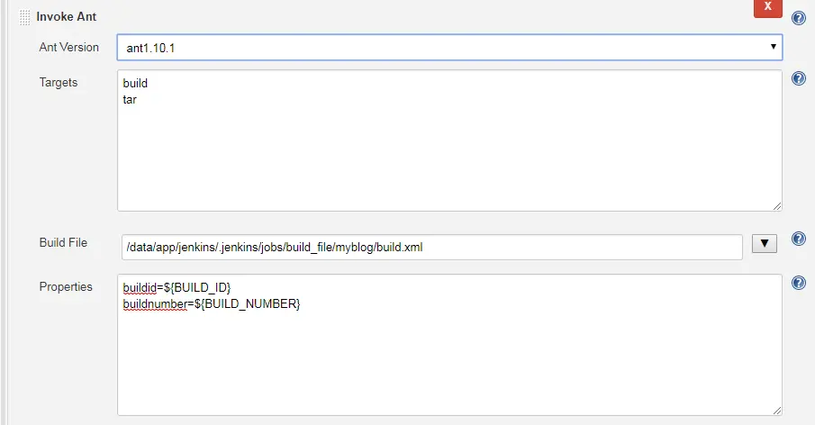

Ant Version： 选择Ant版本。这个ant版本是安装在jenkins服务器上的版本，并且需要在jenkins"系统工具"中设置好。

Targets：要执行的操作，一行一个操作任务。以上图为例，build是构建，tar是打包。

Build File: 是Ant构建的配置文件，如果不指定，则是在项目路径下的workspace目录中的build.xml。build.xml文件具体怎么配置，后面再细讲。

properties: 设定一些变量，这些变量可以在build.xml 中被引用。

Send files or execute commands over SSH：发送文件到远程主机或执行命令(脚本)

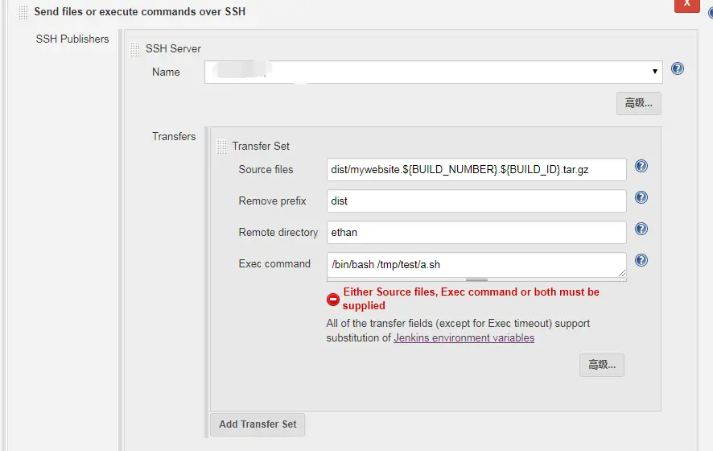

Name: SSH Server的名称。SSH Server可以在jenkins-系统设置中配置。

source files: 需要发送给远程主机的源文件。

Remove prefix: 移除前面的路径。如果不设置这个参数，则远程主机会自动创建构建源 source files 包含的那个路径。

Remote directory: 远程主机目录。

Exec command：在远程主机上执行的命令，或者执行的脚本。

## 6.构建后操作

构建后操作，就是对project构建完成后的一些后续操作，比如生成相应的代码测试报告。

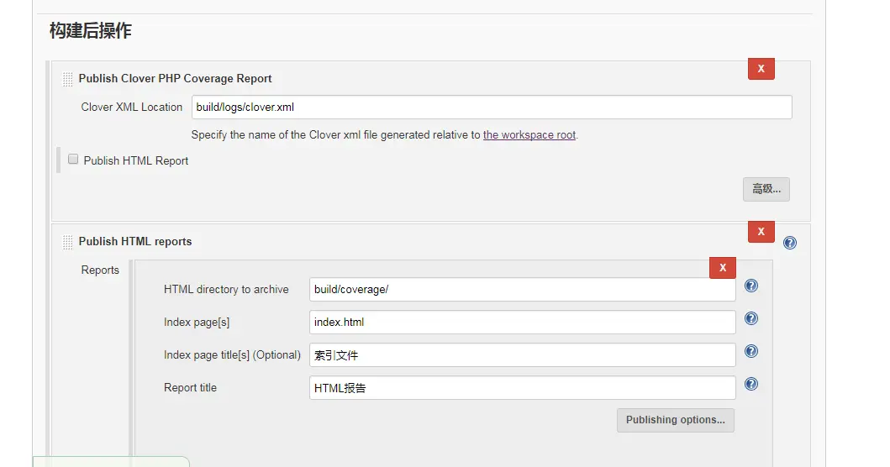

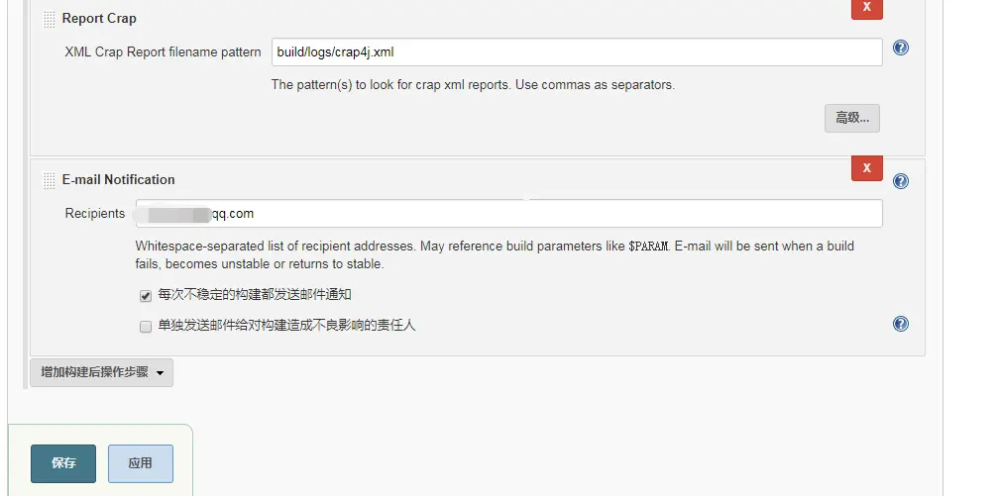

Publish Clover PHP Coverage Report：发布代码覆盖率xml格式的文件报告。路径会在"build.xml"文件中定义

Publish HTML reports：发布代码覆盖率的HTML报告。  

Report Crap: 发布crap报告。

E-mail Notification:  邮件通知，构建完成后发邮件到指定的邮箱。

以上配置完成后，点击保存。

## 7.其他相关配置

SSH Server配置

登录jenkins -- 系统管理 -- 系统设置

配置请看下图

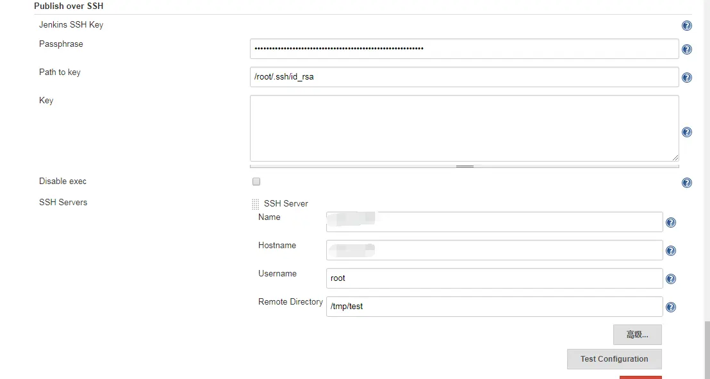

SSH Servers: 由于jenkins服务器公钥文件我已经配置好，所以之后新增SSH Servers 只需要配置这一项即可。 

Name： 自定义，需要全局唯一。

HostName: 主机名，直接用ip地址即可。

Username: 新增Server的用户名，这里配置的是root。

Remote Directory: 远程目录。jenkins服务器发送文件给新增的server默认是在这个目录。

## 构建稳定性

构建稳定性用天气表示：晴、晴转多云、多云、小雨、雷阵雨。天气越好表示构建越稳定，反之亦然。

