# Nexus 运维

Nexus 是一个强大的 Maven 仓库管理器，可以用来搭建 Maven 私服。

关键词：maven, nexus

部署环境：

1. Nexus 3.13.0
2. JDK 1.8
3. Maven 3.5.4

## 一、Nexus 安装

进入官方下载地址 (opens new window)，选择合适版本下载。

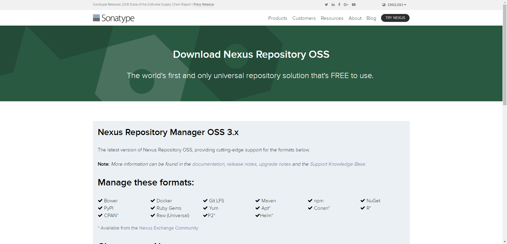

本人将 Nexus 部署在 Linux 机器，所以选用的是 Unix 版本。

这里，如果想通过命令方式直接下载（比如用脚本安装），可以在官方历史发布版本页面 (opens new window)中找到合适版本，然后执行以下命令：

```angular2html
# 个人习惯将 nexus 安装在 /opt/maven 目录下
wget -O /opt/maven/nexus-unix.tar.gz http://download.sonatype.com/nexus/3/nexus-3.13.0-01-unix.tar.gz

```

【解压】执行 tar -zxf nexus-unix.tar.gz 命令，会解压出两个目录：
```angular2html
nexus-<version> - 程序目录。包含了 Nexus 运行所需要的文件。是 Nexus 运行必须的。

nexus-<version>/etc - 配置目录。

nexus-<version>/etc/nexus.properties - nexus 核心配置文件（默认 etc 目录下有 nexus-default.properties，可以基于此修改）。

sonatype-work - 仓库目录。包含了 Nexus 生成的配置文件、日志文件、仓库文件等。当我们需要备份 Nexus 的时候默认备份此目录即可。
```


[修改环境变量】执行 vim /etc/profile，在文件尾部添加以下内容：

```angular2html
NEXUS_HOME=/usr/program/nexus2.11.4
export NEXUS_HOME
```

刷新环境变量：source /etc/profile

【检查安装是否成功】执行 nexus -version 查看是否安装成功。

> 【防火墙】

iptabes

1. 添加规则：iptables -I INPUT -p tcp -m tcp --dport 8081 -j ACCEPT
2. 载入规则：/etc/rc.d/init.d/iptables save
3. 重启 iptables：service iptables restart

firewalld

1. 添加规则：firewall-cmd --zone=public --add-port=8081/tcp --permanent
2. 载入规则：firewall-cmd --reload

## 二、Nexus 使用

### 启动/停止 Nexus

进入 nexus-3.13.0-01/bin 目录，有一个可执行脚本 nexus。

执行 ./nexus，可以查看允许执行的参数，如下所示，含义可谓一目了然：

```

$ ./nexus
Usage: ./nexus {start|stop|run|run-redirect|status|restart|force-reload}

```

1. 启动 nexus - ./nexus start
2. 停止 nexus - ./nexus stop
3. 重启 nexus - ./nexus restart

Nexus 的默认启动端口为 8081，启动成功后，在浏览器中访问 `http://<ip>:8081`，欢迎页面如下图所示：

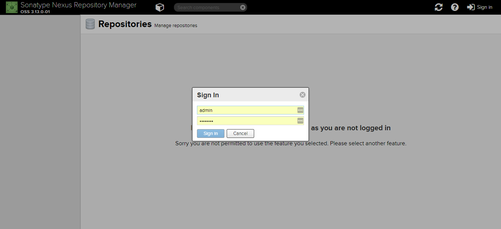

点击右上角 Sign in 登录，默认用户名/密码为：admin/admin123。

## 配置 maven 仓库

Nexus 中的仓库有以下类型：

hosted - 宿主仓库。主要用于部署无法从公共仓库获取的构件（如 oracle 的 JDBC 驱动）以及自己或第三方的项目构件；
proxy - 代理仓库。代理公共的远程仓库；
virtual - 虚拟仓库。用于适配 Maven 1；
group - 仓库组。Nexus 通过仓库组的概念统一管理多个仓库，这样我们在项目中直接请求仓库组即可请求到仓库组管理的多个仓库。

## 配置 maven 仓库

Nexus 中的仓库有以下类型：

1. hosted - 宿主仓库。主要用于部署无法从公共仓库获取的构件（如 oracle 的 JDBC 驱动）以及自己或第三方的项目构件；
2. proxy - 代理仓库。代理公共的远程仓库；
3. virtual - 虚拟仓库。用于适配 Maven 1；
4. group - 仓库组。Nexus 通过仓库组的概念统一管理多个仓库，这样我们在项目中直接请求仓库组即可请求到仓库组管理的多个仓库。

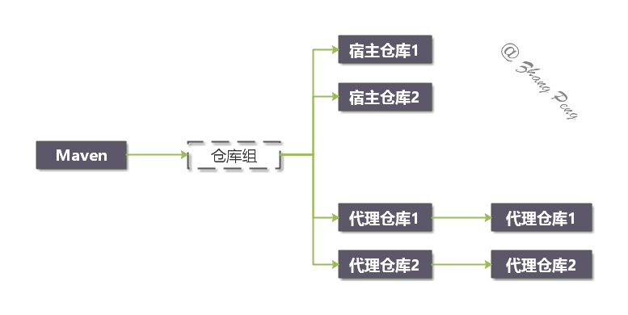

## 建议配置如下：

### hosted 仓库

* maven-releases - 存储私有仓库的发行版 jar 包
* maven-snapshots - 存储私有仓库的快照版（调试版本） jar 包

### proxy 仓库

* maven-central-maven - 中央库（如果没有配置 mirror，默认就从这里下载 jar 包），从 https://repo1.maven.org/maven2/ 获取资源
* maven-aliyun - 国内 maven 仓库，提高访问速度。

### group 仓库

* maven-public - 私有仓库的公共空间，把上面三个仓库组合在一起对外提供服务，在本地 maven 基础配置 settings.xml 中使用。

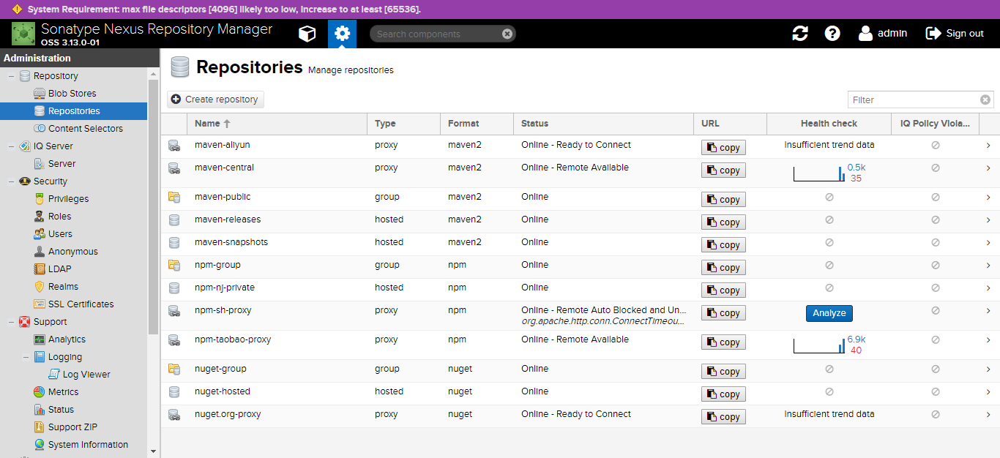

其中：

> maven-central、maven-public、maven-release、maven-snapshot 仓库是默认配置好的 maven 仓库。maven-central 配置的是 https://repo1.maven.org/maven2/ 的代理仓库，即 maven 中央仓库地址。

参考配置如下：

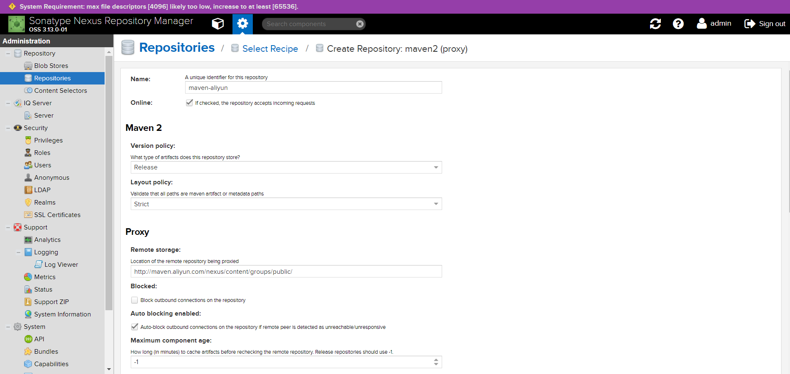

推荐配置的代理仓库：

1. OSS SNAPSHOT 仓库：http://oss.jfrog.org/artifactory/oss-snapshot-local/
2. aliyun 仓库（受限于国内网络，可以通过它来加速）：http://maven.aliyun.com/nexus/content/groups/public/

## 配置 yum 仓库

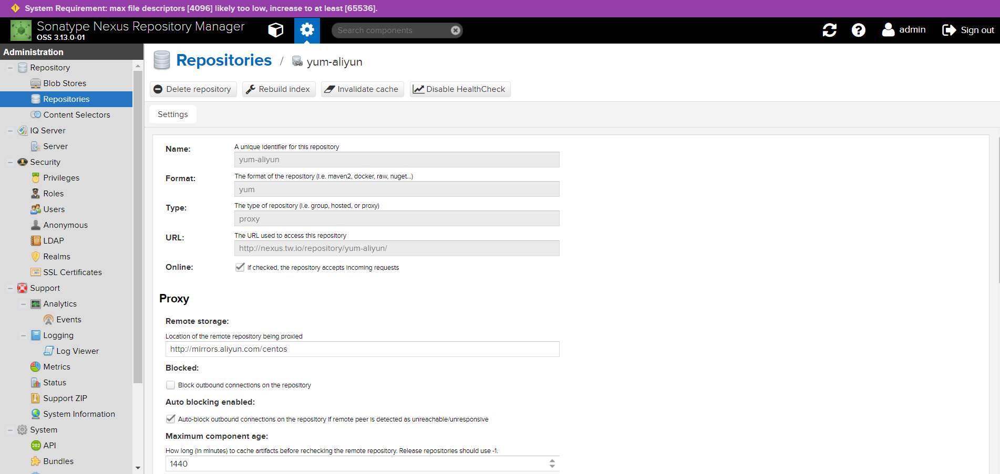

推荐配置的 yum 代理仓库：

aliyun yum 仓库：http://mirrors.aliyun.com/centos

配置本地 yum：

（1）新增 nexus.repo 文件，内容如下：

```
[base]
name=Nexus
baseurl= http://<nexus host>:<nexus port>/repository/yum-aliyun/$releasever/os/$basearch/
enabled=1
gpgcheck=0
priority=1
```

（2）更新 yum 缓存，执行以下命令：

```angular2html
yum clean all
yum makecache

```

## 定时任务

随着 jar 包越来越多，尤其是 SNAPSHOT 包由于不限制重复上传，尤其容易导致磁盘空间膨胀。所以，需要定期进行清理或修复。

Nexus 内置了多个定时任务，可以执行清理。

【示例】定期清理 SNAPSHOST

## 三、开机自启动

作为常用服务，有必要将 Nexus 设为 systemd 服务，以便在断电恢复后自动重启。

配置方法如下：

在 /lib/systemd/system 目录下创建 nexus.service 文件，内容如下：

```
[Unit]
Description=nexus
After=network.target

[Service]
Type=forking
LimitNOFILE=65536 #警告处理
Environment=RUN_AS_USER=root
ExecStart=/opt/maven/nexus-3.13.0-01/bin/nexus start
ExecReload=/opt/maven/nexus-3.13.0-01/bin/nexus restart
ExecStop=/opt/maven/nexus-3.13.0-01/bin/nexus stop
Restart=on-failure
PrivateTmp=true

[Install]
WantedBy=multi-user.target
```

保存后，可以使用以下命令应用 nexus 服务：

* systemctl enable nexus - 启动 nexus 开机启动
* systemctl disable nexus - 关闭 nexus 开机启动
* systemctl start nexus - 启动 nexus 服务
* systemctl stop nexus - 停止 nexus 服务
* systemctl restart nexus - 重启 nexus 服务

> 执行 systemctl enable nexus 后，再执行 reboot 重启，重连后，可以检测是否成功开机自动重启。

## 四、Nexus 和 Maven

Nexus 是 maven 私服。现在，Nexus 服务器已经部署好了，如何配合 maven 使用呢？

### 配置 settings.xml

如果要使用 Nexus，还必须在 settings.xml 和 pom.xml 中配置认证信息。

一份完整的 settings.xml：

```
<?xml version="1.0" encoding="UTF-8"?>

<settings xmlns="http://maven.apache.org/SETTINGS/1.0.0"
  xmlns:xsi="http://www.w3.org/2001/XMLSchema-instance" xsi:schemaLocation="http://maven.apache.org/SETTINGS/1.0.0 http://maven.apache.org/xsd/settings-1.0.0.xsd">
  <pluginGroups>
    <pluginGroup>org.sonatype.plugins</pluginGroup>
  </pluginGroups>

  <!--设置本地 maven 仓库-->
  <localRepository>D:\Tools\maven\.m2</localRepository>

  <!--Maven 私服账号信息-->
  <servers>
    <server>
      <id>releases</id>
      <username>admin</username>
      <password>admin123</password>
    </server>
    <server>
      <id>snapshots</id>
      <username>admin</username>
      <password>admin123</password>
    </server>
  </servers>

  <!--Maven 镜像地址-->
  <mirrors>
    <mirror>
      <id>public</id>
      <mirrorOf>*</mirrorOf>
      <!--Nexus 服务器地址-->
      <url>http://10.255.255.224:8081/repository/maven-public/</url>
    </mirror>
  </mirrors>

  <profiles>
    <profile>
      <id>zp</id>
      <repositories>
        <repository>
          <id>central</id>
          <url>http://central</url>
          <releases>
            <enabled>true</enabled>
          </releases>
          <snapshots>
            <enabled>true</enabled>
          </snapshots>
        </repository>
      </repositories>
      <pluginRepositories>
        <pluginRepository>
          <id>central</id>
          <url>http://central</url>
          <releases>
            <enabled>true</enabled>
          </releases>
          <snapshots>
            <enabled>true</enabled>
            <updatePolicy>always</updatePolicy>
          </snapshots>
        </pluginRepository>
      </pluginRepositories>
    </profile>
  </profiles>

  <activeProfiles>
    <activeProfile>zp</activeProfile>
  </activeProfiles>
</settings>
```

## 配置 pom.xml

在 pom.xml 中添加如下配置，这样就可以执行 mvn deploy，将本地构建的 jar、war 等包发布到私服上。

```
  <distributionManagement>
    <repository>
      <id>releases</id>
      <name>Releases</name>
      <url>http://10.255.255.224:8081/repository/maven-releases</url>
    </repository>
    <snapshotRepository>
      <id>snapshots</id>
      <name>Snapshot</name>
      <url>http://10.255.255.224:8081/repository/maven-snapshots</url>
    </snapshotRepository>
  </distributionManagement>
```

🔔 注意：

```angular2html
<repository> 和 <snapshotRepository> 的 id 必须和 settings.xml 配置文件中的 <server> 标签中的 id 匹配。
<url> 标签的地址需要和 maven 私服的地址匹配。
```

## 执行 maven 构建

如果要使用 settings.xml 中的私服配置，必须通过指定 -P zp 来激活 profile。

示例：

```
# 编译并打包 maven 项目
$ mvn clean package -Dmaven.skip.test=true -P zp

# 编译并上传 maven 交付件（jar 包）
$ mvn clean deploy -Dmaven.skip.test=true -P zp
```

至此，已经可以正常向 Nexus 上传、下载 jar 包。

## 五、备份和迁移

Nexus 三个重要目录：

名称	目录名	重要配置文件

nexus 主目录	nexus-2.6.4-02	conf/nexus.properties 里面有 sonatype-work 的地址

sonatype-work 目录	sonatype-work	nexus/conf/nexus.xml 里面有 storage 的地址

storage 目录	storage	里面主要是各种程序的 jar 包等

# 备份
Nexus 的数据都存储在 sonatype-work 目录，备份 Nexus 数据只需要将其打包即可。

# 迁移
将原 Nexus 服务器中的 sonatype-work 目录迁移到新 Nexus 服务器的 sonatype-work 目录下。

# 六、FAQ
## 配置 INSTALL4J_JAVA_HOME
我在工作中遇到 nexus systemctl 服务无法自启动的问题，通过查看状态，发现以下报错：

Please define INSTALL4J_JAVA_HOME to point to a suitable JVM

通过排查，找到原因：

即使环境上已安装 JDK，且配置了 JAVA_HOME，但 nexus 仍然无法正确找到 JDK，
需要在 /bin/nexus 中指定 INSTALL4J_JAVA_HOME_OVERRIDE=<JDK安装路径>

# maven私库nexus3安装及使用

一、试验环境

1、操作系统：Windows 10

2、nexus版本：nexus-3.0.1-01-win64

二、安装

1、下载地址：http://www.sonatype.com/download-oss-sonatype

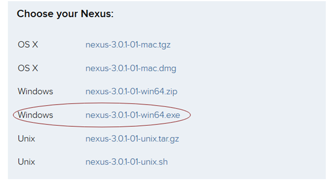

2、我们下载nexus-3.0.1-01-win64.exe后双击安装即可，安装完成后默认开放8081端口。

三、使用

安装成功后有两个默认账号admin、anonymous，其中admin具有全部权限默认密码admin123；anonymous作为匿名用户，只具有查看权限。

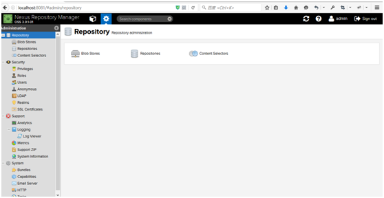

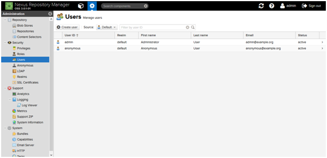

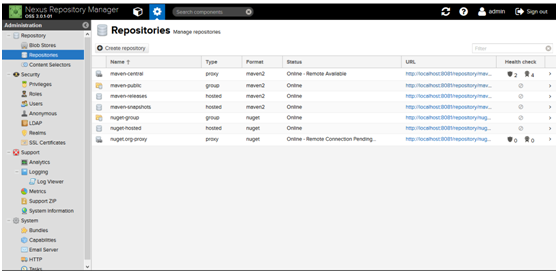

> pepositories说明

* maven-central：maven中央库，默认从https://repo1.maven.org/maven2/拉取jar
* maven-releases：私库发行版jar
* maven-snapshots：私库快照（调试版本）jar
* maven-public：仓库分组，把上面三个仓库组合在一起对外提供服务，在本地maven基础配置settings.xml中使用。

# nexus-install.sh

```angular2html
#!/usr/bin/env bash

# -----------------------------------------------------------------------------------------------------
# 安装 sonatype nexus(用于搭建 maven 私服) 脚本
# @system: 适用于所有 linux 发行版本。
# sonatype nexus 会被安装到 /opt/maven 路径。
# 注意：sonatype nexus 要求必须先安装 JDK
# -----------------------------------------------------------------------------------------------------

# ------------------------------------------------------------------------------ env

# Regular Color
export ENV_COLOR_BLACK="\033[0;30m"
export ENV_COLOR_RED="\033[0;31m"
export ENV_COLOR_GREEN="\033[0;32m"
export ENV_COLOR_YELLOW="\033[0;33m"
export ENV_COLOR_BLUE="\033[0;34m"
export ENV_COLOR_MAGENTA="\033[0;35m"
export ENV_COLOR_CYAN="\033[0;36m"
export ENV_COLOR_WHITE="\033[0;37m"
# Bold Color
export ENV_COLOR_B_BLACK="\033[1;30m"
export ENV_COLOR_B_RED="\033[1;31m"
export ENV_COLOR_B_GREEN="\033[1;32m"
export ENV_COLOR_B_YELLOW="\033[1;33m"
export ENV_COLOR_B_BLUE="\033[1;34m"
export ENV_COLOR_B_MAGENTA="\033[1;35m"
export ENV_COLOR_B_CYAN="\033[1;36m"
export ENV_COLOR_B_WHITE="\033[1;37m"
# Reset Color
export ENV_COLOR_RESET="$(tput sgr0)"

# status
export ENV_YES=0
export ENV_NO=1
export ENV_SUCCEED=0
export ENV_FAILED=1

# ------------------------------------------------------------------------------ functions

# 显示打印日志的时间
SHELL_LOG_TIMESTAMP=$(date "+%Y-%m-%d %H:%M:%S")
# 那个用户在操作
USER=$(whoami)

redOutput() {
    echo -e "${ENV_COLOR_RED} $@${ENV_COLOR_RESET}"
}

greenOutput() {
    echo -e "${ENV_COLOR_B_GREEN} $@${ENV_COLOR_RESET}"
}

yellowOutput() {
    echo -e "${ENV_COLOR_YELLOW} $@${ENV_COLOR_RESET}"
}

blueOutput() {
    echo -e "${ENV_COLOR_BLUE} $@${ENV_COLOR_RESET}"
}

magentaOutput() {
    echo -e "${ENV_COLOR_MAGENTA} $@${ENV_COLOR_RESET}"
}

cyanOutput() {
    echo -e "${ENV_COLOR_CYAN} $@${ENV_COLOR_RESET}"
}

whiteOutput() {
    echo -e "${ENV_COLOR_WHITE} $@${ENV_COLOR_RESET}"
}

printInfo() {
    echo -e "${ENV_COLOR_B_GREEN}[INFO] $@${ENV_COLOR_RESET}"
}

printWarn() {
    echo -e "${ENV_COLOR_B_YELLOW}[WARN] $@${ENV_COLOR_RESET}"
}

printError() {
    echo -e "${ENV_COLOR_B_RED}[ERROR] $@${ENV_COLOR_RESET}"
}

callAndLog () {
    $*
    if [[ $? -eq ${ENV_SUCCEED} ]]; then
        printInfo "$@"
        return ${ENV_SUCCEED}
    else
        printError "$@ EXECUTE FAILED"
        return ${ENV_FAILED}
    fi
}

# ------------------------------------------------------------------------------ main
ENV_NEXUS_VERSION=${ENV_NEXUS_VERSION:-3.13.0-01}
ENV_NEXUS_DIR=${ENV_NEXUS_DIR:-/opt/maven}

printInfo ">>>> install nexus begin."

mkdir -p ${ENV_NEXUS_DIR}
printInfo "download nexus"
#由于国内网络问题，有可能下载失败
curl -o ${ENV_NEXUS_DIR}/nexus-unix.tar.gz https://sonatype-download.global.ssl.fastly.net/repository/repositoryManager/3/nexus-${ENV_NEXUS_VERSION}-unix.tar.gz
if [[ "$?" != ${ENV_SUCCEED} ]]; then
    printError "<<<< download nexus-${ENV_NEXUS_VERSION}-unix.tar.gz failed"
    return ${ENV_FAILED}
fi
tar -zxf nexus-unix.tar.gz

printInfo ">>>> setting systemd."
#通过设置 systemd，是的 nexus 注册为服务，开机自启动
touch /lib/systemd/system/nexus.service
cat >> /lib/systemd/system/nexus.service << EOF
[Unit]
Description=nexus
After=network.target

[Service]
Type=forking
LimitNOFILE=65536 #警告处理
Environment=RUN_AS_USER=root
ExecStart=${ENV_NEXUS_DIR}/nexus-${ENV_NEXUS_VERSION}/bin/nexus start
ExecReload=${ENV_NEXUS_DIR}/nexus-${ENV_NEXUS_VERSION}/bin/nexus restart
ExecStop=${ENV_NEXUS_DIR}/nexus-${ENV_NEXUS_VERSION}/bin/nexus stop
Restart=on-failure
PrivateTmp=true

[Install]
WantedBy=multi-user.target
EOF
systemctl enable nexus
systemctl start nexus

printInfo ">>>> setting firewalld."
firewall-cmd --zone=public --add-port=8081/tcp --permanent
firewall-cmd --reload
# 如果防火墻使用的是 iptables，使用如下配置：
#iptables -I INPUT -p tcp -m tcp --dport 8081 -j ACCEPT
#/etc/rc.d/init.d/iptables save
#service iptables restart

printInfo "<<<<<<<< install nexus success."
```

# Nexus 安装 使用说明

1 . 私服简介

私服是架设在局域网的一种特殊的远程仓库，目的是代理远程仓库及部署第三方构件。有了私服之后，当 Maven 需要下载构件时，直接请求私服，私服上存在则下载到本地仓库；否则，私服请求外部的远程仓库，将构件下载到私服，再提供给本地仓库下载。

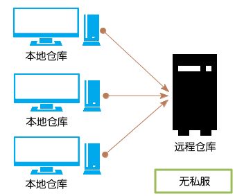

我们可以使用专门的 Maven 仓库管理软件来搭建私服，比如：Apache Archiva，Artifactory，Sonatype Nexus。这里我们使用 Sonatype Nexus。

2 . 安装Nexus

2 . 1 . 下载Nexus

Nexus 专业版是需要付费的，这里我们下载开源版 Nexus OSS。

Nexus 提供两种安装包，一种是包含 Jetty 容器的 bundle 包，另一种是不包含容器的 war 包。下载地址：http://www.sonatype.org/nexus/go。

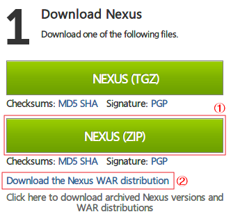

2 . 2 . 使用bundle安装包安装Nexus

解压安装包nexus-2.8.1-bundle.zip，打开命令提示符，进入/nexus-2.8.1-01目录，键入nexus命令（为方便启动和退出Nexus，可将bin目录添加到环境变量）：

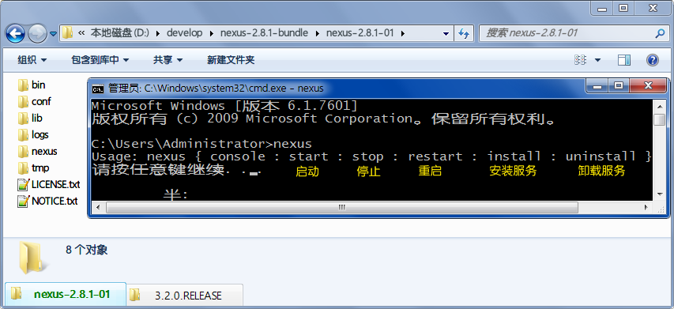

执行 nexus install 将Nexus安装为Windows服务。可将服务启动方式设为手动，以后通过 nexus start 即可启动Nexus ，通过 nexus stop 退出Nexus：

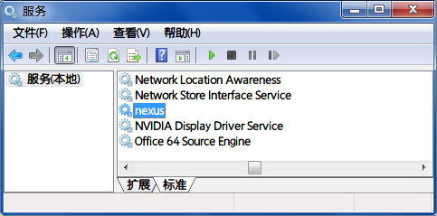

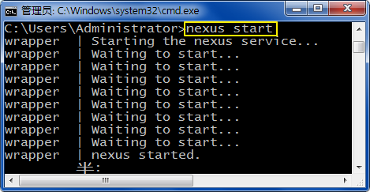

打开浏览器，访问：http://localhost:8081/nexus/：

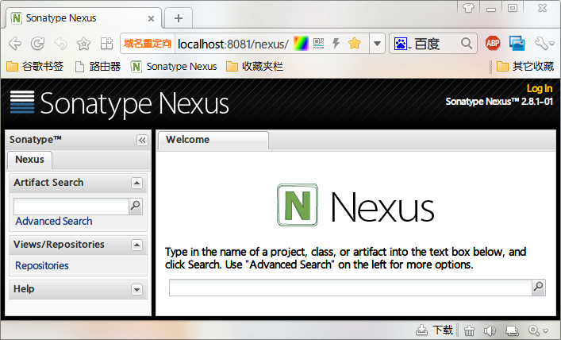

点击右上角 Log In，使用用户名：admin ，密码：admin123 登录，可使用更多功能：

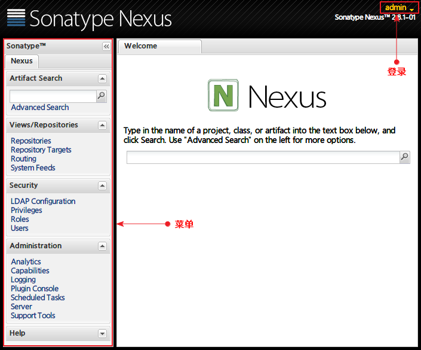

3 . Nexus预置的仓库

点击左侧 Repositories 链接，查看 Nexus 内置的仓库：

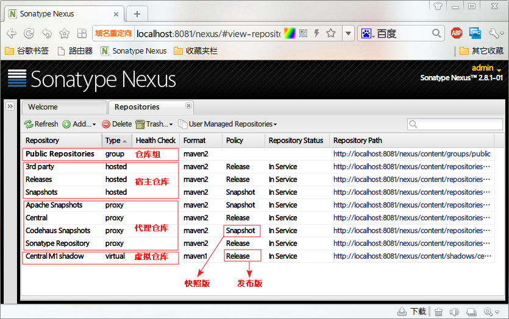

Nexus 的仓库分为这么几类：

1. hosted 宿主仓库：主要用于部署无法从公共仓库获取的构件（如 oracle 的 JDBC 驱动）以及自己或第三方的项目构件；
2. proxy 代理仓库：代理公共的远程仓库；
3. virtual 虚拟仓库：用于适配 Maven 1；
4. group 仓库组：Nexus 通过仓库组的概念统一管理多个仓库，这样我们在项目中直接请求仓库组即可请求到仓库组管理的多个仓库。

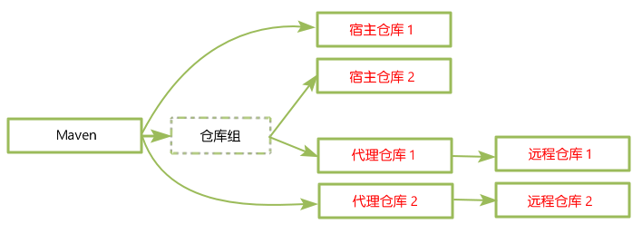

4 . 添加代理仓库

以 Sonatype 为例，添加一个代理仓库，用于代理 Sonatype 的公共远程仓库。点击菜单 Add - Proxy Repository ：

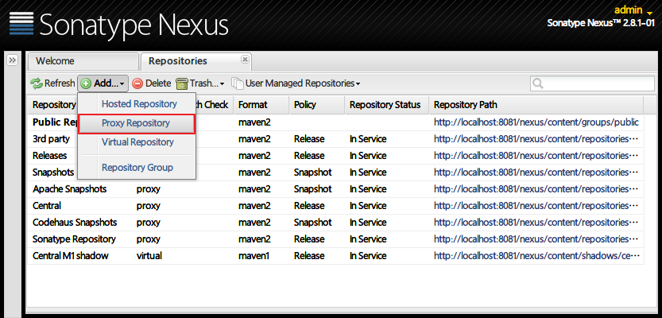

填写Repository ID - sonatype；Repository Name - Sonatype Repository；

Remote Storage Location - http://repository.sonatype.org/content/groups/public/ ，save 保存：

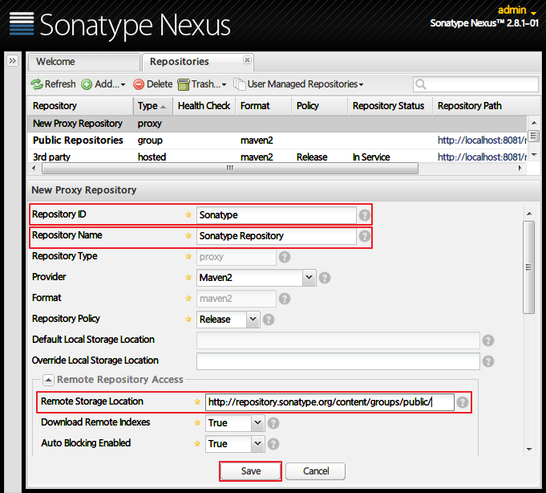

将添加的 Sonatype 代理仓库加入 Public Repositories 仓库组。

选中 Public Repositories，在 Configuration 选项卡中，将 Sonatype Repository 从右侧 Available Repositories 移到左侧 Ordered Group Repositories，save 保存：

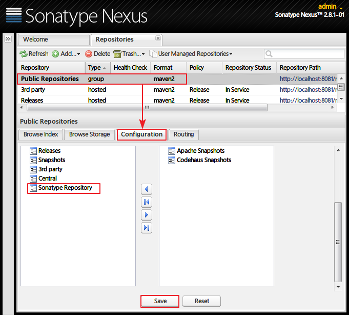

5 . 搜索构件

为了更好的使用 Nexus 的搜索，我们可以设置所有 proxy 仓库的 Download Remote Indexes 为 true，即允许下载远程仓库索引。

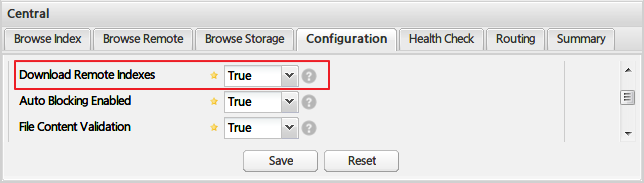

索引下载成功之后，在 Browse Index 选项卡下，可以浏览到所有已被索引的构件信息，包括坐标、格式、Maven 依赖的 xml 代码：

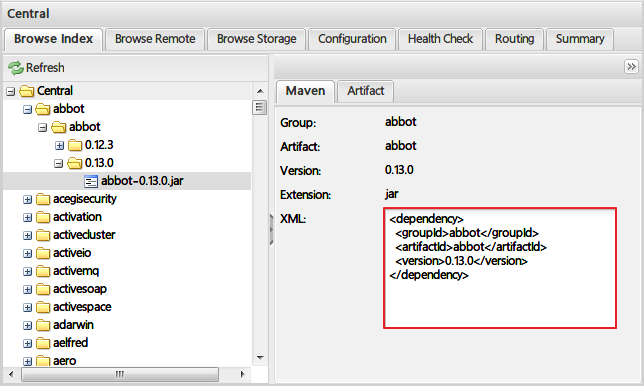

有了索引，我们就可以搜索了：

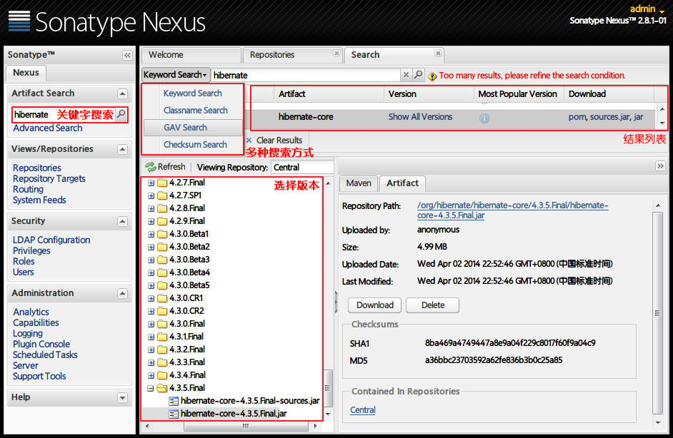

6 . 配置Maven使用私服

私服搭建成功，我们就可以配置 Maven 使用私服，以后下载构件、部署构件，都通过私服来管理。

在 settings.xml 文件中，为所有仓库配置一个镜像仓库，镜像仓库的地址即私服的地址（这儿我们使用私服公共仓库组 Public Repositories 的地址）：


```angular2html
    <mirrors>
            <mirror>
                <id>central</id>
                <mirrorOf>*</mirrorOf> <!-- * 表示让所有仓库使用该镜像--> 
                <name>central-mirror</name> 
                <url>http://localhost:8081/nexus/content/groups/public/</url>
            </mirror> 
    </mirrors>
```

管理本地仓库

```angular2html
　　Releases:

 　　　　这里存放我们自己项目中发布的构建, 通常是Release版本的, 
比如我们自己做了一个FTP Server的项目, 生成的构件为ftpserver.war, 我们就可以把这个构建发布到Nexus的Releases本地仓库. 
关于符合发布后面会有介绍.

　　Snapshots:

 　　　　这个仓库非常的有用, 它的目的是让我们可以发布那些非release版本, 非稳定版本, 
比如我们在trunk下开发一个项目,在正式release之前你可能需要临时发布一个版本给你的同伴使用, 
因为你的同伴正在依赖你的模块开发, 那么这个时候我们就可以发布Snapshot版本到这个仓库, 你的同伴就可以通过简单的命令来获取和使用这个临时版本.

　　3rd Party:

　　　　顾名思义, 第三方库, 你可能会问不是有中央仓库来管理第三方库嘛,没错, 这里的是指可以让你添加自己的第三方库, 
比如有些构件在中央仓库是不存在的. 比如你在中央仓库找不到Oracle 的JDBC驱动, 这个时候我们就需要自己添加到3rdparty仓库。
```

# nexus-install.sh

```angular2html

#!/usr/bin/env bash

# -----------------------------------------------------------------------------------------------------
# 安装 sonatype nexus(用于搭建 maven 私服) 脚本
# @system: 适用于所有 linux 发行版本。
# sonatype nexus 会被安装到 /opt/maven 路径。
# 注意：sonatype nexus 要求必须先安装 JDK
# -----------------------------------------------------------------------------------------------------

# ------------------------------------------------------------------------------ env

# Regular Color
export ENV_COLOR_BLACK="\033[0;30m"
export ENV_COLOR_RED="\033[0;31m"
export ENV_COLOR_GREEN="\033[0;32m"
export ENV_COLOR_YELLOW="\033[0;33m"
export ENV_COLOR_BLUE="\033[0;34m"
export ENV_COLOR_MAGENTA="\033[0;35m"
export ENV_COLOR_CYAN="\033[0;36m"
export ENV_COLOR_WHITE="\033[0;37m"
# Bold Color
export ENV_COLOR_B_BLACK="\033[1;30m"
export ENV_COLOR_B_RED="\033[1;31m"
export ENV_COLOR_B_GREEN="\033[1;32m"
export ENV_COLOR_B_YELLOW="\033[1;33m"
export ENV_COLOR_B_BLUE="\033[1;34m"
export ENV_COLOR_B_MAGENTA="\033[1;35m"
export ENV_COLOR_B_CYAN="\033[1;36m"
export ENV_COLOR_B_WHITE="\033[1;37m"
# Reset Color
export ENV_COLOR_RESET="$(tput sgr0)"

# status
export ENV_YES=0
export ENV_NO=1
export ENV_SUCCEED=0
export ENV_FAILED=1

# ------------------------------------------------------------------------------ functions

# 显示打印日志的时间
SHELL_LOG_TIMESTAMP=$(date "+%Y-%m-%d %H:%M:%S")
# 那个用户在操作
USER=$(whoami)

redOutput() {
    echo -e "${ENV_COLOR_RED} $@${ENV_COLOR_RESET}"
}

greenOutput() {
    echo -e "${ENV_COLOR_B_GREEN} $@${ENV_COLOR_RESET}"
}

yellowOutput() {
    echo -e "${ENV_COLOR_YELLOW} $@${ENV_COLOR_RESET}"
}

blueOutput() {
    echo -e "${ENV_COLOR_BLUE} $@${ENV_COLOR_RESET}"
}

magentaOutput() {
    echo -e "${ENV_COLOR_MAGENTA} $@${ENV_COLOR_RESET}"
}

cyanOutput() {
    echo -e "${ENV_COLOR_CYAN} $@${ENV_COLOR_RESET}"
}

whiteOutput() {
    echo -e "${ENV_COLOR_WHITE} $@${ENV_COLOR_RESET}"
}

printInfo() {
    echo -e "${ENV_COLOR_B_GREEN}[INFO] $@${ENV_COLOR_RESET}"
}

printWarn() {
    echo -e "${ENV_COLOR_B_YELLOW}[WARN] $@${ENV_COLOR_RESET}"
}

printError() {
    echo -e "${ENV_COLOR_B_RED}[ERROR] $@${ENV_COLOR_RESET}"
}

callAndLog () {
    $*
    if [[ $? -eq ${ENV_SUCCEED} ]]; then
        printInfo "$@"
        return ${ENV_SUCCEED}
    else
        printError "$@ EXECUTE FAILED"
        return ${ENV_FAILED}
    fi
}

# ------------------------------------------------------------------------------ main
ENV_NEXUS_VERSION=${ENV_NEXUS_VERSION:-3.13.0-01}
ENV_NEXUS_DIR=${ENV_NEXUS_DIR:-/opt/maven}

printInfo ">>>> install nexus begin."

mkdir -p ${ENV_NEXUS_DIR}
printInfo "download nexus"
#由于国内网络问题，有可能下载失败
curl -o ${ENV_NEXUS_DIR}/nexus-unix.tar.gz https://sonatype-download.global.ssl.fastly.net/repository/repositoryManager/3/nexus-${ENV_NEXUS_VERSION}-unix.tar.gz
if [[ "$?" != ${ENV_SUCCEED} ]]; then
    printError "<<<< download nexus-${ENV_NEXUS_VERSION}-unix.tar.gz failed"
    return ${ENV_FAILED}
fi
tar -zxf nexus-unix.tar.gz

printInfo ">>>> setting systemd."
#通过设置 systemd，是的 nexus 注册为服务，开机自启动
touch /lib/systemd/system/nexus.service
cat >> /lib/systemd/system/nexus.service << EOF
[Unit]
Description=nexus
After=network.target

[Service]
Type=forking
LimitNOFILE=65536 #警告处理
Environment=RUN_AS_USER=root
ExecStart=${ENV_NEXUS_DIR}/nexus-${ENV_NEXUS_VERSION}/bin/nexus start
ExecReload=${ENV_NEXUS_DIR}/nexus-${ENV_NEXUS_VERSION}/bin/nexus restart
ExecStop=${ENV_NEXUS_DIR}/nexus-${ENV_NEXUS_VERSION}/bin/nexus stop
Restart=on-failure
PrivateTmp=true

[Install]
WantedBy=multi-user.target
EOF
systemctl enable nexus
systemctl start nexus

printInfo ">>>> setting firewalld."
firewall-cmd --zone=public --add-port=8081/tcp --permanent
firewall-cmd --reload
# 如果防火墻使用的是 iptables，使用如下配置：
#iptables -I INPUT -p tcp -m tcp --dport 8081 -j ACCEPT
#/etc/rc.d/init.d/iptables save
#service iptables restart

printInfo "<<<<<<<< install nexus success."

```


